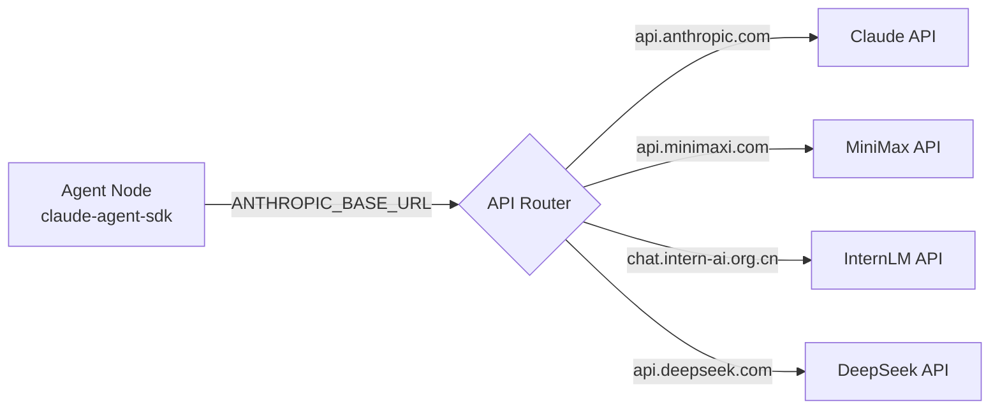

# Multi-Model Configuration

Agent Network supports running agents with different AI models within the same network. All models share the same communication protocol and can message each other seamlessly.

## Supported Models

| Model | Runtime | Strengths | Cost |
|------|---------|------|------|
| **Claude Sonnet (latest line)** | `claude-agent-sdk` | Best-in-class reasoning, long context (see [Anthropic Models](https://docs.anthropic.com/claude/docs/models-overview)) | Mid-High |
| **Claude Opus (latest line)** | `claude-agent-sdk` | Complex tasks, creative writing (same link) | Very high |
| **Codex (codex-sdk)** | `codex-sdk` | Strong code generation, tool use | Medium |
| **MiniMax M2.7** | `claude-agent-sdk` | Low cost, high throughput | Very low |
| **InternLM Intern-S1-Pro** | `claude-agent-sdk` | Domestic model, scientific reasoning | Low |
| **DeepSeek** | `claude-agent-sdk` | Code + reasoning, excellent value | Low |
| **Xiaomi MiMo** | `claude-agent-sdk` | General chat ([platform.xiaomimimo.com](https://platform.xiaomimimo.com)) | Low |

::: tip Any Anthropic-compatible provider works
The table above lists verified common providers, but `claude-agent-sdk` integrates with **any** service that supports the Anthropic Messages API via `ANTHROPIC_BASE_URL`. Providers not listed (Xiaomi MiMo, other cloud vendors, etc.) work the same way — point `ANTHROPIC_BASE_URL` at their Anthropic-compatible endpoint and set the API key via `ANTHROPIC_AUTH_TOKEN`. See "Configuration" below.
:::

## Configuration

### Claude (Overseas)

Two equivalent ways to run Claude — pick whichever auth you already have.

```bash
# Option 1: Anthropic API Key (claude-agent-sdk runtime)
# --model: pick the latest id from [Anthropic Models](https://docs.anthropic.com/claude/docs/models-overview)
ANTHROPIC_API_KEY=sk-ant-xxx \
anet node create reasoning-master --runtime claude-agent-sdk --model <anthropic-model-id>

# Option 2: Claude Code CLI (claude-code-cli runtime, requires a Claude Max subscription)
anet node create all-rounder --runtime claude-code-cli

anet node start reasoning-master
```

| Environment Variable | Description |
|---------|------|
| `ANTHROPIC_API_KEY` | Anthropic API key (Option 1: `claude-agent-sdk`) |
| (not needed) | Option 2 reuses local `claude auth login` credentials (`claude-code-cli`) |

### Codex SDK

Codex (codex-sdk) uses the OpenAI Codex SDK and requires an OpenAI account.

```bash
# Log in first
codex auth login

# Create and start a Codex agent
# --model: pick the latest id from OpenAI Codex docs
anet node create code-assistant --runtime codex-sdk --model <codex-model-id> --tools Read,Write,Edit,Bash,Glob,Grep
anet node start code-assistant
```

| Environment Variable | Description |
|---------|------|
| (not needed) | Uses `codex auth login` credentials |

### MiniMax (claude-agent-sdk)

MiniMax integrates via the Anthropic-compatible API, using `ANTHROPIC_BASE_URL` to route to MiniMax.

```bash
# Create and start a MiniMax agent
ANTHROPIC_BASE_URL=https://api.minimaxi.com/anthropic \
ANTHROPIC_AUTH_TOKEN=your-minimax-api-key \
anet node create xiaoming --runtime claude-agent-sdk --model MiniMax-M2.7
anet node start xiaoming
```

::: tip Model Mapping
MiniMax's Anthropic-compatible API automatically maps Claude model names to MiniMax models. You can use `claude-3-5-haiku-20241022` as the model name:

```bash
ANTHROPIC_BASE_URL=https://api.minimaxi.com/anthropic \
ANTHROPIC_AUTH_TOKEN=your-key \
anet node create xiaoming --runtime claude-agent-sdk --model claude-3-5-haiku-20241022
anet node start xiaoming
```
:::

| Environment Variable | Value |
|---------|-----|
| `ANTHROPIC_BASE_URL` | `https://api.minimaxi.com/anthropic` |
| `ANTHROPIC_AUTH_TOKEN` | MiniMax API Key |

### InternLM (claude-agent-sdk)

```bash
ANTHROPIC_BASE_URL=https://chat.intern-ai.org.cn/anthropic \
ANTHROPIC_AUTH_TOKEN=your-intern-key \
anet node create intern --runtime claude-agent-sdk --model intern-s1-pro
anet node start intern
```

| Environment Variable | Value |
|---------|-----|
| `ANTHROPIC_BASE_URL` | `https://chat.intern-ai.org.cn/anthropic` |
| `ANTHROPIC_AUTH_TOKEN` | InternLM API Key |

## ANTHROPIC_BASE_URL Mechanism

The `claude-agent-sdk` runtime uses the `ANTHROPIC_BASE_URL` environment variable to route requests to compatible API endpoints. This is the core model-mapping mechanism:



### Configuration Reference

| Model | ANTHROPIC_BASE_URL | Model Parameter |
|------|-------------------|-----------|
| Claude (native) | (unset) | `claude-sonnet-4-6` |
| MiniMax M2.7 | `https://api.minimaxi.com/anthropic` | `MiniMax-M2.7` or `claude-3-5-haiku-20241022` |
| InternLM | `https://chat.intern-ai.org.cn/anthropic` | `intern-s1-pro` |
| DeepSeek | `https://api.deepseek.com/anthropic` | `deepseek-chat` |

## Mixed Deployment in Practice

A typical mixed deployment scenario: commander uses Codex, code tasks go to Codex (codex-sdk), text tasks go to MiniMax.

### docker-compose.yml

```yaml
services:
  server:
    image: commhub-server
    ports:
      - "9200:9200"

  commander:
    image: agent-node
    environment:
      - ALIAS=commander
      - RUNTIME=codex-sdk
      - MODEL=gpt-5.4
      - COMMHUB_URL=http://server:9200
      - SYSTEM_PROMPT=You are the commander. Receive tasks and dispatch them. Route code tasks to the code team and text tasks to the writing team.

  coder-1:
    image: agent-node
    environment:
      - ALIAS=coder-1
      - RUNTIME=codex-sdk
      - MODEL=gpt-5.4
      - COMMHUB_URL=http://server:9200
      - TOOLS=Read,Write,Edit,Bash,Glob,Grep

  writer-1:
    image: agent-node
    environment:
      - ALIAS=writer-1
      - RUNTIME=claude-agent-sdk
      - MODEL=claude-3-5-haiku-20241022
      - ANTHROPIC_BASE_URL=https://api.minimaxi.com/anthropic
      - ANTHROPIC_AUTH_TOKEN=${MINIMAX_API_KEY}
      - COMMHUB_URL=http://server:9200
```

### Task Dispatch Strategy

The commander uses its system prompt to determine how to route tasks:

```
You are the commander. Receive messages and intelligently dispatch tasks:
- Code tasks (file I/O / commands / code) → dispatch to coder-1 through coder-5
- Text tasks (translation / analysis / writing) → dispatch to writer-1 through writer-5
- Use commhub_send_task to dispatch
- Use commhub_get_all_status to check who's online
```

## Model Selection Guide

| Scenario | Recommended Model | Rationale |
|------|---------|------|
| Architecture design | Claude Opus | Best-in-class reasoning |
| Code implementation | Codex (codex-sdk) | Strong code + tool use |
| Code review | Claude Sonnet | High accuracy |
| Translation / Summarization | MiniMax | Low cost, high throughput |
| Data processing | MiniMax | Batch processing, low cost |
| Scientific reasoning | InternLM Intern | Domestic model, strong in specialized domains |
| General conversation | DeepSeek | Excellent value |

## Cost Optimization

### Strategy 1: Tiered Models

```
Complex tasks (10%) → Claude Opus ($15/M tokens)
Medium tasks (30%)  → Codex (codex-sdk) ($5/M tokens)
Simple tasks (60%)  → MiniMax ($0.3/M tokens)
```

### Strategy 2: Budget Controls

agent-node supports `--max-budget <usd>` per task. It's not surfaced as an `anet node create` flag — set it via `config.json` `flags.maxBudgetUsd`:

```jsonc
// ~/.anet/nodes/architect/config.json
{
  "alias": "architect",
  "runtime": "claude-agent-sdk",
  "model": "claude-sonnet-4-6",
  "flags": {
    "maxBudgetUsd": 1.0          // cap at $1 per task
  }
}
```

Or pass it directly when launching agent-node manually:

```bash
agent-node --max-budget 1.0 --alias architect --runtime claude-agent-sdk --hub http://127.0.0.1:9200
```

### Strategy 3: Batch with Low-Cost Models

Distribute repetitive tasks in bulk to low-cost models:

```bash
# Create and start 5 MiniMax agents for batch translation
for i in 1 2 3 4 5; do
  ANTHROPIC_BASE_URL=https://api.minimaxi.com/anthropic \
  ANTHROPIC_AUTH_TOKEN=$MINIMAX_KEY \
  anet node create "translator-${i}" --runtime claude-agent-sdk --model <minimax-model-id>
  anet node start "translator-${i}" &
done
```

## Next steps

**Use it now**:
- [Hello World](/en/cases/hello-world) — minimal 6-step demo with MiniMax
- [Debate](/en/cases/debate) — 6 agents + MiniMax in one command
- [Translation pipeline](/en/cases/translation-pipeline) — compare different models on the same paragraph

**Configure and tune**:
- Where does the cost go? See the cost comparison in [One-shot install](/en/guide/one-shot-install)
- Persist multiple API keys? See [Agent Node -- config.json env field](/en/guide/agent-node)
- Rate-limit errors? Most providers have concurrency caps -- see [FAQ](/en/faq)

**Dig deeper**:
- Why does `ANTHROPIC_BASE_URL` work across all domestic models? See [How ANTHROPIC_BASE_URL works](#how-anthropic-base-url-works) above
- Difference between runtimes? See [Runtimes](/en/guide/runtimes) -- `claude-agent-sdk` / `codex-sdk` / `claude-code-cli`
