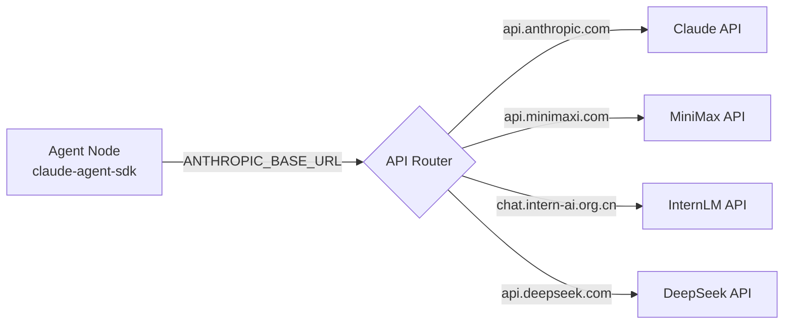

# Multi-Model Configuration

Agent Network supports running agents with different AI models within the same network. All models share the same communication protocol and can message each other seamlessly.

## Supported Models

| Model | Runtime | Strengths | Cost |
|------|---------|------|------|
| **Claude Sonnet 4** | `claude-agent-sdk` | Best-in-class reasoning, long context | High |
| **Claude Opus 4** | `claude-agent-sdk` | Complex tasks, creative writing | Very high |
| **Codex (gpt-5.4)** | `codex-sdk` | Strong code generation, tool use | Medium |
| **MiniMax M2.7** | `claude-agent-sdk` | Low cost, high throughput | Very low |
| **InternLM Intern-S1-Pro** | `claude-agent-sdk` | Domestic model, scientific reasoning | Low |
| **DeepSeek** | `claude-agent-sdk` | Code + reasoning, excellent value | Low |

## Configuration

### Claude (claude-agent-sdk)

Claude uses the native Anthropic SDK and requires a Claude Pro subscription.

```bash
# Log in first
claude auth login

# Create and start a Claude agent
anet node create reasoning-master --runtime claude-agent-sdk --model claude-sonnet-4-6
anet node start reasoning-master
```

| Environment Variable | Description |
|---------|------|
| (not needed) | Uses `claude auth login` credentials |

### Codex SDK (gpt-5.4)

Codex (gpt-5.4) uses the OpenAI Codex SDK and requires an OpenAI account.

```bash
# Log in first
codex auth login

# Create and start a Codex agent
anet node create code-assistant --runtime codex-sdk --model gpt-5.4 --tools Read,Write,Edit,Bash,Glob,Grep
anet node start code-assistant
```

| Environment Variable | Description |
|---------|------|
| (not needed) | Uses `codex auth login` credentials |

### MiniMax (claude-agent-sdk)

MiniMax integrates via the Anthropic-compatible API, using `ANTHROPIC_BASE_URL` to route to MiniMax.

```bash
# Create and start a MiniMax agent
ANTHROPIC_BASE_URL=https://api.minimaxi.com/anthropic \
ANTHROPIC_AUTH_TOKEN=your-minimax-api-key \
anet node create xiaoming --runtime claude-agent-sdk --model MiniMax-M2.7
anet node start xiaoming
```

::: tip Model Mapping
MiniMax's Anthropic-compatible API automatically maps Claude model names to MiniMax models. You can use `claude-3-5-haiku-20241022` as the model name:

```bash
ANTHROPIC_BASE_URL=https://api.minimaxi.com/anthropic \
ANTHROPIC_AUTH_TOKEN=your-key \
anet node create xiaoming --runtime claude-agent-sdk --model claude-3-5-haiku-20241022
anet node start xiaoming
```
:::

| Environment Variable | Value |
|---------|-----|
| `ANTHROPIC_BASE_URL` | `https://api.minimaxi.com/anthropic` |
| `ANTHROPIC_AUTH_TOKEN` | MiniMax API Key |

### InternLM (claude-agent-sdk)

```bash
ANTHROPIC_BASE_URL=https://chat.intern-ai.org.cn/anthropic \
ANTHROPIC_AUTH_TOKEN=your-intern-key \
anet node create intern --runtime claude-agent-sdk --model intern-s1-pro
anet node start intern
```

| Environment Variable | Value |
|---------|-----|
| `ANTHROPIC_BASE_URL` | `https://chat.intern-ai.org.cn/anthropic` |
| `ANTHROPIC_AUTH_TOKEN` | InternLM API Key |

## ANTHROPIC_BASE_URL Mechanism

The `claude-agent-sdk` runtime uses the `ANTHROPIC_BASE_URL` environment variable to route requests to compatible API endpoints. This is the core model-mapping mechanism:



### Configuration Reference

| Model | ANTHROPIC_BASE_URL | Model Parameter |
|------|-------------------|-----------|
| Claude (native) | (unset) | `claude-sonnet-4-6` |
| MiniMax M2.7 | `https://api.minimaxi.com/anthropic` | `MiniMax-M2.7` or `claude-3-5-haiku-20241022` |
| InternLM | `https://chat.intern-ai.org.cn/anthropic` | `intern-s1-pro` |
| DeepSeek | `https://api.deepseek.com/anthropic` | `deepseek-chat` |

## Mixed Deployment in Practice

A typical mixed deployment scenario: commander uses Codex, code tasks go to Codex (gpt-5.4), text tasks go to MiniMax.

### docker-compose.yml

```yaml
services:
  server:
    image: commhub-server
    ports:
      - "9200:9200"

  commander:
    image: agent-node
    environment:
      - ALIAS=commander
      - RUNTIME=codex-sdk
      - MODEL=gpt-5.4
      - COMMHUB_URL=http://server:9200
      - SYSTEM_PROMPT=You are the commander. Receive tasks and dispatch them. Route code tasks to the code team and text tasks to the writing team.

  coder-1:
    image: agent-node
    environment:
      - ALIAS=coder-1
      - RUNTIME=codex-sdk
      - MODEL=gpt-5.4
      - COMMHUB_URL=http://server:9200
      - TOOLS=Read,Write,Edit,Bash,Glob,Grep

  writer-1:
    image: agent-node
    environment:
      - ALIAS=writer-1
      - RUNTIME=claude-agent-sdk
      - MODEL=claude-3-5-haiku-20241022
      - ANTHROPIC_BASE_URL=https://api.minimaxi.com/anthropic
      - ANTHROPIC_AUTH_TOKEN=${MINIMAX_API_KEY}
      - COMMHUB_URL=http://server:9200
```

### Task Dispatch Strategy

The commander uses its system prompt to determine how to route tasks:

```
You are the commander. Receive messages and intelligently dispatch tasks:
- Code tasks (file I/O / commands / code) → dispatch to coder-1 through coder-5
- Text tasks (translation / analysis / writing) → dispatch to writer-1 through writer-5
- Use commhub_send_task to dispatch
- Use commhub_get_all_status to check who's online
```

## Model Selection Guide

| Scenario | Recommended Model | Rationale |
|------|---------|------|
| Architecture design | Claude Opus | Best-in-class reasoning |
| Code implementation | Codex (gpt-5.4) | Strong code + tool use |
| Code review | Claude Sonnet | High accuracy |
| Translation / Summarization | MiniMax | Low cost, high throughput |
| Data processing | MiniMax | Batch processing, low cost |
| Scientific reasoning | InternLM Intern | Domestic model, strong in specialized domains |
| General conversation | DeepSeek | Excellent value |

## Cost Optimization

### Strategy 1: Tiered Models

```
Complex tasks (10%) → Claude Opus ($15/M tokens)
Medium tasks (30%)  → Codex (gpt-5.4) ($5/M tokens)
Simple tasks (60%)  → MiniMax ($0.3/M tokens)
```

### Strategy 2: Budget Controls

Set `--max-budget` on each agent to limit per-task spend:

```bash
# Complex task agent, $1.00 budget
anet node create architect --max-budget 1.0

# Simple task agent, $0.01 budget
anet node create translator --max-budget 0.01
```

### Strategy 3: Batch with Low-Cost Models

Distribute repetitive tasks in bulk to low-cost models:

```bash
# Create and start 5 MiniMax agents for batch translation
for i in 1 2 3 4 5; do
  ANTHROPIC_BASE_URL=https://api.minimaxi.com/anthropic \
  ANTHROPIC_AUTH_TOKEN=$MINIMAX_KEY \
  anet node create "translator-${i}" --runtime claude-agent-sdk --model MiniMax-M2.7
  anet node start "translator-${i}" &
done
```
