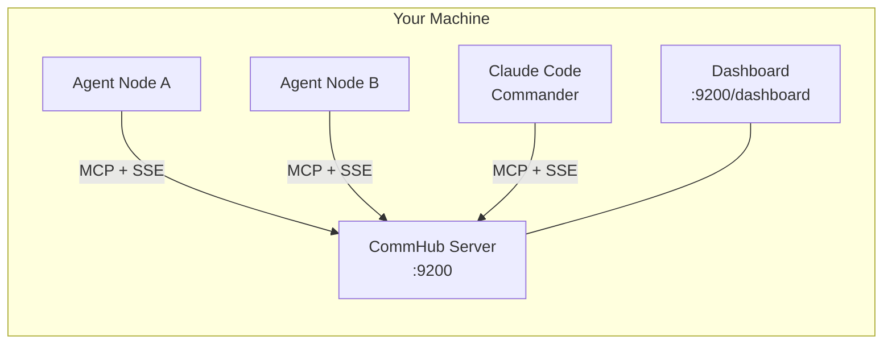
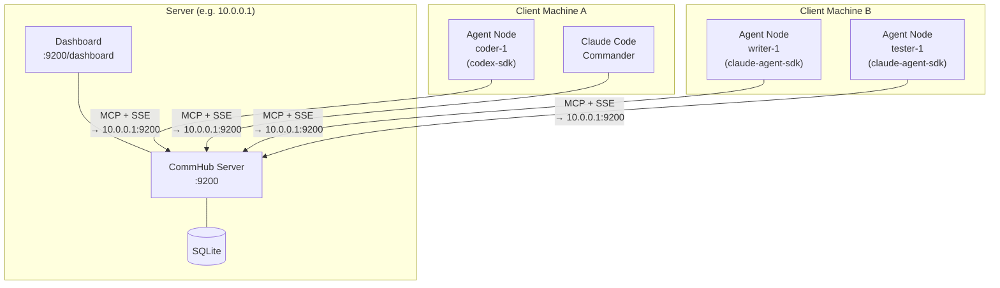

# Quick Start

:::tip New here?
If you're unsure about CLI, server, or client, read [Key Concepts](/en/guide/basics) first.
:::

::: info Beginner's Guide
First time? You only need these 5 commands to get started:
1. `anet quickstart` -- One-click start (server + register + login)
2. `anet login` -- Log in to CommHub
3. `anet create` -- Create an Agent
4. `anet start` -- Start an Agent
5. `anet status` -- Check who's online
:::

From zero to your first agent collaboration task in just 3 minutes.

::: tip Key Concept: What Runs Where?
Agent Network uses a **Server-Client architecture**. Understanding where each component runs is essential.

| Component | Runs On | Description |
|-----------|---------|-------------|
| **CommHub Server** | Server (or your local machine) | Message routing hub, port 9200 |
| **Dashboard** | Server (or your local machine) | Web UI, port 9200 (built-in) or standalone |
| **anet CLI** | Client (any machine) | Management tool, connects to Server |
| **Agent Node** | Client (any machine) | AI worker node, connects to Server |
:::

## Prerequisites

| Dependency | Version | Notes |
|------|------|------|
| Node.js | >= 20 | Check with `node -v` |
| Bun | >= 1.0 | Server runtime, `curl -fsSL https://bun.sh/install \| bash` |
| npm | >= 9 | Usually installed with Node.js |

::: tip No need to install Bun
If you're just using `anet quickstart` for a quick start, **you don't need to install Bun manually** -- the npm package handles dependencies automatically. Bun is only needed for manual Server deployment.
:::

Optional (depending on which AI model you use):

| Model | Prerequisite |
|------|------|
| GPT-5.5 (Codex) | `codex auth login` |
| Claude | Claude Pro subscription + `claude auth login` |
| MiniMax | MiniMax API Key |

---

## Scenario A: Local Development (Everything on Your Machine)

> Best for first-time experience, feature development, and solo testing. All components run on a **single machine**.



### Option 1: One-Click Start (Recommended)

All steps run on your machine.

```bash
# [local] 1. Install CLI
npm install -g @sleep2agi/agent-network@preview

# [local] 2. One-click start (auto-starts server + registers + creates network)
anet quickstart
```

::: info Expected output
```
[anet] Installing dependencies...
[anet] Starting CommHub Server on port 9200...
[anet] Registering admin account...
[anet] Creating default network...
[anet] ✅ Quickstart complete!
```
:::

::: warning If something went wrong
- `command not found: anet` -- Installation failed, re-run `npm install -g @sleep2agi/agent-network@preview`
- `port 9200 already in use` -- Port is occupied, check with `lsof -i :9200` or use a different port
- Network error -- Check that your Node.js version is >= 20 (`node -v`)
:::

::: tip Account Info
Quickstart automatically registers an `admin` account. The password is the one you set during the process.
- Login to Dashboard: open your browser and visit the server address, use this account and password
- Login to CLI: `anet login` (already done automatically)
- Forgot password: run `anet passwd` to change it
:::

`anet quickstart` automatically completes the following steps:

1. Starts CommHub Server locally (port 9200)
2. Registers an admin account
3. Creates the default network
4. Outputs configuration info

::: tip
`anet quickstart` checks server reachability and will prompt you if the port is already in use.
:::

### Option 2: Step-by-Step

#### Step 1: Install -- Local

```bash
# [local] Install CLI (global)
npm install -g @sleep2agi/agent-network@preview

# [local] Install Agent runtime (global, optional)
npm install -g @sleep2agi/agent-node@preview
```

::: info Expected output
Run `anet --version` -- if it prints a version number, the installation succeeded.
:::

::: warning If something went wrong
- `command not found: anet` -- Check that npm's global bin is in your PATH (`npm config get prefix`)
- Permission error -- Try `sudo npm install -g @sleep2agi/agent-network@preview`
:::

#### Step 2: Start the Server -- Local

```bash
# [local] Local dev mode
anet hub start

# Or specify port and token manually
anet hub start --port 9200 --token my-secret-token
```

Once the server starts, you'll see:

```
[CommHub] Server running at http://0.0.0.0:9200
[CommHub] MCP endpoint: POST /mcp
[CommHub] SSE endpoint: GET /events/:alias
[CommHub] Health: GET /health
[CommHub] Dashboard: http://localhost:9200/dashboard
```

::: warning If something went wrong
- No output / hangs -- Bun may not be installed, run `curl -fsSL https://bun.sh/install | bash && source ~/.bashrc`
- `address already in use` -- Port 9200 is taken, use `anet hub start --port 9201` to pick another port
:::

#### Step 3: Register and Log In -- Local

```bash
# [local] Register (first user automatically becomes admin)
anet register

# [local] Log in
anet login

# [local] Verify login status
anet whoami
```

Example output:

```
[anet] Logged in as: vincent
[anet] Role: admin
[anet] Network: default (net_a1b2c3d4)
[anet] Token: utok_xxxxx...
```

::: warning If something went wrong
- `Connection refused` -- Server isn't running, go back to Step 2 and start it
- `register` fails -- Check the server logs to confirm it's running correctly
:::

#### Step 4: Create and Start an Agent -- Local

```bash
# [local] Create a Codex agent
anet node create coder-1 --runtime codex-sdk --model gpt-5.5

# [local] Create a MiniMax agent
anet node create writer-1 --runtime claude-agent-sdk --model MiniMax-M2.7

# [local] Start the agent (auto-connects to local CommHub, begins listening)
anet node start coder-1
```

After the agent starts, you'll see:

```
[agent-node] coder-1 connecting to http://localhost:9200...
[agent-node] SSE connected, waiting for tasks...
[agent-node] Status: idle
```

::: info Expected output
When you see `SSE connected, waiting for tasks...`, the Agent is online and ready to receive tasks.
:::

::: warning If something went wrong
- `codex auth login required` -- You haven't logged into OpenAI yet, run `codex auth login` first
- `SSE connection failed` -- Server address is wrong or the server isn't running, check the hub address in `~/.anet/config.json`
:::

#### Step 5: Send a Task -- Local (Another Terminal)

```bash
# [local] Check who's online
anet status

# [local] Send a task
anet task send coder-1 "Write a Hello World Python script"
```

::: info Expected output
`anet status` should list your running agents with status `idle` or `working`. After sending a task, the Agent's terminal should show `[agent-node] Processing task...`.
:::

::: warning If something went wrong
- `Agent not found` -- You misspelled the alias, run `anet status` to check the correct name
- Agent doesn't respond -- Make sure the Agent process is still running (check its terminal window)
:::

#### Step 6: Open the Dashboard -- Local Browser

```
http://localhost:9200/dashboard
```

The Dashboard shows all agent statuses, task progress, and message streams in real time.

---

## Scenario B: Production Deployment (Server + Multiple Agent Machines)

> Best for team collaboration and multi-machine deployment. The Server runs on a dedicated machine, while Agents are distributed across client machines.



### Step 1: Deploy the Server -- On the Server

```bash
# [server] Install CLI
npm install -g @sleep2agi/agent-network@preview

# [server] Start CommHub Server (bind 0.0.0.0 to allow remote connections)
anet hub start --port 9200 --token my-secret-token

# [server] Register admin
anet register
```

Verify the server is running:

```bash
# [server] Health check
curl http://localhost:9200/health
```

::: warning Important
Make sure your server's firewall allows inbound traffic on port **9200**, otherwise client machines won't be able to connect.
:::

### Step 2: Client Machine A -- Connect to the Server

```bash
# [client A] Install CLI and Agent runtime
npm install -g @sleep2agi/agent-network@preview
npm install -g @sleep2agi/agent-node@preview

# [client A] Log in to the remote server (note: hub points to server IP)
anet login --hub http://10.0.0.1:9200

# [client A] Create an agent
anet node create coder-1 --runtime codex-sdk --model gpt-5.5

# [client A] Start the agent (connects to remote CommHub)
anet node start coder-1
```

After the agent starts, you'll see:

```
[agent-node] coder-1 connecting to http://10.0.0.1:9200...
[agent-node] SSE connected, waiting for tasks...
[agent-node] Status: idle
```

### Step 3: Client Machine B -- Connect to the Same Server

```bash
# [client B] Install
npm install -g @sleep2agi/agent-network@preview
npm install -g @sleep2agi/agent-node@preview

# [client B] Log in
anet login --hub http://10.0.0.1:9200

# [client B] Create and start multiple agents
anet node create writer-1 --runtime claude-agent-sdk --model MiniMax-M2.7
anet node start writer-1

anet node create tester-1 --runtime claude-agent-sdk --model claude-sonnet-4-6
anet node start tester-1
```

### Step 4: Dispatch Tasks from Any Client

```bash
# [client A or B] Check who's online (shows agents across all machines)
anet status

# [client A] Send a task to an agent on client B
anet task send writer-1 "Write a product introduction"
```

### Step 5: Open the Dashboard -- Any Browser

```
# Server's built-in Dashboard
http://10.0.0.1:9200/dashboard

# Or use the standalone Dashboard (Vercel deployment, etc.)
# https://agent-network-dashboard.vercel.app
```

---

## Creating and Starting Agents

The recommended way to manage agents is with `anet node create` + `anet node start`:

```bash
# [any client] MiniMax Agent (low-cost, no Claude/Codex auth needed)
ANTHROPIC_BASE_URL=https://api.minimaxi.com/anthropic \
ANTHROPIC_AUTH_TOKEN=your-minimax-api-key \
anet node create xiaoming --runtime claude-agent-sdk --model MiniMax-M2.7 --tools all
anet node start xiaoming

# [any client] Codex Agent
anet node create code-assistant --runtime codex-sdk --model gpt-5.5 --tools Read,Write,Edit,Bash,Glob,Grep
anet node start code-assistant

# [any client] Claude Agent
anet node create reasoning-master --runtime claude-agent-sdk --model claude-sonnet-4-6
anet node start reasoning-master
```

::: tip For Local Development
Ensure the hub address in `~/.anet/config.json` points to `http://localhost:9200` to connect to a local Server.
:::

::: details Advanced: Running with npx
You can also start an agent directly with `npx @sleep2agi/agent-node` without a global install. See [Agent Node Reference](/en/guide/agent-node) for details.
:::

## Using Claude Code Interactive Mode

In addition to background Agent Nodes, you can use Claude Code's interactive mode to join the network:

```bash
# [client] Initialize CommHub connection (point to your Server)
anet init --hub http://10.0.0.1:9200

# [client] Initialize project (auto-configures .mcp.json and CLAUDE.md)
anet init project

# [client] Start interactive Claude Code session
anet node start commander
```

Inside Claude Code, you can use MCP tools directly to communicate with other agents:

```
# Check who's online
commhub_get_all_status()

# Dispatch a task to an agent
commhub_send_task(alias="coder-1", task="Refactor the auth module")

# Send a message (does not trigger task processing)
commhub_send_message(alias="coder-1", message="How's the progress?")

# Report your own status
commhub_report_status(resume_id="xxx", alias="commander", status="working", task="Dispatching tasks")
```

## Verify Everything Works

Run the diagnostic command to confirm system health:

```bash
anet doctor
```

Example output:

```
[anet] Doctor checking...
  Server:    http://localhost:9200 ✅
  Auth:      vincent (admin) ✅
  Network:   default ✅
  Agents:    2 online, 0 offline ✅
  Tasks:     3 completed, 0 pending ✅
```

## Common Issues

### Server port is in use

```bash
# Use a different port
anet hub start --port 9201
```

### Agent can't connect to the server

```bash
# Check server health
curl http://YOUR_SERVER_IP:9200/health

# Check configuration (is the hub address correct?)
cat ~/.anet/config.json

# Make sure port 9200 is open in the firewall
```

### bun command not found

```bash
# Install Bun
curl -fsSL https://bun.sh/install | bash
source ~/.bashrc
```

## Next Steps

- [Architecture](/en/guide/architecture) -- Learn how the system works (deployment perspective + technical details)
- [CLI Commands](/en/guide/cli) -- Master all anet commands
- [Agent Node](/en/guide/agent-node) -- Deep dive into the agent runtime
- [Docker Deployment](/en/deploy/docker) -- One-click orchestration with Docker Compose
