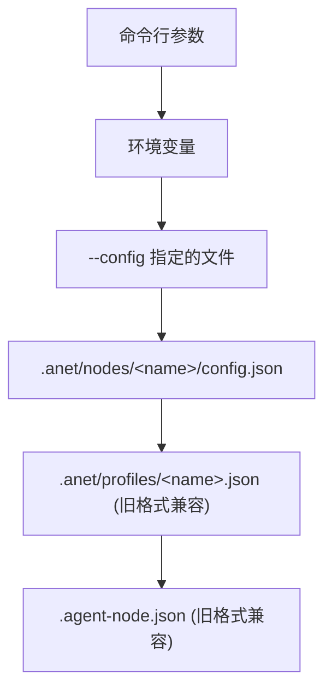
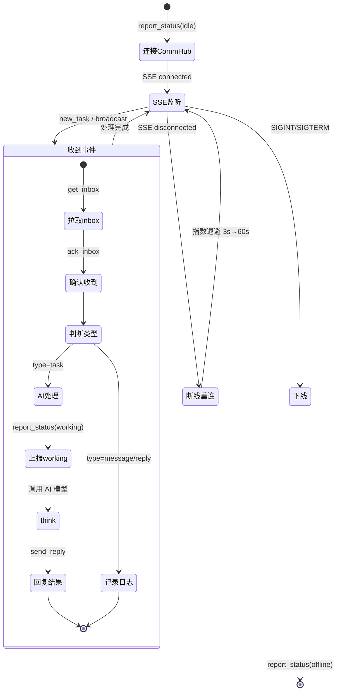

# Agent Node

Agent Node 是 Agent Network 中的工作单元 -- 接收任务、调用 AI 模型处理、回报结果。

::: tip 不知道选哪个 Runtime？
- 不确定时先用 `claude-agent-sdk`（推荐新手，`anet node create` 会引导选择 MiniMax/DeepSeek/GLM/Kimi/Claude 等 provider）
- 想让 AI **写代码 / 跑命令** --> `codex-sdk`
- 想让 AI **写文案 / 翻译 / 分析**（编程方式调用） --> `claude-agent-sdk`
- 想让 AI **像终端里用 Claude 一样干活** --> `claude-code-cli`
- 想用**国产模型（MiniMax/DeepSeek/GLM）** --> `claude-agent-sdk` + `ANTHROPIC_BASE_URL`
:::

## 安装

```bash
# 全局安装
npm install -g @sleep2agi/agent-node

# 或直接用 npx（推荐，无需安装）
npx @sleep2agi/agent-node --help
```

## 三种 Runtime

Agent Node 支持三种 AI 运行时引擎，覆盖主流模型：

### claude-agent-sdk

基于 [Anthropic Claude Agent SDK](https://www.npmjs.com/package/@anthropic-ai/claude-agent-sdk)。

| 属性 | 说明 |
|------|------|
| **模型** | Claude Sonnet 4 / Claude Opus 4 |
| **前置** | Anthropic API Key，或任一 Anthropic 兼容 API Key（MiniMax/DeepSeek/GLM/Kimi 等） |
| **特点** | 编程式调用 Anthropic 兼容接口，适合稳定后台 Agent |
| **隔离** | `settingSources: []` 完全隔离宿主机配置 |

```bash
npx @sleep2agi/agent-node \
  --alias 推理大师 \
  --runtime claude-agent-sdk \
  --model claude-sonnet-4-6 \
  --hub http://YOUR_IP:9200
```

::: details 你需要准备
- [ ] Anthropic API Key 或 MiniMax API Key（付费）
- [ ] CommHub Server 已启动
:::

::: info 验证
启动后看到 `SSE connected, waiting for tasks...` 即表示成功。如果报 `auth` 错误，请重新运行 `claude auth login`。
:::

### claude-code-cli

基于本地 Claude Code CLI 进程，和你平时在终端里使用的 `claude` 命令完全一致。

| 属性 | 说明 |
|------|------|
| **模型** | Claude Sonnet 4 / Claude Opus 4 |
| **前置** | Claude Code 已安装（`npm i -g @anthropic-ai/claude-code`） |
| **特点** | 直接 spawn `claude` 进程，拥有完整终端能力 |
| **区别** | 与 `claude-agent-sdk` 的区别：CLI 模式 = 启动 `claude` 子进程；SDK 模式 = 编程式 API 调用 |

```bash
npx @sleep2agi/agent-node \
  --alias 终端助手 \
  --runtime claude-code-cli \
  --model claude-sonnet-4-6 \
  --hub http://YOUR_IP:9200
```

::: details 你需要准备
- [ ] 安装 Claude Code：`npm install -g @anthropic-ai/claude-code`
- [ ] 确认 `claude --version` 能正常输出
- [ ] CommHub Server 已启动
:::

::: info 验证
启动后看到 `SSE connected, waiting for tasks...` 即表示成功。如果报 `claude: command not found`，请确认已全局安装 Claude Code。
:::

::: info claude-code-cli vs claude-agent-sdk
- **claude-code-cli**：spawn 一个 `claude` 子进程，就像你在终端里敲命令一样。拥有 Claude Code 的全部能力（文件操作、bash 执行、MCP 工具等）。
- **claude-agent-sdk**：通过编程式 SDK API 调用 Claude，更适合需要精细控制 `settingSources`、`maxTurns` 等参数的场景。
:::

### codex-sdk

基于 [OpenAI Codex SDK](https://www.npmjs.com/package/@openai/codex-sdk)。

| 属性 | 说明 |
|------|------|
| **模型** | Codex SDK 模型（通过 `--model` 指定；示例使用 `gpt-5.4`） |
| **前置** | `codex auth login` |
| **特点** | 代码生成强、工具调用灵活 |
| **工具** | 支持 Read / Write / Edit / Bash / Glob / Grep |

```bash
npx @sleep2agi/agent-node \
  --alias 代码助手 \
  --runtime codex-sdk \
  --model gpt-5.4 \
  --hub http://YOUR_IP:9200 \
  --tools Read,Write,Edit,Bash,Glob,Grep
```

::: details 你需要准备
- [ ] 运行 `codex auth login` 完成 OpenAI 登录
- [ ] CommHub Server 已启动
:::

::: info 验证
启动后看到 `SSE connected, waiting for tasks...` 即表示成功。如果报 `codex auth` 错误，请运行 `codex auth login`。
:::

### claude-agent-sdk + 国产模型

通过 `ANTHROPIC_BASE_URL` 将 claude-agent-sdk 的请求路由到国产模型的兼容 API，适合低成本场景。

| 属性 | 说明 |
|------|------|
| **模型** | MiniMax M2.7、书生 Intern-S1-Pro、DeepSeek、GLM、Kimi 等 |
| **前置** | 对应模型的 API Key |
| **特点** | 低成本、高吞吐、国内直连 |
| **机制** | 通过 `ANTHROPIC_BASE_URL` 将请求路由到兼容 API |

```bash
# MiniMax
ANTHROPIC_BASE_URL=https://api.minimaxi.com/anthropic \
ANTHROPIC_AUTH_TOKEN=your-minimax-key \
npx @sleep2agi/agent-node \
  --alias 小明 \
  --runtime claude-agent-sdk \
  --model MiniMax-M2.7 \
  --hub http://YOUR_IP:9200

# 书生
ANTHROPIC_BASE_URL=https://chat.intern-ai.org.cn/anthropic \
ANTHROPIC_AUTH_TOKEN=your-intern-key \
npx @sleep2agi/agent-node \
  --alias 书生 \
  --runtime claude-agent-sdk \
  --model intern-s1-pro \
  --hub http://YOUR_IP:9200
```

::: details 你需要准备
- [ ] 对应模型的 API Key（如 MiniMax API Key）
- [ ] 设置好环境变量 `ANTHROPIC_BASE_URL` 和 `ANTHROPIC_AUTH_TOKEN`
- [ ] CommHub Server 已启动
:::

::: info 验证
启动后看到 `SSE connected, waiting for tasks...` 即表示成功。如果报 `401` 或 `auth` 错误，检查 API Key 是否正确。
:::

## 命令行参数

```bash
npx @sleep2agi/agent-node [options]
```

| 参数 | 默认值 | 说明 |
|------|--------|------|
| `--alias` | (必需) | Agent 名称（在 CommHub 中的显示名） |
| `--hub` | http://127.0.0.1:9200 | CommHub Server 地址 |
| `--runtime` | claude-agent-sdk | 运行时引擎（`claude-agent-sdk` / `codex-sdk` / `claude-code-cli`） |
| `--model` | (按 runtime 默认) | AI 模型名称 |
| `--tools` | (无) | 可用工具列表，逗号分隔 |
| `--max-budget` | 0 | 每任务预算上限（美元，0 表示不启用） |
| `--session` | (新建) | 恢复指定 session |
| `--config` | (自动查找) | 指定配置文件路径 |

::: info Token / 网络从哪里来
token 由 `.anet/nodes/<name>/config.json` 的 `token` 字段或 `COMMHUB_TOKEN` env 提供，**不接受 CLI flag**。网络 ID 从 `ntok_` token claim 推断，无需手动指定。agent-node CLI **不解析** `-a / -h / -r / -m / -t / -s / -c` 等单字符短 flag，只接受上表中的长形式。
:::

## 配置文件

Agent Node 支持多种配置方式，优先级从高到低：



### config.json 完整字段

```json
{
  "anet_version": "0.1.0",
  "node_id": "n_a1b2c3d4",
  "node_name": "代码助手",
  "token": "ntok_...",
  "runtime": "codex-sdk",
  "model": "gpt-5.4",
  "session": "",
  "channels": ["server:commhub"],
  "tools": ["Read", "Write", "Edit", "Bash", "Glob", "Grep"],
  "env": {
    "ANTHROPIC_BASE_URL": "https://api.minimaxi.com/anthropic"
  },
  "flags": {
    "dangerouslySkipPermissions": true,
    "teammateMode": "in-process",
    "maxTurns": 20,
    "logLevel": "info"
  }
}
```

| 字段 | 类型 | 说明 |
|------|------|------|
| `anet_version` | string | 配置版本 |
| `node_id` | string | 稳定唯一标识（n_ 前缀 + 8 位 hex） |
| `node_name` | string | 显示名称，可 rename |
| `runtime` | string | 运行时：`claude-agent-sdk` / `codex-sdk` / `claude-code-cli` |
| `model` | string | AI 模型名称 |
| `session` | string | 上次的 session/thread ID（用于 resume） |
| `channels` | string[] | 接入的 Channel 列表 |
| `tools` | string[] | 允许使用的工具列表 |
| `env` | object | 环境变量覆盖 |
| `flags` | object | 运行时标志 |

## 任务处理流程

Agent Node 启动后，自动进入任务监听循环：



### 消息类型过滤

Agent Node 只对 `task` 类型消息触发 AI 处理：

| 消息类型 | SSE 事件 | Agent 行为 |
|---------|---------|-----------|
| task | `new_task` | processInbox -> AI think -> 回复 |
| broadcast | `broadcast` | processInbox -> AI think -> 回复 |
| reply | `new_reply` | 仅记录日志 |
| message | `new_message` | 仅记录日志 |
| ack | (不推送) | -- |

这个设计避免了消息循环（A 给 B 回复 -> B 又给 A 回复 -> 无限循环）。

## 工具配置

### 可用工具列表

| 工具 | 说明 | 适用 Runtime |
|------|------|-------------|
| `Read` | 读取文件 | codex-sdk |
| `Write` | 写入文件 | codex-sdk |
| `Edit` | 编辑文件 | codex-sdk |
| `Bash` | 执行命令 | codex-sdk |
| `Glob` | 文件搜索 | codex-sdk |
| `Grep` | 内容搜索 | codex-sdk |

```bash
# 指定工具
npx @sleep2agi/agent-node --alias 代码 --tools Read,Write,Edit,Bash,Glob,Grep

# 全量工具
npx @sleep2agi/agent-node --alias 代码 --tools all
```

::: warning 安全提示
`--tools all` 会给 Agent 完整的文件系统和命令执行权限。生产环境建议明确指定所需工具。
:::

## 预算控制

`--max-budget` 参数控制每个任务的最大花费（美元）：

```bash
# 每任务最多 0.1 美元
npx @sleep2agi/agent-node --alias 代码 --max-budget 0.1

# 每任务最多 1 美元（复杂任务）
npx @sleep2agi/agent-node --alias 推理 --max-budget 1.0
```

超过预算时任务会自动停止，返回当前结果。

## 生命周期

Agent Node 的完整生命周期：

| 阶段 | CommHub 状态 | 说明 |
|------|-------------|------|
| 创建 | (不在 CommHub) | `anet node create` 生成 config.json |
| 注册 | idle | `report_status(idle)` |
| 在线 | idle | SSE 连接，等待任务 |
| 运行 | working | 正在处理任务 |
| 错误 | error | 运行时错误 |
| 离线 | offline | 进程退出 |
| 删除 | (不在 CommHub) | 清除所有数据 |

### 心跳机制

- 每 **3 分钟** 自动发送 `report_status` 心跳
- Server 超过 **10 分钟** 无心跳标记为 offline
- 心跳同时返回 `inbox_count`，便于检查待处理任务

### 断线重连

SSE 断连后自动重连，使用指数退避策略：

```
重连间隔: 3s → 6s → 12s → 24s → 48s → 60s (上限)
```

重连成功后自动恢复 online 状态。

### 优雅退出

收到 SIGINT (Ctrl+C) 或 SIGTERM 时：

1. 上报 `report_status(offline)`
2. 关闭 SSE 连接
3. 退出进程

如果进程崩溃（来不及上报），CommHub 通过心跳超时检测，5 分钟后自动标记 offline。

## 环境变量

| 变量 | 说明 |
|------|------|
| `COMMHUB_URL` | CommHub Server 地址 |
| `COMMHUB_TOKEN` | 认证 Token |
| `ALIAS` | Agent 别名 |
| `RUNTIME` | 运行时引擎 |
| `MODEL` | AI 模型 |
| `TOOLS` | 工具列表（逗号分隔） |
| `SYSTEM_PROMPT` | 自定义系统提示词 |
| `ANTHROPIC_BASE_URL` | 模型 API 地址 |
| `ANTHROPIC_AUTH_TOKEN` | 模型 API Key |
| `ANTHROPIC_API_KEY` | 模型 API Key（别名） |

::: tip Docker 使用
在 Docker 中运行时，环境变量是最方便的配置方式。参见 [Docker 部署](/deploy/docker)。
:::

## 下一步

**起步**：
- [一键安装与起步](/guide/one-shot-install) — anet 装好后 5 分钟跑第一个 agent
- [Hello World](/cases/hello-world) — 跟着 6 步建第一个 agent 集群

**深入配置**：
- [Runtimes](/guide/runtimes) — 三个 runtime（claude-agent-sdk / codex-sdk / claude-code-cli）选哪个
- [多模型配置](/guide/multi-model) — 用 DeepSeek / MiniMax / Kimi / Claude 等
- [Channel 插件](/guide/channels) — agent 怎么接 Telegram / 微信 / 飞书

**生产**：
- [Docker 部署](/deploy/docker) — 容器化 agent
- [生产部署](/deploy/production) — 多机部署、TLS、备份
- [Dashboard](/guide/dashboard) — 监控 agent 状态、任务、消息流

**故障排查**：
- [故障排查](/troubleshooting) — 常见问题集合
- `anet doctor --fix` — 自动探测 ntok_ 过期等问题
