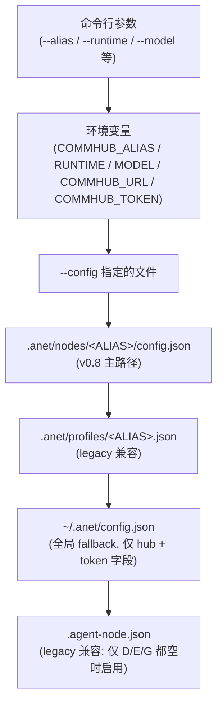
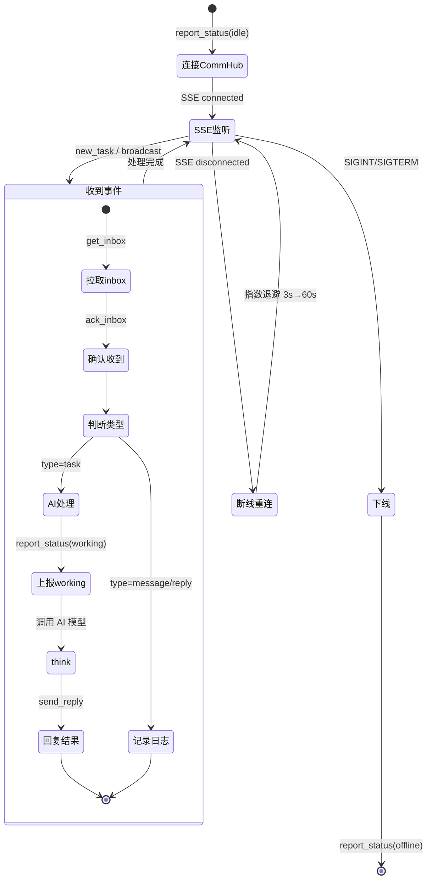

# Agent Node

Agent Node 是 Agent Network 中的工作单元 -- 接收任务、调用 AI 模型处理、回报结果。

::: tip 不知道选哪个 Runtime？
- 不确定时先用 `claude-agent-sdk`（推荐新手）。`anet node create` 交互式**先选供应商（vendor）**：内置 `VENDORS` 列表 = 书生 Intern / MiniMax / 小米 MiMo / Anthropic Claude / Codex / Claude Code CLI / 自定义（custom）—— 每个内置 vendor 都跑通过真 API 验证。**DeepSeek / GLM / Kimi / OpenRouter / vLLM / SiliconFlow / 通义千问等不在内置列表的 Anthropic 兼容 provider 走「自定义」**+ `ANTHROPIC_BASE_URL` env 接入（[完整 provider 表见 multi-model.md](/guide/multi-model)）
- 想让 AI **写代码 / 跑命令** --> `codex-sdk`
- 想让 AI **写文案 / 翻译 / 分析**（编程方式调用） --> `claude-agent-sdk`
- 想让 AI **像终端里用 Claude 一样干活** --> `claude-code-cli`
- 想用**国产模型（MiniMax / DeepSeek / GLM / Kimi / 书生 / 小米 MiMo / OpenRouter 等）** --> `claude-agent-sdk` + `ANTHROPIC_BASE_URL`（[完整 provider 表](/guide/multi-model)）
:::

## 安装

```bash
# 全局安装
npm install -g @sleep2agi/agent-node

# 或直接用 npx（推荐，无需安装）
npx @sleep2agi/agent-node --help
```

## 三种 Runtime

Agent Node 支持三种 AI 运行时引擎，覆盖主流模型：

### claude-agent-sdk

基于 [Anthropic Claude Agent SDK](https://www.npmjs.com/package/@anthropic-ai/claude-agent-sdk)。

| 属性 | 说明 |
|------|------|
| **模型** | 当前主线 Claude Sonnet / Opus / Haiku（具体型号查 [Anthropic 官方](https://docs.anthropic.com/claude/docs/models-overview)） |
| **前置** | Anthropic API Key，或任一 Anthropic 兼容 API Key（MiniMax / DeepSeek / GLM / Kimi / 书生 / 小米 MiMo / OpenRouter 等，完整列表见 [multi-model](/guide/multi-model)） |
| **特点** | 编程式调用 Anthropic 兼容接口，适合稳定后台 Agent |
| **隔离** | `settingSources: []` 完全隔离宿主机配置 |

```bash
npx @sleep2agi/agent-node \
  --alias 推理大师 \
  --runtime claude-agent-sdk \
  --model claude-sonnet-4-6 \
  --hub http://YOUR_IP:9200
```

::: details 你需要准备
- [ ] Anthropic API Key 或 MiniMax API Key（付费）
- [ ] CommHub Server 已启动
:::

::: info 验证
启动后看到 `SSE connected, waiting for tasks...` 即表示成功。如果报 `auth` / `401` / `invalid x-api-key`：检查 `ANTHROPIC_API_KEY`（接 api.anthropic.com）或 `ANTHROPIC_AUTH_TOKEN` + `ANTHROPIC_BASE_URL`（接第三方 Anthropic 兼容 endpoint）env 是否正确设置（详见 [runtimes — 常见坑](/guide/runtimes#claude-agent-sdk)）。`claude auth login` 是给 `claude-code-cli` 用的，跟 SDK 路径无关。
:::

### claude-code-cli

基于本地 Claude Code CLI 进程，和你平时在终端里使用的 `claude` 命令完全一致。

| 属性 | 说明 |
|------|------|
| **模型** | 当前主线 Claude Sonnet / Opus / Haiku（具体型号查 [Anthropic 官方](https://docs.anthropic.com/claude/docs/models-overview)） |
| **前置** | Claude Code 已安装（`npm i -g @anthropic-ai/claude-code`） |
| **特点** | 直接 spawn `claude` 进程，拥有完整终端能力 |
| **区别** | 与 `claude-agent-sdk` 的区别：CLI 模式 = 启动 `claude` 子进程；SDK 模式 = 编程式 API 调用 |

```bash
npx @sleep2agi/agent-node \
  --alias 终端助手 \
  --runtime claude-code-cli \
  --model claude-sonnet-4-6 \
  --hub http://YOUR_IP:9200
```

::: details 你需要准备
- [ ] 安装 Claude Code：`npm install -g @anthropic-ai/claude-code`
- [ ] 确认 `claude --version` 能正常输出
- [ ] 跑过 `claude auth login` 让本机 Claude 订阅生效（claude-code-cli runtime 复用本地登录态）
- [ ] CommHub Server 已启动
:::

::: info 验证
启动后看到 `SSE connected, waiting for tasks...` 即表示成功。
- 如果报 `claude: command not found`，请确认已全局安装 Claude Code
- 如果报 `auth` / 401，请跑 `claude auth login` 重新登录订阅
:::

::: info claude-code-cli vs claude-agent-sdk
- **claude-code-cli**：spawn 一个 `claude` 子进程，就像你在终端里敲命令一样。拥有 Claude Code 的全部能力（文件操作、bash 执行、MCP 工具等）。
- **claude-agent-sdk**：通过编程式 SDK API 调用 Claude，更适合需要精细控制 `settingSources`、`maxTurns` 等参数的场景。
:::

### codex-sdk

基于 [OpenAI Codex SDK](https://www.npmjs.com/package/@openai/codex-sdk)。

| 属性 | 说明 |
|------|------|
| **模型** | Codex SDK 模型（通过 `--model` 指定；具体 model id 查 OpenAI Codex 文档） |
| **前置** | `codex auth login` |
| **特点** | 代码生成强、工具调用灵活 |
| **工具** | Codex CLI 内置 Read / Write / Edit / Bash / Glob / Grep / WebSearch（baked in，**不接受 `--tools` 自定义**；R243 chain 一致） |

```bash
npx @sleep2agi/agent-node \
  --alias 代码助手 \
  --runtime codex-sdk \
  --model <codex-model-id> \
  --hub http://YOUR_IP:9200
# 注：codex-sdk 不接受 --tools flag（静默忽略）。工具集由 codex CLI 二进制 baked in
```

::: details 你需要准备
- [ ] 安装 codex CLI：`npm install -g @openai/codex`（`@openai/codex-sdk` 在 `@sleep2agi/agent-node` 的 optional `peerDependencies` 里，npm 7+ 默认会随 agent-node 一起拉；但 SDK 实际要 spawn `codex` 二进制；详见 [runtimes / codex-sdk 前置](/guide/runtimes#codex-sdk)）
- [ ] 跑 `codex auth login` 完成 OpenAI 登录（或 `export OPENAI_API_KEY=sk-xxx`）
- [ ] CommHub Server 已启动
:::

::: info 验证
启动后看到 `SSE connected, waiting for tasks...` 即表示成功。
- 如果报 `Error: spawn codex ENOENT`，说明 `codex` 二进制不在 PATH 上，跑 `npm install -g @openai/codex` + `which codex` 检查
- 如果报 `codex auth` 错误，请跑 `codex auth login`（或检查 `OPENAI_API_KEY` env）
:::

### claude-agent-sdk + 国产模型

通过 `ANTHROPIC_BASE_URL` 将 claude-agent-sdk 的请求路由到国产模型的兼容 API，适合低成本场景。

| 属性 | 说明 |
|------|------|
| **模型** | MiniMax、DeepSeek、GLM、Kimi、书生 Intern、小米 MiMo、OpenRouter 等任何 Anthropic-compatible endpoint（完整 provider 表见 [多模型配置](/guide/multi-model)） |
| **前置** | 对应模型的 API Key |
| **特点** | 低成本、高吞吐、国内直连 |
| **机制** | 通过 `ANTHROPIC_BASE_URL` 将请求路由到兼容 API |

```bash
# MiniMax
ANTHROPIC_BASE_URL=https://api.minimaxi.com/anthropic \
ANTHROPIC_AUTH_TOKEN=your-minimax-key \
npx @sleep2agi/agent-node \
  --alias 小明 \
  --runtime claude-agent-sdk \
  --model <minimax-model-id> \
  --hub http://YOUR_IP:9200

# 书生（注意：裸域名，无 /anthropic 后缀）
ANTHROPIC_BASE_URL=https://chat.intern-ai.org.cn \
ANTHROPIC_AUTH_TOKEN=your-intern-key \
npx @sleep2agi/agent-node \
  --alias 书生 \
  --runtime claude-agent-sdk \
  --model intern-s1-pro \
  --hub http://YOUR_IP:9200
```

::: details 你需要准备
- [ ] 对应模型的 API Key（如 MiniMax API Key）
- [ ] 设置好环境变量 `ANTHROPIC_BASE_URL` 和 `ANTHROPIC_AUTH_TOKEN`
- [ ] CommHub Server 已启动
:::

::: info 验证
启动后看到 `SSE connected, waiting for tasks...` 即表示成功。如果报 `401` 或 `auth` 错误，检查 API Key 是否正确。
:::

## 命令行参数

```bash
npx @sleep2agi/agent-node [options]
```

| 参数 | 默认值 | 说明 |
|------|--------|------|
| `--alias` | (必需) | Agent 名称（在 CommHub 中的显示名） |
| `--hub` | http://127.0.0.1:9200 | CommHub Server 地址 |
| `--runtime` | claude-agent-sdk | 运行时引擎（`claude-agent-sdk` / `codex-sdk` / `claude-code-cli`） |
| `--model` | (按 runtime 默认) | AI 模型名称 |
| `--tools` | (无) | 可用工具列表，逗号分隔 |
| `--max-budget` | 0 | 每任务预算上限（美元，0 表示不启用） |
| `--session` | (新建) | 恢复指定 session |
| `--config` | (自动查找) | 指定配置文件路径 |

::: info Token / 网络从哪里来
token 由 `.anet/nodes/<name>/config.json` 的 `token` 字段或 `COMMHUB_TOKEN` env 提供，**不接受 CLI flag**。网络 ID 从 `ntok_` token claim 推断，无需手动指定。agent-node CLI **不解析** `-a / -h / -r / -m / -t / -s / -c` 等单字符短 flag，只接受上表中的长形式。
:::

## 配置文件

Agent Node 支持多种配置方式，优先级从高到低（verify [`agent-node/src/cli.ts:100-128`](https://github.com/sleep2agi/agent-network/blob/main/agent-node/src/cli.ts#L100)）：



::: tip 全局 `~/.anet/config.json` fallback
[`cli.ts:123-125`](https://github.com/sleep2agi/agent-network/blob/main/agent-node/src/cli.ts#L123) 在加载完项目 config 后会用全局 `~/.anet/config.json` 的 `hub` 和 `token` 字段填空缺。**只有这两个字段会跨项目 fallback**——`runtime` / `model` / `tools` / `env` 等都必须在项目 `config.json` / CLI / env 提供，全局 config 不接管。跟 [feedback_config_priority] memory 一致（项目字段级覆盖全局，缺失字段 fallback 到全局）。
:::

### config.json 完整字段

```json
{
  "anet_version": "0.1.0",
  "node_id": "n_a1b2c3d4",
  "node_name": "代码助手",
  "token": "ntok_...",
  "runtime": "claude-agent-sdk",
  "model": "<model-id>",
  "session": "",
  "channels": ["server:commhub"],
  "tools": ["Read", "Write", "Edit", "Bash", "Glob", "Grep"],
  "logLevel": "info",
  "env": {
    "ANTHROPIC_BASE_URL": "https://api.minimaxi.com/anthropic"
  },
  "flags": {
    "dangerouslySkipPermissions": true,
    "teammateMode": "in-process",
    "maxTurns": 20
  }
}
```

| 字段 | 类型 | 说明 |
|------|------|------|
| `anet_version` | string | 配置版本 |
| `node_id` | string | 稳定唯一标识（n_ 前缀 + 8 位 hex） |
| `node_name` | string | 显示名称，可 rename |
| `alias` | string | 节点别名（`.anet/nodes/<alias>/` 目录名 + CommHub 上的显示标识；不单独设时等于 `node_name`） |
| `runtime` | string | 运行时：`claude-agent-sdk` / `codex-sdk` / `claude-code-cli` |
| `model` | string | AI 模型名称 |
| `session` | string | session/thread ID。`claude-code-cli` runtime 下由 `anet node create` 预生成 UUID（首次 start 用 `--session-id <uuid>` 绑定，重启自动 `--resume <uuid>` 续会话；v0.8.2 修了之前默认丢 session 的 bug）；其他 runtime 是上次 session ID 用作 resume |
| `channels` | string[] | 接入的 Channel 列表 |
| `tools` | string[] | 允许使用的工具列表。**仅 `claude-agent-sdk` 生效**；`codex-sdk` 静默忽略（工具集 baked in codex 二进制，见上方 L109 注 + [runtimes#codex-sdk](/guide/runtimes#codex-sdk)）|
| `env` | object | 环境变量覆盖 |
| `flags` | object | 运行时标志 |
| `hub` | string | CommHub Server 地址覆盖（不设时 fallback 到全局 `~/.anet/config.json` 的 `hub`） |
| `token` | string | 认证 Token 覆盖（不设时 fallback 到全局 config 的 `token`） |
| `network_id` | string | 所属网络 ID（多数情况靠 `ntok_` 推断，不需手填） |
| `systemPrompt` | string | 系统提示词，拼到每个任务前（也可用 `--prompt` flag；env `SYSTEM_PROMPT` **不读**，见上方 R242 注） |

## 任务处理流程

Agent Node 启动后，自动进入任务监听循环：



### 消息类型过滤

Agent Node 只对 `task` 类型消息触发 AI 处理：

| 消息类型 | SSE 事件 | Agent 行为 |
|---------|---------|-----------|
| task | `new_task` | processInbox -> AI think -> 回复 |
| broadcast | `broadcast` | processInbox -> AI think -> 回复 |
| reply | `new_reply` | 仅记录日志 |
| message | `new_message` | 仅记录日志 |
| ack | (不推送) | -- |

这个设计避免了消息循环（A 给 B 回复 -> B 又给 A 回复 -> 无限循环）。

## 工具配置

### 默认 = Claude Code preset 全集（v0.9.0+，#101 Option B）

从 [#101](https://github.com/sleep2agi/agent-network/issues/101) Option B 起（agent-node v2.3.6+），`claude-agent-sdk` runtime **默认 toolset 是 Claude Code preset 全集**，不再是空集。每个节点 spawn 后立刻可调：

- 文件系统：`Read` / `Write` / `Edit` / `Glob` / `Grep`
- Shell：`Bash`（受 `dangerouslySkipPermissions=true` 默认开启影响，不弹确认）
- 网络：`WebFetch` / `WebSearch`
- 子任务 / 笔记本：`Task` / `NotebookEdit` / ...

加上 hub 端 17 个 MCP 工具（`commhub_send_task` / `commhub_reply` / ...）。

> **Root cause** ([#101](https://github.com/sleep2agi/agent-network/issues/101))：老版本 `config.json` 无 `tools` 字段时 agent-node 传 SDK `options.tools = undefined`，SDK 解读为「零内建工具」，agent 只能调 MCP 工具，被问 WebFetch / Bash / Read 时会幻觉「网络受限」。Option B 强制 fallback 到 SDK `{ type: 'preset', preset: 'claude_code' }` sentinel —— SDK 类型定义里这是「给我全套 Claude Code 工具」的标准表达（`sdk.d.ts:1229-1238`）。

### 三种 `--tools` 行为（仅 `claude-agent-sdk` runtime）

`--tools` flag 只控制 `claude-agent-sdk` runtime —— `codex-sdk` 的工具集由 codex CLI baked in（`Read/Write/Edit/Bash/Grep/Glob/WebSearch`，**不接受** `--tools`）；`claude-code-cli` 共享本机 Claude Code 工具集，也不通过这个 flag 选（R243 chain）。

| 输入 | 实际效果 | verify |
|------|---------|--------|
| `--tools all` | SDK preset 全集（同上）—— 单一 source-of-truth | [`cli.ts:219`](https://github.com/sleep2agi/agent-network/blob/main/agent-node/src/cli.ts#L219) |
| `--tools Read,Glob,Grep` | 显式 allowlist（字符串数组），跳过 preset —— 严格 sandbox 用 | [`cli.ts:217,220`](https://github.com/sleep2agi/agent-network/blob/main/agent-node/src/cli.ts#L217) |
| 未传 / 空字符串 | **fallback 到 preset 全集**（#101 fix；老版本是 `undefined` → 空集） | [`cli.ts:216,221`](https://github.com/sleep2agi/agent-network/blob/main/agent-node/src/cli.ts#L216) |

源码实际逻辑（[`agent-node/src/cli.ts:210-221`](https://github.com/sleep2agi/agent-network/blob/main/agent-node/src/cli.ts#L210)）：

```ts
const TOOLS_PRESET = { type: "preset" as const, preset: "claude_code" as const };
// Behaviour matrix (sdk.d.ts:1229-1238):
//   --tools "all"       → SDK preset (full Claude Code tool set)
//   --tools "Read,Bash" → explicit allowlist
//   --tools "" (absent) → SDK preset (the #101 fix; previously left empty)
const TOOLS_EXPLICIT = toolsRaw === "all" ? null : toolsRaw.split(",").filter(Boolean);
let TOOLS: string[] | typeof TOOLS_PRESET =
  toolsRaw === "all" ? TOOLS_PRESET
  : (TOOLS_EXPLICIT && TOOLS_EXPLICIT.length) ? TOOLS_EXPLICIT
  : TOOLS_PRESET;
// ... cli.ts:653: tools: TOOLS  ← 传给 claude-agent-sdk query options（preset 或 string[]）
```

```bash
# 默认（不传 --tools）→ Claude Code preset 全集
npx @sleep2agi/agent-node --alias 代码

# 显式 "all" → 同 preset（单一 source-of-truth，不是老版的硬编码 8-tool 列表）
npx @sleep2agi/agent-node --alias 代码 --tools all

# 显式 allowlist（只读 agent）→ 跳过 preset，给字符串数组
npx @sleep2agi/agent-node --alias 代码 --tools Read,Glob,Grep

# codex-sdk runtime 不接受 --tools（会被静默忽略）
npx @sleep2agi/agent-node --alias 代码 --runtime codex-sdk
# codex 内置 Read/Write/Edit/Bash/Grep/Glob/WebSearch 全套, 无法剥离
```

### `anet node create` 行为披露 banner（Vincent 4927 push）

`anet node create <alias>` 成功后 print **行为披露 banner**：built-in tools 清单（具体 list 或 `all (Claude Code preset)`）+ MCP tools + 当前 flags（`dangerouslySkipPermissions=true` / `teammateMode=true`）+ 一行 "agent 可读写文件、跑 shell、访问网络"。banner 在 [agent-network/bin/cli.ts](https://github.com/sleep2agi/agent-network/blob/main/agent-network/bin/cli.ts) `createCommand` 末尾打印 —— 让你**看清你创建了一个能干啥的 agent**，主动决定 sandboxing。

> **⚠ User responsibility**：默认 preset + 默认 `dangerouslySkipPermissions=true` 意味着 agent 启动后**能改文件、跑 shell、访问网络且不弹确认**。详见 [安全设计 → 工具权限](/concepts/security#工具权限默认-claude-code-preset-user-responsibility)。

::: warning 安全提示
- 默认 preset 全集 + 默认 yolo mode（`dangerouslySkipPermissions`）—— 别在 `$HOME` 直接跑 agent，用一次性工作目录
- 严格 sandbox 时 `--tools Read,Glob,Grep` 只给只读
- 关 yolo 用 `anet node create --no-skip-permissions`（长任务每个工具调用都弹确认）
- 预算限制 `--max-budget 0.1`（见下方 [预算控制](#预算控制)）
:::

### Vendor 适配层（书生 intern 等）

`claude-agent-sdk` 在某些厂商 endpoint 走 RLHF 默认会偏离 Anthropic 标准（典型：intern-s2-preview 不发 `tool_use` content blocks 改走 verbose Thinking Process）。agent-node 通过 **vendor adapter** 按 `ANTHROPIC_BASE_URL` 检测 + 注入 system-prompt bias 修正行为 —— 详见 [Vendor 适配层](/concepts/vendor-adapters)（含 5 副作用 + opt-out 路径）。

## 预算控制

`--max-budget` 参数控制每个任务的最大花费（美元）—— **只对 `claude-agent-sdk` runtime 生效**：

```bash
# 每任务最多 0.1 美元 (claude-agent-sdk)
npx @sleep2agi/agent-node --alias 代码 --max-budget 0.1

# 每任务最多 1 美元（复杂任务）
npx @sleep2agi/agent-node --alias 推理 --max-budget 1.0
```

verify [`agent-node/src/cli.ts:580`](https://github.com/sleep2agi/agent-network/blob/main/agent-node/src/cli.ts#L580):
```ts
if (MAX_BUDGET > 0) options.maxBudgetUsd = MAX_BUDGET;  // 传给 claude-agent-sdk query options
```

claude-agent-sdk 在 `SDKResultMessage.total_cost_usd` 达到 `maxBudgetUsd` 时自动结束当前 turn，task 状态走 `error_max_budget`。

::: warning codex-sdk / claude-code-cli runtime 不支持 budget cap
- `codex-sdk` 路径（[`cli.ts:669-755 processWithCodex`](https://github.com/sleep2agi/agent-network/blob/main/agent-node/src/cli.ts#L669)）没读 `MAX_BUDGET`，**`--max-budget` 静默忽略**；codex-sdk 仅返 token 数（`TurnCompletedEvent.usage`）不返美金，预算控制要你自己跟价表算（R215 sdk-deep-dive chain 一致）
- `claude-code-cli` 走本机 Claude Code 订阅，按订阅 quota 不按美金算
- **跨 runtime 通用预算控制**：前置反向代理（nginx / Cloudflare / litellm proxy）按 model API 调用次数限流
:::

## 生命周期

Agent Node 的完整生命周期：

| 阶段 | CommHub 状态 | 说明 |
|------|-------------|------|
| 创建 | (不在 CommHub) | `anet node create` 生成 config.json |
| 注册 | idle | `report_status(idle)` |
| 在线 | idle | SSE 连接，等待任务 |
| 运行 | working | 正在处理任务 |
| 错误 | error | 运行时错误 |
| 离线 | offline | 进程退出 |
| 删除 | (不在 CommHub) | 清除所有数据 |

### 心跳机制

- 每 **3 分钟** 自动发送 `report_status` 心跳
- Server 超过 **10 分钟** 无心跳标记为 offline
- 心跳同时返回 `inbox_count`，便于检查待处理任务

### 断线重连

SSE 断连后自动重连，使用指数退避策略：

```
重连间隔: 3s → 6s → 12s → 24s → 48s → 60s (上限)
```

重连成功后自动恢复 online 状态。

### 优雅退出

收到 SIGINT (Ctrl+C) 或 SIGTERM 时：

1. 上报 `report_status(offline)`
2. 关闭 SSE 连接
3. 退出进程

如果进程崩溃（来不及上报），CommHub 通过心跳超时检测，**10 分钟**后自动标记 offline（verify [`server/src/index.ts:816-821`](https://github.com/sleep2agi/agent-network/blob/main/server/src/index.ts#L816) `Date.now() - 10 * 60 * 1000` cutoff，惰性触发于 `/api/status` 调用时；R219 chain 一致）。

## 环境变量

仅列 agent-node 实际从 `process.env` 读的字段（verify [`agent-node/src/cli.ts:100-260`](https://github.com/sleep2agi/agent-network/blob/main/agent-node/src/cli.ts#L100)）：

| 变量 | 等价 CLI flag / config 字段 | 说明 |
|------|------------------------------|------|
| `COMMHUB_URL` | `--hub` / `--url` / `config.hub` | CommHub Server 地址（cli.ts:158） |
| `COMMHUB_TOKEN` | `config.token` / `globalConfig.token` | 认证 Token（cli.ts:186；**不接受 CLI flag**） |
| `COMMHUB_ALIAS` / `ALIAS` | `--alias` / `config.alias` | Agent 别名，两个 env 名都接受（cli.ts:109） |
| `RUNTIME` | `--runtime` / `config.runtime` | 运行时引擎，默认 `claude-agent-sdk` |
| `MODEL` | `--model` / `config.model` | AI 模型 |
| `LOG_LEVEL` | `--log-level` / `config.logLevel`（**top-level**，不在 `flags` 里） | `debug` / `info` / `warn` / `error`，R211 chain 一致 |
| `ANET_NETWORK_ID` | `config.network_id` / `globalConfig.network_id` | network ID 兜底（多数情况靠 ntok_ 推断，不需手填；cli.ts:356） |
| `TELEGRAM_BOT_TOKEN` | channel `.env` / `config.env.TELEGRAM_BOT_TOKEN` | Telegram channel 的 bot token —— agent-node 在 telegram channel 启动路径直接读（cli.ts:259）；白名单走 `access.json` 不走 env（见 [Channel — Telegram](/guide/channels#telegram-channel)） |
| `CLAUDE_TIMEOUT_MS` | `--claude-timeout-ms` / `config.flags.claudeTimeoutMs` / `config.claudeTimeoutMs` | `claude-agent-sdk` runtime 单次 query 超时（毫秒），默认 **`300000`（300s）**（[#132 Tier 1](https://github.com/sleep2agi/agent-network/issues/132) v0.9.2 起从 120s 提升 —— [SDK concurrency investigation](https://github.com/sleep2agi/agent-network/blob/main/docs/research/sdk-concurrency-investigation.md) 实测 fan-out 高并发场景 intern API 单次 latency 拉到 17-37s，120s 老 ceiling 中途触发 abort 导致 25/30 子 agent 失败）；超时 abort + 返回错误，提示检查 `ANTHROPIC_BASE_URL` 是否可达。verify [`agent-node/src/cli.ts:241-243`](https://github.com/sleep2agi/agent-network/blob/main/agent-node/src/cli.ts#L241) |
| `CLAUDE_MAX_RETRIES` | `--claude-max-retries` / `config.flags.claudeMaxRetries` / `config.claudeMaxRetries` | `claude-agent-sdk` runtime 单 query 失败时的重试次数，默认 **`2`**（共 3 attempts 含 initial）。每次 attempt 跑满 `CLAUDE_TIMEOUT_MS` window；transient error / timeout backoff `4s, 8s + 0-1s jitter`（jitter 散开 herd retries 防一窝蜂打 vendor queue）。**auth-class 错误不 retry**（[#129 fast-fail](https://github.com/sleep2agi/agent-network/issues/129)：`isAuthError` regex 命中 401 / 403 / `invalid_api_key` / intern A02xx 等直接 FATAL 返回 vendor-specific URL hint）。设 `0` 退回 v0.9.1 行为（no retry）。[#132 Tier 1](https://github.com/sleep2agi/agent-network/issues/132) v0.9.2 起引入。verify [`agent-node/src/cli.ts:250-253`](https://github.com/sleep2agi/agent-network/blob/main/agent-node/src/cli.ts#L250) + retry loop [`cli.ts:729-792`](https://github.com/sleep2agi/agent-network/blob/main/agent-node/src/cli.ts#L729) |
| `ANET_CODEX_STDIO_DIRECT` | env only（无 CLI flag / config 字段；per-spawn 注入）| **v0.10.0 起，仅 `runtime=codex` 时生效**（claude-agent-sdk / claude-code-cli 忽略）。设 `=1` 把 codex runtime 从 `@openai/codex-sdk` wrapper 切到**直 stdio JSON-RPC 客户端**路径：agent-node `spawn('codex', ['app-server'])` + ~155 LOC stdio client + 完整 67-method v2 protocol surface（thread / turn / item / realtime），**绕开** wrapper `--mcp-config` HTTP transport bug 链（[#102](https://github.com/sleep2agi/agent-network/issues/102) hang root cause family）。v0.10.0 **默认仍走 wrapper**（preview 反馈窗口 + backward compat）；v0.11.0 计划 default flip，届时 toggle 改成 `ANET_CODEX_LEGACY_SDK=1` opt-out 反向开关（per [`agent-node/src/cli.ts:1043-1048` 注释](https://github.com/sleep2agi/agent-network/blob/main/agent-node/src/cli.ts#L1043)）。[#141](https://github.com/sleep2agi/agent-network/issues/141) v0.10.0 起引入。verify [`agent-node/src/cli.ts:1048` `if (process.env.ANET_CODEX_STDIO_DIRECT === "1")`](https://github.com/sleep2agi/agent-network/blob/main/agent-node/src/cli.ts#L1048) |
| `ANTHROPIC_BASE_URL` | `config.env.ANTHROPIC_BASE_URL` | 模型 API 地址（接第三方 Anthropic 兼容 endpoint 时必填） |
| `ANTHROPIC_AUTH_TOKEN` | `config.env.ANTHROPIC_AUTH_TOKEN` | 模型 API Key —— **第三方 Anthropic 兼容 endpoint**（MiniMax / DeepSeek / GLM / Kimi / 书生 / 小米 MiMo / OpenRouter / vLLM 等）走这个 |
| `ANTHROPIC_API_KEY` | `config.env.ANTHROPIC_API_KEY` | 模型 API Key —— **api.anthropic.com 直连专用**，不要拿来传第三方 endpoint key（详见 [runtimes — claude-agent-sdk 常见坑](/guide/runtimes#claude-agent-sdk)） |

::: warning `TOOLS` / `SYSTEM_PROMPT` env vars 不存在
R242 校准：旧 doc 列的 `TOOLS` / `SYSTEM_PROMPT` 这两个 env var **agent-node 不读**（verify cli.ts:161 `toolsRaw = opts.tools || fileConfig.tools` 没 `process.env.TOOLS`；cli.ts:180 `SYSTEM_PROMPT = opts.prompt || fileConfig.systemPrompt` 没 env）。要设置 tools 用 `--tools` CLI flag 或 `config.json` 的 `tools` 字段；系统提示词用 `--prompt` flag 或 `config.json` 的 `systemPrompt` 字段。
:::

::: tip Docker 使用
在 Docker 中运行时，环境变量是最方便的配置方式。参见 [Docker 部署](/deploy/docker)。
:::

## 下一步

**起步**：
- [一键安装与起步](/guide/one-shot-install) — anet 装好后 5 分钟跑第一个 agent
- [Hello World](/cases/hello-world) — 跟着 6 步建第一个 agent 集群

**深入配置**：
- [Runtimes](/guide/runtimes) — 三个 runtime（claude-agent-sdk / codex-sdk / claude-code-cli）选哪个
- [多模型配置](/guide/multi-model) — 用 DeepSeek / MiniMax / Kimi / Claude 等
- [Channel 插件](/guide/channels) — agent 怎么接 Telegram / 微信 / 飞书

**生产**：
- [Docker 部署](/deploy/docker) — 容器化 agent
- [生产部署](/deploy/production) — 多机部署、TLS、备份
- [Dashboard](/guide/dashboard) — 监控 agent 状态、任务、消息流

**故障排查**：
- [故障排查](/troubleshooting) — 常见问题集合
- `anet doctor --fix` — 自动探测 ntok_ 过期等问题
