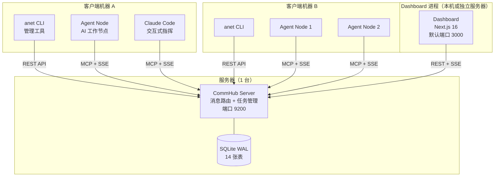
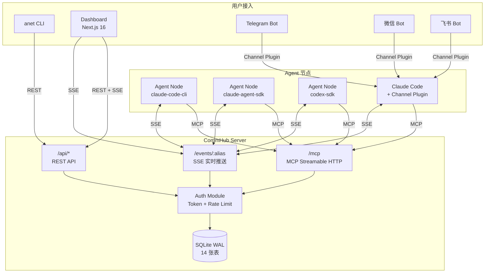
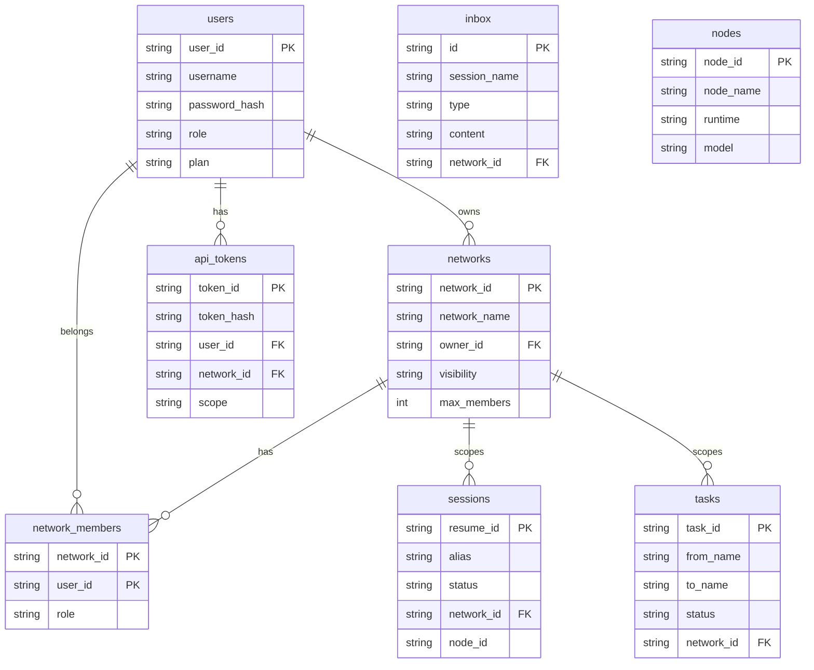
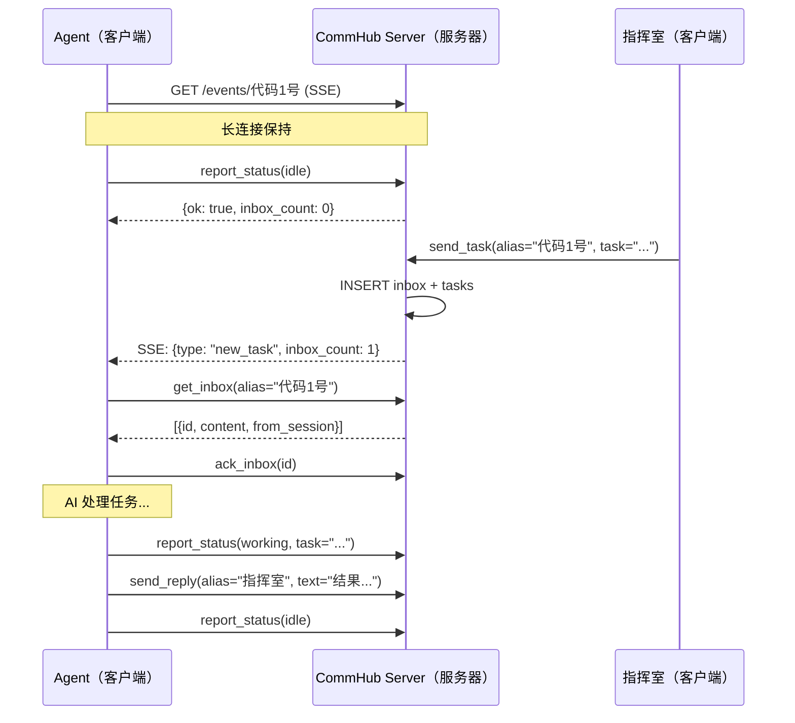
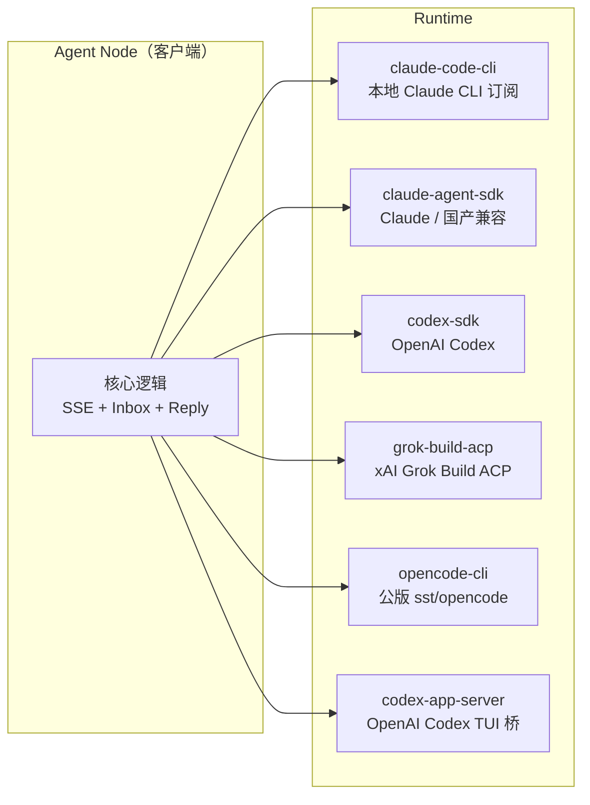
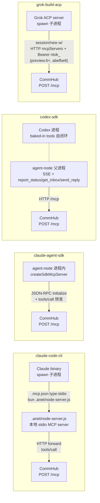
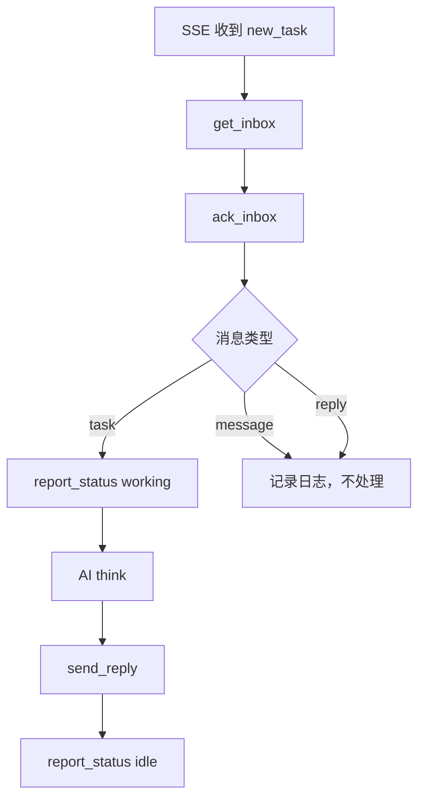
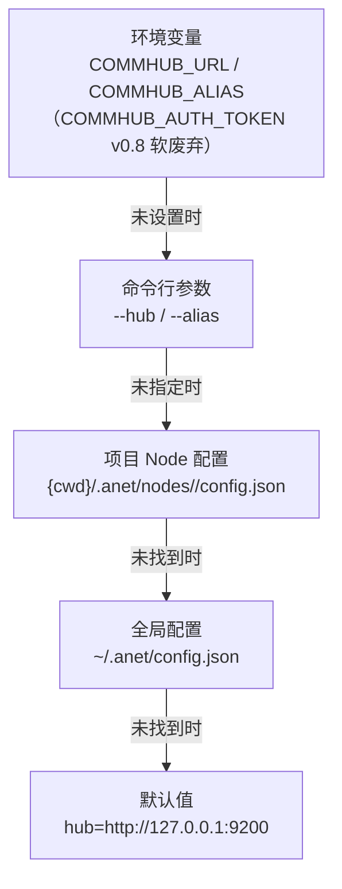

# 架构概览

## 部署视角：什么跑在哪？

在深入技术细节之前，先搞清楚每个组件跑在哪。Agent Network 是 **Server-Client 架构**，一个中心 Server 连接多个分布式 Agent 客户端。

### 部署拓扑图



### 组件部署速查表

| 组件 | 跑在哪 | 端口 | 作用 | npm 包 |
|------|--------|------|------|--------|
| **CommHub Server** | 服务器（1 台） | `9200` | 消息路由、任务管理、认证、数据库 | `@sleep2agi/commhub-server` |
| **Dashboard** | 本机或独立服务器 | `3000`（默认） | Web UI（主导航：Nodes / Overview / Schedules / SkillHub / Tasks / Servers / Providers / Admin / Settings；ChatPanel 内嵌于节点/总览交互，不是独立页面。详见 [Dashboard 文档](/guide/dashboard#页面一览)） | `@sleep2agi/agent-network-dashboard` |
| **anet CLI** | 每台客户端机器 | -- | 管理命令行工具（完整命令清单见 [CLI 命令参考](/guide/cli)） | `@sleep2agi/agent-network` |
| **Agent Node** | 每台客户端机器 | -- | AI 工作节点（接任务、调 AI、回结果） | `@sleep2agi/agent-node` |
| **Claude Code** | 客户端机器 | -- | 交互式 AI 开发（通过 MCP 接入网络） | Anthropic 官方 |
| **Channel 插件** | 客户端机器 | -- | 接入 Telegram（v0.8 stable）；微信 / 飞书走外部 MCP 插件（[详见 channels.md](/guide/channels)） | `channel/` |

### 端口说明

| 端口 | 组件 | 协议 | 说明 |
|------|------|------|------|
| **9200** | CommHub Server | HTTP | MCP (`POST /mcp`)、SSE (`GET /events/:alias`)、REST (`/api/*`) |
| **3000** | Dashboard | HTTP | `anet hub dashboard` 默认端口 |

### 本地 vs 生产

| | 本地开发 | 生产部署 |
|---|---------|---------|
| CommHub Server | 本机 `localhost:9200` | 服务器 `YOUR_IP:9200` |
| Agent Node | 本机，`--hub localhost:9200` | 客户端机器，`--hub YOUR_IP:9200` |
| Dashboard | `localhost:3000` | `YOUR_IP:3000` 或独立部署 |
| 数据库 | 本机 SQLite 文件 | 服务器 SQLite 文件 |
| 通信 | 全部走 localhost | 走内网/公网 IP |

---

## 系统架构

Agent Network 采用中心化消息路由架构，所有 Agent 通过 CommHub Server 进行通信。



## 四个 npm 包

Agent Network 由四个 npm 包组成，职责清晰：

| 包名 | 用途 | 安装方式 |
|------|------|---------|
| `@sleep2agi/agent-network` | **anet CLI** -- 配置管理、启动服务、状态监控 | `npm i -g @sleep2agi/agent-network` |
| `@sleep2agi/agent-node` | **Agent 运行时** -- AI 模型 + 工具调用 + 任务处理 | `anet node create` + `anet node start` |
| `@sleep2agi/commhub-server` | **通信中枢** -- 消息路由 + SSE 推送 + 任务管理 | `anet hub start` |
| `@sleep2agi/agent-network-dashboard` | **Web Dashboard** -- 可视化监控 + 任务管理（Nodes / Overview / Schedules / SkillHub / Tasks / Servers / Providers / Admin / Settings；ChatPanel 为内嵌面板） | `anet hub dashboard`（CLI 自动拉起）|

这些包可以独立使用，也可以配合使用：

- **只需 CLI 管控**：安装 `@sleep2agi/agent-network`
- **只需 Agent 运行时**：`anet node create` + `anet node start`
- **只需通信服务**：`bunx @sleep2agi/commhub-server`
- **只需 Web 界面**：`anet hub dashboard`

完整版本号体系（npm 包独立 semver vs `v0.10.x` bundle release 锚点）见 [版本号体系](/guide/versioning)。

## CommHub Server

CommHub Server 是整个系统的核心，负责消息路由、状态管理、任务追踪。

**部署位置**：服务器（1 台），所有客户端 Agent 连向它。

### 三重协议

| 协议 | 端点 | 用途 | 认证 |
|------|------|------|------|
| **MCP Streamable HTTP** | `POST /mcp` | Agent 调用工具（send_task, report_status 等） | Bearer Token |
| **SSE** | `GET /events/:alias` | 实时推送任务/消息给 Agent | Bearer Token |
| **REST** | `GET/POST /api/*` | Dashboard / CLI / 外部集成 | Bearer Token |

::: tip v0.10.0 新增 — 守护节点 observability endpoint family（[#99](https://github.com/sleep2agi/agent-network/issues/99) Phase 1 scaffold，commhub-server `0.8.2`，**默认路径需 `agent-network@2.2.1+`**）
REST 层新增**单机 health + agent 列表**两个 endpoint，给 dashboard ServersDrawer + 监控脚本 / 外部 observability 集成用：

- `GET /api/server/:host/health` — 单 host 当前健康快照（CPU / mem / disk + 24h 分桶 history `5m`/`1h`/`24h`）+ `alert_level`
- `GET /api/server/:host/agents` — 单 host 上 agent 列表 + per-agent `process_telemetry`（`rss` / `cpu_pct` / `uptime_seconds` / `in_flight_count`，[#142](https://github.com/sleep2agi/agent-network/issues/142) ship in `agent-node@2.4.0` + server schema align in `commhub-server@0.8.2`）

**版本要求**：`anet hub start` 默认路径要拿到这两个 endpoint 需 `agent-network ≥ 2.2.1`（[v0.10.1 hotfix](/changelog#v0-10-1-—-hotfix-pinned-server-version-跟-v0-10-0-ship-chain-bump-2026-05-17-✅-stable) `PINNED_SERVER_VERSION` bump `0.8.0` → `0.8.2`）。

**v0.10.2 Hero A 补**：`agent-node ≥ 2.4.1` 加 host **disk telemetry** —— `latest.disk_total_gb` / `disk_used_gb` / `disk_avail_gb`（`execFileSync('df', ['-k', '/'])`，Linux/macOS 同 POSIX path，Windows / 解析失败 graceful `null`）+ `alert_level` 加 `disk_avail < 1GB critical` / `< 5GB warn` 触发 + 24h history bucket 加 `disk_avail_min` / `disk_used_max` 极值聚合，完成 [#99 守护节点 Phase 2 host metrics 闭环 final 10%](https://github.com/sleep2agi/agent-network/issues/99)。

控制层（kill / restart / redeploy）defer 到 v0.11.0。详见 [REST API — server endpoint family](/api/rest#get-api-server-host-health)。
:::

### MCP 工具分组

CommHub 为 agent 提供 17 个核心 MCP Tools，分为两组：

**Agent 端工具（4 个）** -- Agent 上报状态、拉取任务：

| 工具 | 说明 |
|------|------|
| `report_status` | 心跳 + 状态上报（idle/working/error） |
| `report_completion` | 任务完成汇报 + 结果 |
| `get_inbox` | 拉取待处理的消息 |
| `ack_inbox` | 确认消息已接收 |

**Hub 端工具（13 个）** -- 指挥室/Dashboard 管理任务：

| 工具 | 说明 |
|------|------|
| `send_task` | 派发任务（带生命周期） |
| `send_message` | 发消息（不触发处理） |
| `send_reply` | 回复任务结果 |
| `send_ack` | 确认任务收到 |
| `retry_task` | 重试失败任务 |
| `cancel_task` | 取消待处理任务 |
| `reassign_task` | 转移任务到另一个 Agent |
| `get_task` | 查询任务详情 |
| `list_tasks` | 查询任务列表 |
| `get_all_status` | 获取所有 Session 状态 |
| `get_session_status` | 获取单个 Session 详情 |
| `broadcast` | 群发消息 |
| `get_completions` | 查询完成记录 |

### 数据库设计

SQLite WAL 模式，14 张表：



其他表：`completions`（完成记录）、`task_events`（任务事件日志）、`audit_log`（审计日志）、`licenses`（授权）、`network_invites`（邀请码）、`rename_txn`（RFC-010 节点改名两阶段事务状态：`prepared` / `committed` / `aborted`）。

### SSE 推送机制

Agent 通过 SSE 长连接实时接收任务，不需要轮询：



### 心跳与超时

- Agent 每 **3 分钟** 发送心跳（`report_status`）
- Server 每次请求更新 `last_seen_at`
- 超过 **10 分钟** 无心跳，自动标记为 `offline`
- SSE 断连后自动重连（[#202](https://github.com/sleep2agi/agent-network/issues/202)：指数退避 `1s → 30s` 上限 + 重连即重 register + 1h 失败放弃，[详见 agent-node](/guide/agent-node#断线重连)）

## Agent Node

Agent Node 是网络中的工作单元，负责接收任务、调用 AI 模型处理、回报结果。

**部署位置**：客户端机器（可多台），通过网络连接 CommHub Server。

### Runtime 一览

::: tip 正式版 4 种 / 预览版 6 种
下图与表含全部 runtime；标 *(preview)* 的仅预览版可用，正式版 `anet node create` 选不到（渠道可用性见 [runtimes canonical 表](/guide/runtimes#runtime-对比-canonical-表)）。
:::



| Runtime | AI 引擎 | 适用场景 | 模型 |
|---------|---------|---------|------|
| `claude-code-cli` | spawn 本机 `claude` 进程 | 复用 Claude 订阅 / 终端交互式工具调用 | Claude Sonnet/Opus（订阅） |
| `claude-agent-sdk` | Anthropic Claude Agent SDK | 编程式调任何 Anthropic 兼容 API | Anthropic / MiniMax / DeepSeek / GLM / Kimi / 书生 / 小米 MiMo / OpenRouter（详见 [多模型配置](/guide/multi-model)） |
| `codex-sdk` | OpenAI Codex SDK（v0.10.0 起可 opt-in 直 stdio 路径，见下） | 代码生成、工具调用 | OpenAI Codex |
| `grok-build-acp` | spawn 本机 `grok` ACP server | xAI Grok Build ACP 协议跨 agent 协作 | xAI Grok (grok-build 系列)（[详见 GitHub ↗](https://github.com/sleep2agi/agent-network/blob/main/docs/grok-build-runtime.md)） |
| `opencode-cli` *(preview)* | spawn 本机 `opencode` 命令（公版 sst/opencode CLI） | 用 opencode 当多 vendor 前端（统一 session/auth 抽象，[RFC-029](https://github.com/sleep2agi/agent-network/blob/main/docs/rfcs/RFC-029-opencode-runtime-integration.md)） | 多 vendor：Anthropic 原生 / OpenAI preset |
| `codex-app-server` *(preview)* | 起/adopt codex app-server 桥（[RFC-030](https://github.com/sleep2agi/agent-network/blob/main/docs/rfcs/RFC-030-codex-tui-bridge.md)） | 人机共存：人和 agent 共用同一个 codex 会话 | OpenAI Codex（默认 gpt-5.6-sol） |

::: tip v0.10.0 新增 — `codex-direct-stdio` opt-in 路径（[#141](https://github.com/sleep2agi/agent-network/issues/141)）
设 `ANET_CODEX_STDIO_DIRECT=1`，agent-node 把 codex runtime 从 `@openai/codex-sdk` wrapper 切到 **`spawn('codex', ['app-server'])` + ~155 LOC 直 stdio JSON-RPC 客户端**，拿到完整 67-method v2 protocol surface（thread / turn / item / realtime），**绕开** wrapper `--mcp-config` HTTP transport bug 链（[#102](https://github.com/sleep2agi/agent-network/issues/102) hang root cause family）。**v0.10.x（含当前 stable）默认仍走 wrapper**；v0.11.0 计划 default flip + toggle 改成 `ANET_CODEX_LEGACY_SDK=1` opt-out 反向开关。LLM 侧看到的工具集**不变**（codex thread 仍只用 baked-in 工具，commhub roundtrip 仍由 agent-node 父进程承担），变的只是 agent-node ↔ codex 进程间的**传输协议**。详见 [runtimes — codex-sdk § codex-direct-stdio](/guide/runtimes#codex-sdk) + [agent-node — 环境变量 § ANET_CODEX_STDIO_DIRECT](/guide/agent-node#环境变量) + [v0.10.0 GitHub release notes](https://github.com/sleep2agi/agent-network/releases/tag/v0.10.0)。
:::

### MCP 接入路径（不同 runtime 不同走法，v0.9.0+）

各 runtime 给 LLM 暴露 commhub 工具的方式**不同**，对 LLM 看到的工具名 / 排错路径都有影响（下图画了 4 个 MCP-injected/proxy 的走法；`opencode-cli` 与 `codex-sdk` 同属**父进程中介**模型、`codex-app-server`(preview) 走 codex app-server 的 **HTTP MCP 注入**，都在图后说明）：



**`claude-agent-sdk` 走 in-process SDK MCP**（[#102](https://github.com/sleep2agi/agent-network/issues/102) Option A，agent-node `2.3.5-preview.0+`）：

- agent-node 进程内通过 `createSdkMcpServer({ name: "commhub" })` 起一个**进程内 McpServer**，注册 7 个 agent-facing 工具（`send_task` / `send_message` / `send_reply` / `get_all_status` / `get_session_status` / `get_task` / `list_tasks`）
- 每个工具 handler 在 agent-node 进程内把调用**转发**到 CommHub `POST /mcp` 走 JSON-RPC `initialize → tools/call` 链
- LLM 看到的工具名是 SDK namespace 化的 **`mcp__commhub__send_task`**（单 commhub 前缀）—— 不是 `mcp__commhub__commhub__send_task` 之类的双前缀
- verify [`agent-node/src/commhub-mcp.ts`](https://github.com/sleep2agi/agent-network/blob/main/agent-node/src/commhub-mcp.ts) `createCommhubSdkMcpServer()`

**为啥 `claude-agent-sdk` 不直接走 HTTP MCP？** Claude Agent SDK 0.2.x 把 `mcpServers={commhub:{type:"http", url:.../mcp}}` 配置原样传给 claude 二进制 `--mcp-config`，但二进制的 HTTP MCP 路径**不发** `initialize` / `tools/list` 给 endpoint —— commhub 看不到二进制子进程的请求，工具列表对 LLM 是空（[#102 root cause](https://github.com/sleep2agi/agent-network/issues/102)）。Option A 把 MCP server 起在 agent-node 自己进程内绕开这个 SDK 限制。

**`claude-code-cli` 走 stdio + 本地 `.anet/node-server.js` proxy**：anet CLI 在项目 cwd 写 `.mcp.json` 把 commhub 注册为 `{ "type": "stdio", "command": "bun", "args": [".anet/node-server.js"] }`（[`agent-network/bin/cli.ts ensureMcpJson`](https://github.com/sleep2agi/agent-network/blob/main/agent-network/bin/cli.ts)）。claude 二进制 spawn 这个本地 bun 脚本作为 stdio MCP server；`node-server.ts` 内部通过 HTTP 把工具调用转发到 CommHub `/mcp`（[`agent-network/src/node-server.ts`](https://github.com/sleep2agi/agent-network/blob/main/agent-network/src/node-server.ts) `StdioServerTransport`）。tool names 由 `node-server.ts` 内部命名空间决定。

**`codex-sdk` 不直接给 LLM 暴露 commhub 工具**：`codexOpts` 不传 `mcpServers`（[`agent-node/src/cli.ts`](https://github.com/sleep2agi/agent-network/blob/main/agent-node/src/cli.ts)），codex thread 只用 baked-in 工具（Read / Write / Edit / Bash / Glob / Grep / WebSearch）。**多 Agent 派活通过 agent-node 父进程**外部完成：agent-node 维持 SSE + `report_status` / `get_inbox` / `send_reply` 跟 commhub roundtrip，把任务文本喂给 codex thread，再把 codex 回复经 commhub 回上游。codex thread 本身**不知道** commhub 存在 —— 它只是个 LLM 工作器。

**`opencode-cli` 同款父进程中介，不给 LLM 暴露 commhub 工具**：anet 写给 opencode 的 `opencode.json` 只 pin vendor provider baseUrl（[`agent-network/src/opencode-preset.ts` `writeOpencodeConfigJson`](https://github.com/sleep2agi/agent-network/blob/main/agent-network/src/opencode-preset.ts)），**不挂 commhub MCP server**（opencode runtime 侧 `mcpServers: []`）。`processWithOpencode` 只把任务当 prompt 喂给 opencode session（`opencodeThink({ prompt })`），拿 `replyText` 回来；SSE / inbox / reply 的 commhub roundtrip 全由 agent-node 父进程承担 —— opencode 进程和 codex thread 一样是个纯 LLM 工作器，不知道 commhub 存在。

**`codex-app-server`(preview) 走 codex app-server 的 HTTP MCP 注入**（[RFC-030](https://github.com/sleep2agi/agent-network/blob/main/docs/rfcs/RFC-030-codex-tui-bridge.md)）：跟 `codex-sdk` 的父进程中介**不同** —— agent-node 起 / adopt codex app-server 时，若配了 commhub，就用 `-c mcp_servers.commhub.url="<hub>/mcp"` + `-c mcp_servers.commhub.bearer_token_env_var="ANET_CODEX_COMMHUB_TOKEN"`（Bearer 从 spawn env 注入）把 commhub 挂成 streamable-HTTP MCP server，**codex 会话里的 LLM 直接调 commhub 工具**（跟 `grok-build-acp` 的 HTTP 注入同族）。verify [`agent-node/src/runtime/codex-app-server/runtime.ts`](https://github.com/sleep2agi/agent-network/blob/main/agent-node/src/runtime/codex-app-server/runtime.ts) `buildOwnedAppServerArgs`（`wireCommhub = commhubMcpUrl && commhubToken` 时才注入）。

**`grok-build-acp` 走 per-session mcpServers 显式注入 + HTTP transport**（v0.10.11 preview [#204](https://github.com/sleep2agi/agent-network/issues/204)）：

agent-node 在每次 `session/new` / `session/load` 显式把 `mcpServers` 列表传给 Grok ACP server。preview chain 经历两阶段：

- **preview.2** ([`4b5a657`](https://github.com/sleep2agi/agent-network/commit/4b5a657))：Stdio variant — `mcpServers: [{ name: "commhub", command: "bun", args: ["<abs-path>/.anet/node-server.js"], env: { COMMHUB_ALIAS, COMMHUB_TOKEN, COMMHUB_URL, ... } }]`，Grok spawn `.anet/node-server.js` 作为 stdio MCP subprocess。结构性 fix 共享 `.mcp.json` identity bug，但仍受 stdout pollution / bun PATH / framing 风险。
- **preview.6** ([`abefbe8`](https://github.com/sleep2agi/agent-network/commit/abefbe8))：**transport 切到 HTTP** — `mcpServers: [{ type: "http", name: "commhub", url: "${COMMHUB_URL}/mcp", headers: [{ name: "Authorization", value: "Bearer ${AUTH_TOKEN}" }, ...] }]`，Grok 直接 HTTP 调 commhub `/mcp`（Grok ACP `init` response 报 `mcpCapabilities = {http: true, sse: true}` 明确支持）。commhub-server `/mcp` 已 ntok→alias 派生（[`index.ts` (`callerAlias` derivation)](https://github.com/sleep2agi/agent-network/blob/main/server/src/index.ts) [`d1d867e`](https://github.com/sleep2agi/agent-network/commit/d1d867e) #194 hub-side），attribute `from_session` 自动正确。**跳过 subprocess + bun PATH + framing + stdout-pollution 全栈风险**。tool names 由 commhub-server `/mcp` JSON-RPC 返回。
- **preview.7** ([`72e28fd`](https://github.com/sleep2agi/agent-network/commit/72e28fd))：**per-node isolated cwd**。Vincent UAT 仍 `from=` 错 alias root cause: Grok CLI **同时**读 cwd `.mcp.json` + ACP `session/new` mcpServers 注入 — 两个 commhub MCP server 共存, stale stdio one 赢 LLM hello。fix: ACP `session/new` 显式传 `cwd: <home>/.anet/nodes/<node-id>/grok-cwd/`，该 dir symlink 镜像 top-level user 文件（LLM `Read('./*')` 仍 work）但 skip `.mcp.json` —— Grok CLI cwd discovery 找不到, 无 stdio fallback。Multi-node concurrent-spawn safe by construction。

> ⚠ Debug tip：LLM 调不到 commhub 工具时先确认 runtime —— `claude-agent-sdk` 节点查 `commhub-mcp.ts` 在不在 dist 里（agent-node ≥ 2.3.5-preview.0）；`claude-code-cli` 节点查 `.mcp.json` 里 commhub 是不是 `type:stdio` + `.anet/node-server.js` 路径正确；`codex-sdk` 节点**直接看 agent-node 父进程日志**（codex thread 不调 commhub）；`grok-build-acp` 节点（当前 stable，`agent-node@2.4.9`+，[#204](https://github.com/sleep2agi/agent-network/issues/204) per-node isolated cwd）查 agent-node 日志 `[grok] commhub MCP server resolved: <abs-path>` debug 行 + 节点隔离 cwd 路径见 `.anet/nodes/<alias>/` 子目录；v0.10.10 及之前（`agent-node@2.4.8`）`grok-build-acp` 走 legacy 共享 cwd 路径（有 stale `.mcp.json` 身份污染风险，#204 修），完整 chain 参考 [grok-build-runtime.md](https://github.com/sleep2agi/agent-network/blob/main/docs/grok-build-runtime.md)。

### 任务处理流程



**关键规则**：只有 `task` 类型触发 AI 处理（think），`message` 和 `reply` 只记录不处理，避免无限循环。

### 隔离策略

每个 Agent Node 实例完全隔离，不读取宿主机的全局配置 —— 调 claude-agent-sdk 的 `query()` 时传 `settingSources: []`（claude-agent-sdk 入口是 `query()` 函数，不是 `new Agent({...})` 类）：

```typescript
const options = {
  model: MODEL || undefined,
  settingSources: [],  // 完全隔离，不读 ~/.claude/ 等全局配置
  // permissionMode / mcpServers / env ...
};
for await (const message of query({ prompt, options })) { /* ... */ }
```

## anet CLI

anet CLI 是 Agent Network 的管理工具，覆盖 Hub / 账号 / 网络 / 节点 / 监控 / Demo 操作（完整命令清单见 [CLI 命令参考](/guide/cli)）。

**部署位置**：每台客户端机器上安装，通过 `--hub` 参数或配置文件指向 CommHub Server。

### 配置优先级



### 配置文件

**全局配置** `~/.anet/config.json`:

```json
{
  "hub": "http://YOUR_IP:9200",
  "token": "utok_xxxxx"
}
```

**项目 Node 配置** `{cwd}/.anet/nodes/<alias>/config.json`（v0.8 per-node 子目录 schema；旧的 `.anet/config.json` `{alias, type}` 2 字段是 V2 早期格式，完整字段见 [Agent Node](/guide/agent-node)）:

```json
{
  "anet_version": "0.1.0",
  "node_id": "n_a1b2c3d4",
  "node_name": "指挥室",
  "alias": "指挥室",
  "runtime": "claude-code-cli",
  "network_id": "net_a1b2c3d4",
  "channels": ["server:commhub"],
  "env": {},
  "flags": { "dangerouslySkipPermissions": true, "teammateMode": "in-process" },
  "session": "550e8400-e29b-41d4-a716-446655440000"
}
```

## Dashboard

Dashboard 是独立 Web 进程，通过 REST 连接 CommHub：

| 类型 | 技术栈 | 部署位置 | 端口 | 功能 |
|------|--------|---------|------|------|
| Dashboard | Next.js 16 | 本机、Vercel 或独立服务器 | `3000` 默认 | Chat、节点、任务、消息、网络、日志、Admin |

## Channel 插件

Channel 插件让 Agent 可以接入外部通信平台。

- **Telegram** -- 通过 Bot API 接入（v0.8 stable，`anet channel add telegram`）
- **微信 / 飞书** -- 走**外部** MCP 插件（不在 `@sleep2agi/commhub-server` 内）；详见 [Channel 插件文档](/guide/channels)

**部署位置**：客户端机器，以 MCP Server 形式挂载到 Claude Code。

Channel 消息格式：

```xml
<channel source="telegram" chat_id="123" user="alice">
  用户发来的消息
</channel>
```

## 代码结构

```
agent-network/        # 仓库根 (github.com/sleep2agi/agent-network) —— monorepo
├── server/            # CommHub Server (Bun + SQLite) → 跑在服务器
│   └── src/
│       ├── index.ts          # HTTP 路由 + MCP + SSE
│       ├── tools.ts          # 约 40 个 MCP Tools
│       ├── auth.ts           # 认证 + 权限 + 网络管理
│       ├── db.ts             # 数据库 + 表定义
│       ├── db-adapter.ts     # 数据库适配层（SQLite + 抽象接口）
│       ├── push.ts           # SSE 推送管理
│       └── password-dict.ts  # 弱密码字典（v0.8 admin bootstrap 用）
├── agent-network/     # anet CLI + CommHub SDK → 跑在客户端
│   ├── bin/cli.ts            # CLI 入口（完整命令列表见 [CLI 文档](/guide/cli)）
│   └── src/
│       ├── index.ts          # 默认 export
│       ├── client.ts         # CommHub SDK 客户端
│       ├── server.ts         # Server 编程入口
│       └── node-server.ts    # Agent Node 长跑 server entry
├── agent-node/        # Agent 运行时 → 跑在客户端
│   └── src/cli.ts     # 三引擎 + 任务处理
├── channel/           # Claude Code Channel 插件 → 跑在客户端
│   └── commhub-channel.ts
├── demos/             # Demo 编排
│   └── codex-telegram-squad/
└── docs/              # 设计文档
```

## 安全架构

详见 [安全设计](/concepts/security)。关键安全措施：

- **双 Token 认证**：utok_（用户级）+ ntok_（网络级）
- **网络隔离**：Server 端强制 network_id，客户端无法跨网络
- **RBAC 四级权限**：owner / admin / member / viewer
- **SQL 注入防护**：全部参数化查询
- **速率限制**：注册 30/min、登录 10/min per IP
- **审计日志**：所有操作记录
- **v0.8 RFC-001 阶段 2**：`COMMHUB_AUTH_TOKEN` master token 软废弃（仅 `/api/*` 只读 + deprecation warning）；首次 `anet hub start` 自动 bootstrap admin utok_（`~/.anet/server/admin-utok.json` chmod 600），默认账号 `admin / anethub`；密码强度 ≥ 8 + 弱密码字典；`anet passwd` / `anet hub admin reset-user` 工具；`anet doctor --fix` 自动探测并重发过期 `ntok_`。详见 [RFC-001](https://github.com/sleep2agi/agent-network/blob/main/docs/rfcs/RFC-001-deprecate-commhub-auth-token.md)。
