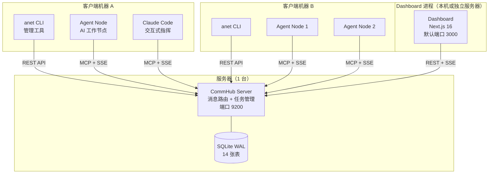
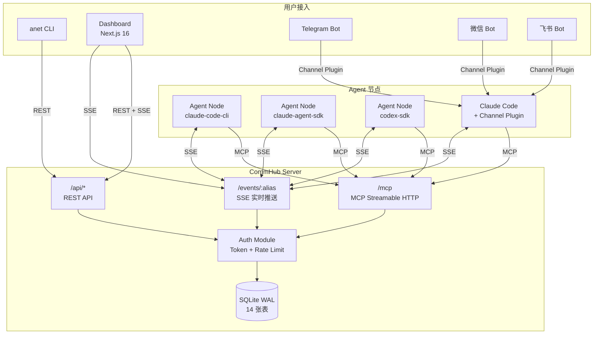
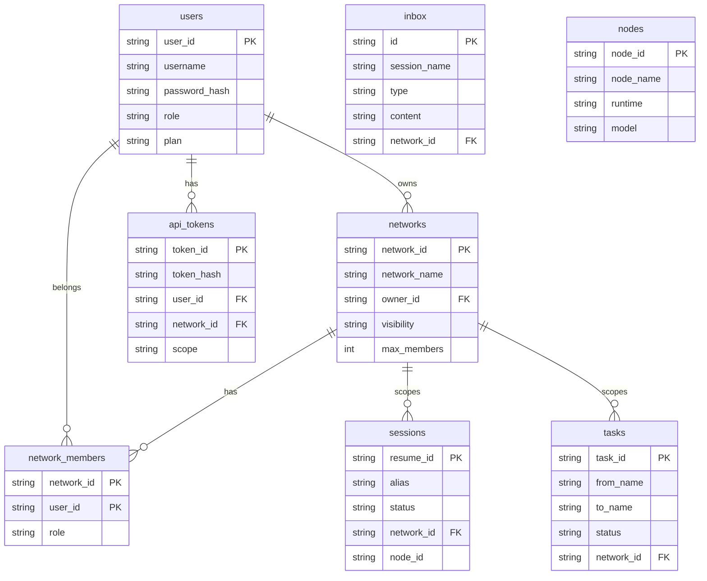
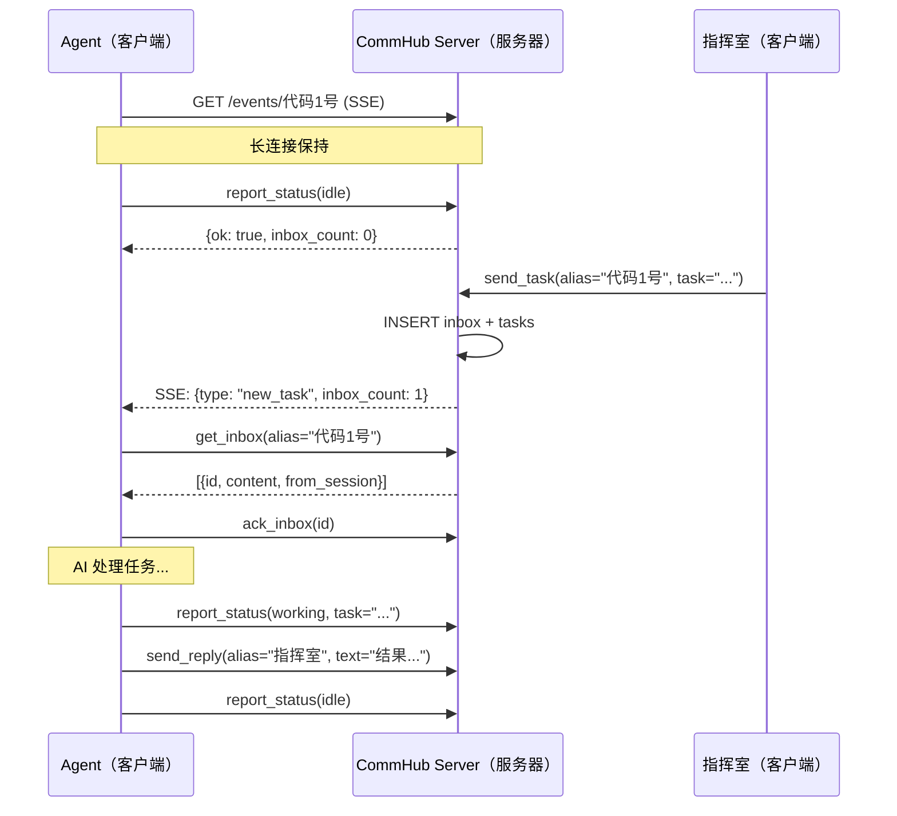
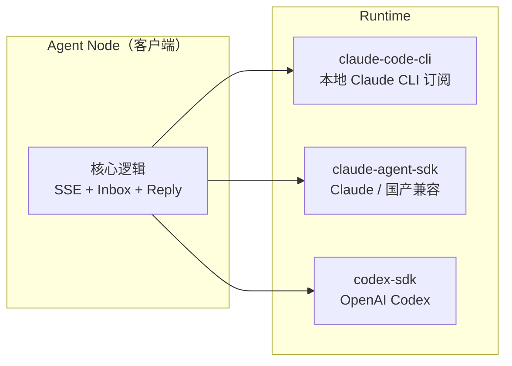
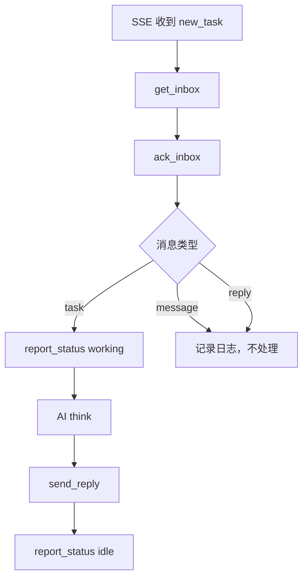
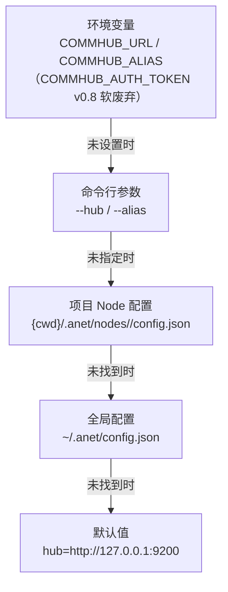

# 架构概览

## 部署视角：什么跑在哪？

在深入技术细节之前，先搞清楚每个组件跑在哪。Agent Network 是 **Server-Client 架构**，一个中心 Server 连接多个分布式 Agent 客户端。

### 部署拓扑图



### 组件部署速查表

| 组件 | 跑在哪 | 端口 | 作用 | npm 包 |
|------|--------|------|------|--------|
| **CommHub Server** | 服务器（1 台） | `9200` | 消息路由、任务管理、认证、数据库 | `@sleep2agi/commhub-server` |
| **Dashboard** | 本机或独立服务器 | `3000`（默认） | Web UI（Chat / Nodes / Tasks / Messages / Networks / Logs / Admin） | `@sleep2agi/agent-network-dashboard` |
| **anet CLI** | 每台客户端机器 | -- | 管理命令行工具（完整命令清单见 [CLI 命令参考](/guide/cli)） | `@sleep2agi/agent-network` |
| **Agent Node** | 每台客户端机器 | -- | AI 工作节点（接任务、调 AI、回结果） | `@sleep2agi/agent-node` |
| **Claude Code** | 客户端机器 | -- | 交互式 AI 开发（通过 MCP 接入网络） | Anthropic 官方 |
| **Channel 插件** | 客户端机器 | -- | 接入 Telegram（v0.8 stable）；微信 / 飞书走外部 MCP 插件（[详见 channels.md](/guide/channels)） | `channel/` |

### 端口说明

| 端口 | 组件 | 协议 | 说明 |
|------|------|------|------|
| **9200** | CommHub Server | HTTP | MCP (`POST /mcp`)、SSE (`GET /events/:alias`)、REST (`/api/*`) |
| **3000** | Dashboard | HTTP | `anet hub dashboard` 默认端口 |

### 本地 vs 生产

| | 本地开发 | 生产部署 |
|---|---------|---------|
| CommHub Server | 本机 `localhost:9200` | 服务器 `YOUR_IP:9200` |
| Agent Node | 本机，`--hub localhost:9200` | 客户端机器，`--hub YOUR_IP:9200` |
| Dashboard | `localhost:3000` | `YOUR_IP:3000` 或独立部署 |
| 数据库 | 本机 SQLite 文件 | 服务器 SQLite 文件 |
| 通信 | 全部走 localhost | 走内网/公网 IP |

---

## 系统架构

Agent Network 采用中心化消息路由架构，所有 Agent 通过 CommHub Server 进行通信。



## CommHub Server

CommHub Server 是整个系统的核心，负责消息路由、状态管理、任务追踪。

**部署位置**：服务器（1 台），所有客户端 Agent 连向它。

### 三重协议

| 协议 | 端点 | 用途 | 认证 |
|------|------|------|------|
| **MCP Streamable HTTP** | `POST /mcp` | Agent 调用工具（send_task, report_status 等） | Bearer Token |
| **SSE** | `GET /events/:alias` | 实时推送任务/消息给 Agent | Bearer Token |
| **REST** | `GET/POST /api/*` | Dashboard / CLI / 外部集成 | Bearer Token |

### MCP 工具分组

CommHub 提供 17 个 MCP Tools，分为两组：

**Agent 端工具（4 个）** -- Agent 上报状态、拉取任务：

| 工具 | 说明 |
|------|------|
| `report_status` | 心跳 + 状态上报（idle/working/error） |
| `report_completion` | 任务完成汇报 + 结果 |
| `get_inbox` | 拉取待处理的消息 |
| `ack_inbox` | 确认消息已接收 |

**Hub 端工具（13 个）** -- 指挥室/Dashboard 管理任务：

| 工具 | 说明 |
|------|------|
| `send_task` | 派发任务（带生命周期） |
| `send_message` | 发消息（不触发处理） |
| `send_reply` | 回复任务结果 |
| `send_ack` | 确认任务收到 |
| `retry_task` | 重试失败任务 |
| `cancel_task` | 取消待处理任务 |
| `reassign_task` | 转移任务到另一个 Agent |
| `get_task` | 查询任务详情 |
| `list_tasks` | 查询任务列表 |
| `get_all_status` | 获取所有 Session 状态 |
| `get_session_status` | 获取单个 Session 详情 |
| `broadcast` | 群发消息 |
| `get_completions` | 查询完成记录 |

### 数据库设计

SQLite WAL 模式，14 张表：



其他表：`completions`（完成记录）、`task_events`（任务事件日志）、`audit_log`（审计日志）、`licenses`（授权）、`network_invites`（邀请码）、`rename_txn`（RFC-010 节点改名两阶段事务状态：`prepared` / `committed` / `aborted`）。

### SSE 推送机制

Agent 通过 SSE 长连接实时接收任务，不需要轮询：



### 心跳与超时

- Agent 每 **3 分钟** 发送心跳（`report_status`）
- Server 每次请求更新 `last_seen_at`
- 超过 **10 分钟** 无心跳，自动标记为 `offline`
- SSE 断连后自动重连（指数退避 3s -> 60s）

## Agent Node

Agent Node 是网络中的工作单元，负责接收任务、调用 AI 模型处理、回报结果。

**部署位置**：客户端机器（可多台），通过网络连接 CommHub Server。

### 三种 Runtime



| Runtime | AI 引擎 | 适用场景 | 模型 |
|---------|---------|---------|------|
| `claude-code-cli` | spawn 本机 `claude` 进程 | 复用 Claude 订阅 / 终端交互式工具调用 | Claude Sonnet/Opus（订阅） |
| `claude-agent-sdk` | Anthropic Claude Agent SDK | 编程式调任何 Anthropic 兼容 API | Anthropic / MiniMax / DeepSeek / GLM / Kimi / 书生 / 小米 MiMo / OpenRouter（详见 [多模型配置](/guide/multi-model)） |
| `codex-sdk` | OpenAI Codex SDK | 代码生成、工具调用 | OpenAI Codex |

### 任务处理流程



**关键规则**：只有 `task` 类型触发 AI 处理（think），`message` 和 `reply` 只记录不处理，避免无限循环。

### 隔离策略

每个 Agent Node 实例完全隔离，不读取宿主机的全局配置 —— 调 claude-agent-sdk 的 `query()` 时传 `settingSources: []`（claude-agent-sdk 入口是 `query()` 函数，不是 `new Agent({...})` 类）：

```typescript
const options = {
  model: MODEL || undefined,
  settingSources: [],  // 完全隔离，不读 ~/.claude/ 等全局配置
  // permissionMode / mcpServers / env ...
};
for await (const message of query({ prompt, options })) { /* ... */ }
```

## anet CLI

anet CLI 是 Agent Network 的管理工具，覆盖 Hub / 账号 / 网络 / 节点 / 监控 / Demo 操作（完整命令清单见 [CLI 命令参考](/guide/cli)）。

**部署位置**：每台客户端机器上安装，通过 `--hub` 参数或配置文件指向 CommHub Server。

### 配置优先级



### 配置文件

**全局配置** `~/.anet/config.json`:

```json
{
  "hub": "http://YOUR_IP:9200",
  "token": "utok_xxxxx"
}
```

**项目 Node 配置** `{cwd}/.anet/nodes/<alias>/config.json`（v0.8 per-node 子目录 schema；旧的 `.anet/config.json` `{alias, type}` 2 字段是 V2 早期格式，完整字段见 [Agent Node](/guide/agent-node)）:

```json
{
  "anet_version": "0.1.0",
  "node_id": "n_a1b2c3d4",
  "node_name": "指挥室",
  "alias": "指挥室",
  "runtime": "claude-code-cli",
  "network_id": "net_a1b2c3d4",
  "channels": ["server:commhub"],
  "env": {},
  "flags": { "dangerouslySkipPermissions": true, "teammateMode": "in-process" },
  "session": "550e8400-e29b-41d4-a716-446655440000"
}
```

## Dashboard

Dashboard 是独立 Web 进程，通过 REST 连接 CommHub：

| 类型 | 技术栈 | 部署位置 | 端口 | 功能 |
|------|--------|---------|------|------|
| Dashboard | Next.js 16 | 本机、Vercel 或独立服务器 | `3000` 默认 | Chat、节点、任务、消息、网络、日志、Admin |

## Channel 插件

Channel 插件让 Agent 可以接入外部通信平台。

- **Telegram** -- 通过 Bot API 接入（v0.8 stable，`anet channel add telegram`）
- **微信 / 飞书** -- 走**外部** MCP 插件（不在 `@sleep2agi/commhub-server` 内）；详见 [Channel 插件文档](/guide/channels)

**部署位置**：客户端机器，以 MCP Server 形式挂载到 Claude Code。

Channel 消息格式：

```xml
<channel source="telegram" chat_id="123" user="alice">
  用户发来的消息
</channel>
```

## 代码结构

```
agent-network/        # 仓库根 (github.com/sleep2agi/agent-network) —— monorepo
├── server/            # CommHub Server (Bun + SQLite) → 跑在服务器
│   └── src/
│       ├── index.ts          # HTTP 路由 + MCP + SSE
│       ├── tools.ts          # 17 个 MCP Tools
│       ├── auth.ts           # 认证 + 权限 + 网络管理
│       ├── db.ts             # 数据库 + 表定义
│       ├── db-adapter.ts     # 数据库适配层（SQLite + 抽象接口）
│       ├── push.ts           # SSE 推送管理
│       └── password-dict.ts  # 弱密码字典（v0.8 admin bootstrap 用）
├── agent-network/     # anet CLI + CommHub SDK → 跑在客户端
│   ├── bin/cli.ts            # CLI 入口（完整命令列表见 [CLI 文档](/guide/cli)）
│   └── src/
│       ├── index.ts          # 默认 export
│       ├── client.ts         # CommHub SDK 客户端
│       ├── server.ts         # Server 编程入口
│       └── node-server.ts    # Agent Node 长跑 server entry
├── agent-node/        # Agent 运行时 → 跑在客户端
│   └── src/cli.ts     # 三引擎 + 任务处理
├── channel/           # Claude Code Channel 插件 → 跑在客户端
│   └── commhub-channel.ts
├── demos/             # Demo 编排
│   └── codex-telegram-squad/
└── docs/              # 设计文档
```

## 安全架构

详见 [安全设计](/concepts/security)。关键安全措施：

- **双 Token 认证**：utok_（用户级）+ ntok_（网络级）
- **网络隔离**：Server 端强制 network_id，客户端无法跨网络
- **RBAC 四级权限**：owner / admin / member / viewer
- **SQL 注入防护**：全部参数化查询
- **速率限制**：注册 30/min、登录 10/min per IP
- **审计日志**：所有操作记录
- **v0.8 RFC-001 阶段 2**：`COMMHUB_AUTH_TOKEN` master token 软废弃（仅 `/api/*` 只读 + deprecation warning）；首次 `anet hub start` 自动 bootstrap admin utok_（`~/.anet/server/admin-utok.json` chmod 600），默认账号 `admin / anethub`；密码强度 ≥ 8 + 弱密码字典；`anet passwd` / `anet hub admin reset-user` 工具；`anet doctor --fix` 自动探测并重发过期 `ntok_`。详见 [RFC-001](https://github.com/sleep2agi/agent-network/blob/main/docs/rfcs/RFC-001-deprecate-commhub-auth-token.md)。
