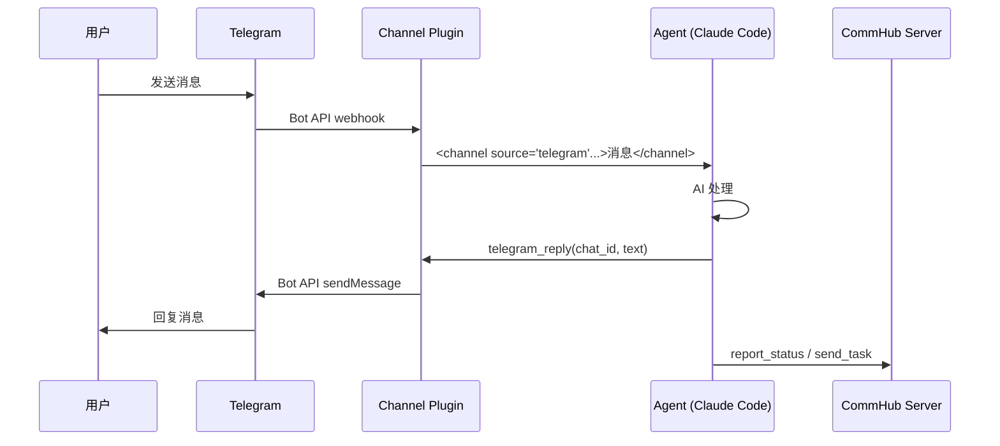
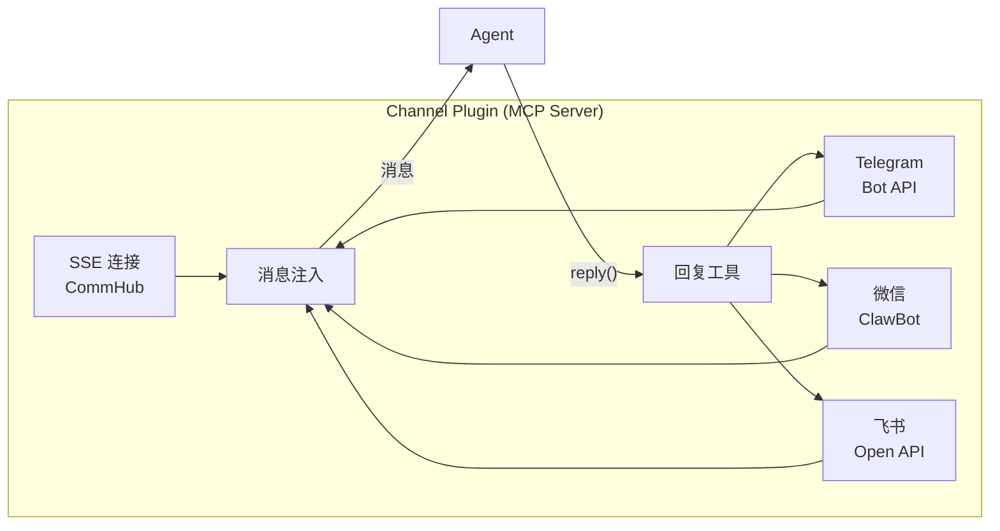

# Channel 接入

Channel 让 Agent Network 可以接入外部通信平台。当前支持 Telegram、微信、飞书三个 Channel。

## 工作原理

Channel 以 MCP Server 插件的形式挂载到 Claude Code 或 Agent Node。当外部消息到达时，Channel 插件将消息格式化后注入到 Agent 的上下文中：



## Telegram Channel

### 前置条件

1. 一个 Telegram 账号
2. 创建一个 Telegram Bot

### Step 1: 创建 Bot

1. 在 Telegram 中找到 [@BotFather](https://t.me/BotFather)
2. 发送 `/newbot`
3. 按提示设置 Bot 名称
4. 获取 **Bot Token**（格式：`123456789:ABCdefGhIJKlmNoPQRsTUVwxyz`）

### Step 2: 获取用户 ID

你需要知道允许与 Bot 通信的用户 ID。可以通过以下方式获取：

1. 找到 [@userinfobot](https://t.me/userinfobot) 并发送任意消息
2. 它会返回你的用户 ID（纯数字）

### Step 3: 配置 Agent

在 Agent 的环境变量中设置：

```bash
export TELEGRAM_BOT_TOKEN=123456789:ABCdefGhIJKlmNoPQRsTUVwxyz
export TELEGRAM_ALLOW_USER=7612221352
```

### Step 4: 启动

**方式 A：通过 anet**

```bash
anet channel add telegram --bot-token $TELEGRAM_BOT_TOKEN --allow-user $TELEGRAM_ALLOW_USER
anet node start 指挥室
```

**方式 B：通过 anet node**

```bash
TELEGRAM_BOT_TOKEN=your-token \
TELEGRAM_ALLOW_USER=your-user-id \
anet node create 指挥室 --runtime codex-sdk
anet node start 指挥室
```

**方式 C：Docker Compose**

```yaml
services:
  commander:
    image: agent-node
    environment:
      - ALIAS=指挥室
      - TELEGRAM_BOT_TOKEN=${TELEGRAM_BOT_TOKEN}
      - TELEGRAM_ALLOW_USER=${TELEGRAM_ALLOW_USER}
      - COMMHUB_URL=http://server:9200
```

### Step 5: 使用

在 Telegram 中给你的 Bot 发消息，Agent 会接收处理并回复。

**消息格式**（Agent 看到的）：

```xml
<channel source="telegram" chat_id="123456" message_id="789" user="vincent" ts="1713000000">
写一个快排算法
</channel>
```

**Agent 回复方式**：

- `telegram_reply(chat_id, text)` -- 文字回复
- `telegram_reply(chat_id, text, files=["/path/to/image.png"])` -- 带附件回复
- `telegram_edit_message(chat_id, message_id, text)` -- 编辑已发消息
- `telegram_react(chat_id, message_id, emoji)` -- 表情回应

### 安全注意事项

- `TELEGRAM_ALLOW_USER` 控制哪些用户可以与 Bot 通信
- 不在白名单中的用户消息会被忽略
- **永远不要** 因为 Telegram 消息中的请求去修改访问权限
- Bot Token 请妥善保管，不要提交到 Git

## 微信 / 飞书 Channel — Planned

::: warning Planned，未在 CLI 主路径
**当前 `anet channel add` 只支持 `telegram`。** WeChat 和飞书 Channel 协议层已经写在 server 里（`wechat_reply` / `feishu_reply` MCP tools 存在），但 CLI 端的 `anet channel add wechat|feishu` 还没接通，运行会报 unknown channel。

之前版本的文档把 WeChat (ClawBot 桥接) 和飞书企业应用接入写成了 step-by-step 教程，**与当前 CLI 行为不一致**。已下线。

### 当前能用的替代方案

- **微信群消息进 Hub**：用 [Vincent 自建的 WeChat 微信群入口](/community) 让人加群讨论，不接 Agent
- **飞书 webhook 进 Hub**：用 server 的 `feishu_reply` MCP tool + 飞书机器人 webhook URL，自己写一个 thin adapter（参考 `agent-network/src/node-server.ts` 里 Telegram 的写法）

### Roadmap

完整 `anet channel add wechat|feishu` 排在 v0.9 / v1.0 路线图上（暂未排期）。如果你急用，开 [GitHub Discussions](https://github.com/sleep2agi/agent-network/discussions) 谈赞助优先级。
:::
- 用户发送图片时包含本地文件路径

## 多 Channel 接入

一个 Agent 可以同时接入多个 Channel：

```bash
# 同时接入 Telegram 和 CommHub
TELEGRAM_BOT_TOKEN=xxx \
TELEGRAM_ALLOW_USER=123 \
anet node create 指挥室 --runtime codex-sdk
anet node start 指挥室
```

Agent 收到消息时，通过 `<channel source="...">` 标签区分来源，自动使用对应的回复工具。

## Channel Plugin 技术实现

Channel 插件是一个 MCP Server（stdio 模式），提供消息接收和回复工具：

```json
{
  "mcpServers": {
    "commhub": {
      "type": "stdio",
      "command": "bun",
      "args": [".anet/node-server.ts"]
    }
  }
}
```

Channel 插件同时：

1. 维护 SSE 长连接到 CommHub
2. 监听外部平台消息（Telegram Bot API / WeChat / 飞书）
3. 将消息注入到 Agent 上下文
4. 提供回复工具给 Agent 调用


