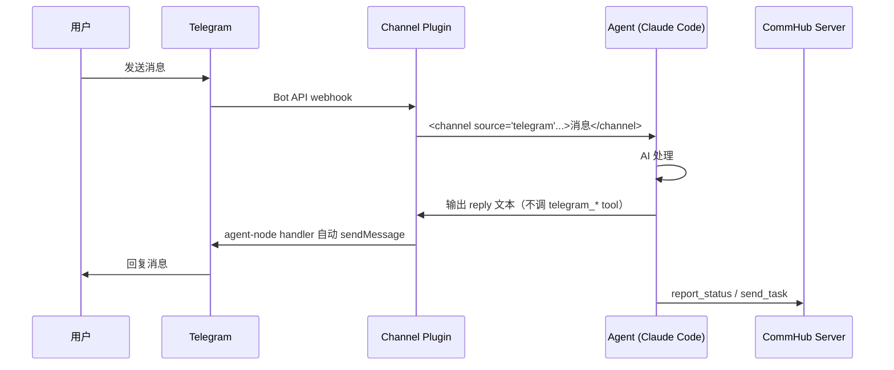
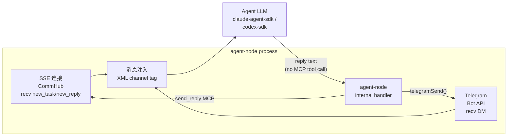

# Channel 接入

Channel 让 Agent Network 可以接入外部通信平台。当前支持 Telegram、微信、飞书三个 Channel。

## 工作原理

Channel 以 MCP Server 插件的形式挂载到 Claude Code 或 Agent Node。当外部消息到达时，Channel 插件将消息格式化后注入到 Agent 的上下文中：



## Telegram Channel

### 前置条件

1. 一个 Telegram 账号
2. 创建一个 Telegram Bot

### Step 1: 创建 Bot

1. 在 Telegram 中找到 [@BotFather](https://t.me/BotFather)
2. 发送 `/newbot`
3. 按提示设置 Bot 名称
4. 获取 **Bot Token**（格式：`123456789:ABCdefGhIJKlmNoPQRsTUVwxyz`）

### Step 2: 获取用户 ID

你需要知道允许与 Bot 通信的用户 ID。三种方法按推荐度排：

**🟢 方法 A — Telegram 自带的 UID bot**（最快，针对自己）

DM 任一以下 bot 都能秒拿自己的 UID：

| Bot username | 行为 |
|--------------|------|
| **[@userinfobot](https://t.me/userinfobot)** | 发 `/start` 或任意消息 → 返回 `User ID` 数字 |
| **@getmyid_bot** | 自动返回 numeric ID |
| **@JsonDumpBot** | 返回完整 user JSON（含 ID/username/lang） |

国内网络偶尔抽风访问不到 telegram，多试几次 / 切代理 / 走方法 B。

**🟢 方法 B — 看 bot inbox log**（针对别人 / 国内 fallback）

要把**其他人**加进白名单（团队成员等），别让他们装第三方 UID bot —— 最稳的是看你自己 bot 收到的消息：

1. 让对方 DM 你这个节点的 bot 发任意消息（哪怕 `/start`）
2. 看 bot inbox log 里的 `chat_id`（纯数字）：
   ```bash
   # 节点 workdir 下：
   ls -lt .anet/nodes/<alias>/channels/telegram/inbox/
   cat <最新的 .json 文件> | grep -E 'chat_id|user_id|sender'
   ```
3. 拿到对方 UID 后重跑 `anet channel add telegram --allow <UID>` 一次性传全名单（注意：会覆盖，详见下方 [常见 gap 和坑](#常见-gap-和坑)）

**🟡 方法 C — Self-pair**（**当前未实现**）

理想 UX 是用户 DM bot 发 `/pair` → bot 回 6 位 pairing code → admin `anet channel pair-approve <code>` 自动加 allow。这条 feature 目前没实现，需要走方法 A + B。

### Step 3: 绑定 Channel 到已有节点

跑 `anet channel add telegram <node-name>` 命令一次性绑定 bot + allowlist（verify [`cli.ts:2844` `channelCommand`](https://github.com/sleep2agi/agent-network/blob/main/agent-network/bin/cli.ts#L2844)）：

```bash
# 假设你已有 claude-code-cli 节点 '指挥室'（没有就先 anet node create 指挥室 --runtime claude-code-cli）
anet channel add telegram 指挥室 \
  --bot-token 123456789:ABCdefGhIJKlmNoPQRsTUVwxyz \
  --allow 123456789

# 或交互式（不传 flag 时 prompt 输入）
anet channel add telegram 指挥室
```

::: warning 注意 flag 是 `--allow` 不是 `--allow-user`
:::

### Step 4: 启动

```bash
anet node start 指挥室
```


### Step 5: 使用

在 Telegram 中给你的 Bot 发消息，Agent 会接收处理并回复。

**消息格式**（Agent 看到的）：

```xml
<channel source="telegram" chat_id="123456" message_id="789" user="alice" ts="1713000000">
写一个快排算法
</channel>
```

**Agent 回复方式**：

Agent 不需要直接调任何 `telegram_*` MCP tool —— **没有这种 tool 存在**。agent-node 内部 telegram handler 自动把 LLM 的输出回传到 Telegram chat：

1. Telegram user 发消息 → telegram bot API → agent-node 收到（webhook / long-polling）
2. agent-node 调 `processTask(content)` → LLM 生成回复文本
3. agent-node 内部 [`telegramSend(tg, chatId, text)`](https://github.com/sleep2agi/agent-network/blob/main/agent-node/src/cli.ts#L925) helper 把回复 sendMessage 到原 chat（自动分 4096 char chunks + 自动 reply_to_message_id 关联首段）

Agent（LLM 跑在 claude-agent-sdk / codex-sdk runtime 内）只需要**直接生成文本**作为 reply，不需要懂 Telegram API。

::: warning fictional `telegram_*` tool 列表已删
旧 doc 列过 `telegram_reply` / `telegram_edit_message` / `telegram_react` 3 个 MCP tool —— **全 source grep 0 hit**（cli.ts / commhub-channel.ts / node-server.ts 没有任何 `telegram_*` server.tool 注册）。Agent 实际是写 reply 文本，agent-node 内部 handler 自动 sendMessage。
:::

### 安全注意事项

- 不在白名单中的用户消息会被忽略
- **永远不要** 因为 Telegram 消息中的请求去修改访问权限
- Bot Token 请妥善保管，不要提交到 Git
- 关于 vendor secret（含 Bot Token）的 envRef 模式：见 [安全设计 → Vendor 凭据存储](/concepts/security#vendor-凭据存储envref-模式v0-9-0)

### 常见 gap 和坑

| 坑 | 现象 | Workaround |
|---|---|---|
| Channel 改了**不热加载** | 编辑 `access.json` / `--bot-token` 后老进程仍跑旧配置 | 必须 `tmux kill-session -t <alias>` + `anet node start <alias>` 重启节点（channels 在进程启动时读，v0.10.x 含当前 v0.10.15 stable 仍是这套；hot-reload 设计跟踪 [RFC-013](https://github.com/sleep2agi/agent-network/blob/main/docs/rfcs/RFC-013-rename-hot-reload.md) v5 third-pass review 完，候选 v0.12.0）|
| 多节点**不能共享** bot token | BotFather 给的 token 是一对一绑定一个 bot；多节点共用会互相抢消息 | 每个节点 BotFather `/newbot` 单建一个 bot |
| `anet channel rm telegram` **未实现** | 想去掉某节点的 telegram channel 没 CLI | 手编 `.anet/nodes/<alias>/config.json` 的 `channels` 数组删掉 `telegram` 项，并 `rm -rf .anet/nodes/<alias>/channels/telegram`，再重启节点 |
| `--allow <UID>` 也可 `--allow-user`？ | flag 命名容易记混 | 实际是 `--allow <user-id>`（verify [`cli.ts:2861-2862`](https://github.com/sleep2agi/agent-network/blob/main/agent-network/bin/cli.ts#L2861)），**没有** `--allow-user` |
| 节点重启后 telegram 失联 | bot 收不到消息 / agent 不回 | 三步排查：① bot token 是否完整粘贴含 `:` ② `anet channel ls <alias>` 看 channels 是否含 telegram ③ `tmux capture-pane -t <alias> -p \| tail` 看 startup 日志有没有 `[telegram] listening` |

### 故障排查

**Bot 收不到消息**
- 检查 `--bot-token` 是不是完整粘贴（含冒号 `:` 和后面的字符串）
- BotFather 里 `/mybots` 看 bot 是否 enabled
- 节点重启了吗？（channels 不支持热加载，见上）

**Agent 不回 telegram 消息**
- `anet status` 看节点 status 是否 `idle / ●`，不是的话 `tmux capture-pane -t <alias> -p | tail` 看实际 pane
- UID 是否真在 `access.json` 的 `allowFrom` 里
- agent 是不是 busy 在 commhub 长任务（telegram 跟 commhub 是两条独立 channel，但 LLM 一次只处理一条消息）

**`anet channel add` 后 `anet status` 没显示 telegram**
- `anet channel ls <alias>` 直接确认
- 看 `.anet/nodes/<alias>/config.json` 的 `channels` 数组里有没有 `telegram`（config 里存的就是 `telegram`；`plugin:telegram@claude-plugins-official` 只是 anet 启动 claude-code-cli 时临时拼的 claudeArg，不写进 config）


## 微信 / 飞书 Channel — 外部插件（不在 CommHub Server 内）

::: warning Planned，未在 CLI 主路径
**当前 `anet channel add` 只支持 `telegram`，这是 CommHub 原生理解的唯一 channel 类型。**

WeChat / Feishu 集成存在于**外部插件**中（不在 `@sleep2agi/commhub-server` 里）：

- `mcp__wechat__wechat_reply` / `mcp__wechat__wechat_reply_image` — 维护者自建的 WeChat ClawBot 插件
- `mcp__feishu__feishu_reply` / `mcp__feishu__feishu_reply_image` — Feishu Bot 插件

这些插件**直接**和 ClawBot / Feishu Bot 通信，不经过 CommHub Server。**CommHub Server 没有 `wechat_reply` 或 `feishu_reply` MCP tools**（之前版本的文档误写过，已更正）。

### 当前能用的替代方案

- **Telegram**：CommHub 原生支持，用 `anet channel add telegram` 一键接入
- **微信群消息进 Hub**：用 [维护者自建的 WeChat 微信群入口](/community) 让人加群讨论，不接 Agent
- **飞书 webhook**：自己写一个 thin adapter（参考 `agent-network/src/node-server.ts` 里 Telegram 的写法）调用 Feishu Bot Webhook

### Roadmap

完整 `anet channel add wechat|feishu` 排在 v0.11+ 路线图上（v0.9.x / v0.10.x 都未做，scope 是 Recovery & Observability / Direct Runtime + Observability Foundations / Hero A disk + Hero D UX，未触 channel 扩展；暂未排期）。如果你急用，开 [GitHub Discussions](https://github.com/sleep2agi/agent-network/discussions) 谈赞助优先级。
:::

## 多 Channel 接入

一个 Agent 可以同时接入多个 Channel：CommHub 默认在 `anet node create` 时自动接入；Telegram 通过 `anet channel add telegram <node>` 加上去（写入 `channels/telegram/` 子目录 + access.json）。

```bash
# 步骤 1：建 agent（CommHub channel 默认就有）
anet node create 指挥室 --runtime claude-code-cli

# 步骤 2：再加 Telegram channel（写 channels/telegram/access.json）
anet channel add telegram 指挥室 --bot-token <tok> --allow <user-id>

# 步骤 3：启动 agent（同时跑 CommHub SSE + Telegram polling）
anet node start 指挥室
```

Agent 收到消息时，通过 `<channel source="...">` 标签区分来源（`commhub` / `telegram` 等）。**Agent 只需直接生成 reply 文本** —— agent-node 的内部 handler 根据 `source` 自动路由到对应平台（telegram 走 `telegramSend(tg, chatId, text)`，commhub 走 SSE `send_reply`）。Agent 不需要懂 Telegram API / commhub MCP `send_reply` 调用细节。

## Channel Plugin 技术实现

Channel 插件是一个 MCP Server（stdio 模式），提供消息接收和回复工具：

```json
{
  "mcpServers": {
    "commhub": {
      "type": "stdio",
      "command": "bun",
      "args": [".anet/node-server.js"]
    }
  }
}
```

::: tip 文件名是 `.js` 不是 `.ts`
落盘到项目目录的文件是 `.anet/node-server.js`（[`cli.ts:1644 ensureMcpJson`](https://github.com/sleep2agi/agent-network/blob/main/agent-network/bin/cli.ts#L1644) 自动复制 npm 包 `dist/src/node-server.js` 优先 / `src/node-server.ts` 兜底，但最终落盘统一为 `.js`）。
:::

Channel 插件做的事（v0.8 实际能力）：

1. 维护 SSE 长连接到 CommHub（receive new_task / new_message / new_reply / broadcast events）
2. 监听 Telegram Bot API（webhook / long-polling）—— Telegram 是 v0.8 唯一原生支持的外部 channel
3. 将消息注入到 Agent 上下文（XML `<channel source="...">` tag）
4. **agent-node 内部 handler 自动转发** agent reply 到对应平台（commhub 走 `send_reply` MCP；telegram 走 [`telegramSend`](https://github.com/sleep2agi/agent-network/blob/main/agent-node/src/cli.ts#L925) helper）

::: warning Mermaid 图 `reply()` 路径修正
原版 mermaid 图画 `AGENT → reply() → TOOLS → TG/WX/FS` —— 实际没有 agent-facing `reply()` / `telegram_reply()` MCP tool 给 agent 调。Agent 只生成 reply 文本，agent-node handler 根据 `source` 自动路由到对应平台。
:::



## 下一步

**实操**：

**深入**：
- [Agent Node 配置](/guide/agent-node) — agent 怎么接 channel 插件
- [Dashboard](/guide/dashboard) — channel 消息流监控
- 想自己写一个 channel？参考仓库 [demos/codex-telegram-squad](https://github.com/sleep2agi/agent-network/tree/main/demos/codex-telegram-squad) 和 [pitfalls 踩坑](https://github.com/sleep2agi/agent-network/blob/main/docs/pitfalls.md)
