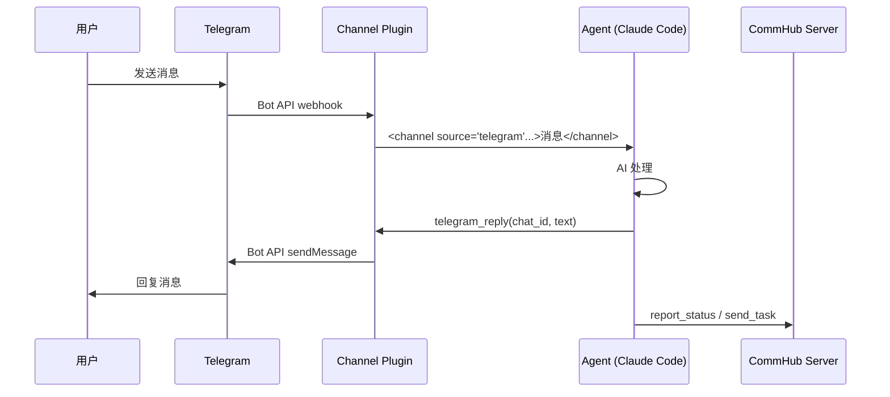
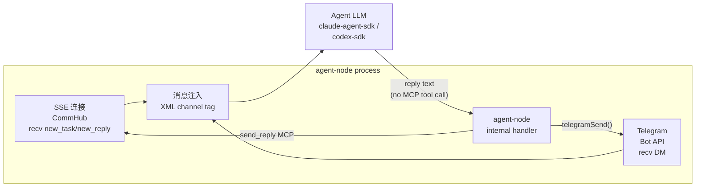

# Channel 接入

Channel 让 Agent Network 可以接入外部通信平台。当前支持 Telegram、微信、飞书三个 Channel。

## 工作原理

Channel 以 MCP Server 插件的形式挂载到 Claude Code 或 Agent Node。当外部消息到达时，Channel 插件将消息格式化后注入到 Agent 的上下文中：



## Telegram Channel

### 前置条件

1. 一个 Telegram 账号
2. 创建一个 Telegram Bot

### Step 1: 创建 Bot

1. 在 Telegram 中找到 [@BotFather](https://t.me/BotFather)
2. 发送 `/newbot`
3. 按提示设置 Bot 名称
4. 获取 **Bot Token**（格式：`123456789:ABCdefGhIJKlmNoPQRsTUVwxyz`）

### Step 2: 获取用户 ID

你需要知道允许与 Bot 通信的用户 ID。可以通过以下方式获取：

1. 找到 [@userinfobot](https://t.me/userinfobot) 并发送任意消息
2. 它会返回你的用户 ID（纯数字）

### Step 3: 绑定 Channel 到已有节点

跑 `anet channel add telegram <node-name>` 命令一次性绑定 bot + allowlist（verify [`cli.ts:2683` `channelCommand`](https://github.com/sleep2agi/agent-network/blob/main/agent-network/bin/cli.ts#L2683)）：

```bash
# 假设你已有 claude-code-cli 节点 '指挥室'（没有就先 anet node create 指挥室 --runtime claude-code-cli）
anet channel add telegram 指挥室 \
  --bot-token 123456789:ABCdefGhIJKlmNoPQRsTUVwxyz \
  --allow 123456789

# 或交互式（不传 flag 时 prompt 输入）
anet channel add telegram 指挥室
```

::: warning 注意 flag 是 `--allow` 不是 `--allow-user`
verify [`cli.ts:2700-2701`](https://github.com/sleep2agi/agent-network/blob/main/agent-network/bin/cli.ts#L2700): `--bot-token <token>` + `--allow <user-id>`。命令落地：写入 `.anet/nodes/<node-name>/channels/telegram/access.json` 含 `allowFrom: ["<user-id>"]` 数组（多人白名单见 [Telegram bind 详细 walkthrough — 多人白名单](/cases/telegram-bind-claude-code-cli#多人白名单)）。**没有 `TELEGRAM_ALLOW_USER` env var**，agent-node 只读 `TELEGRAM_BOT_TOKEN` env（[`agent-node/src/cli.ts:244`](https://github.com/sleep2agi/agent-network/blob/main/agent-node/src/cli.ts#L244)），allowlist 走 access.json。
:::

### Step 4: 启动

```bash
anet node start 指挥室
```

跑起来后 agent-node 自动加载 `channels/telegram/` 配置 + `access.json` 白名单。详细 step-by-step + expected output + 错误排查见 [Telegram 接入已有节点案例](/cases/telegram-bind-claude-code-cli)。

### Step 5: 使用

在 Telegram 中给你的 Bot 发消息，Agent 会接收处理并回复。

**消息格式**（Agent 看到的）：

```xml
<channel source="telegram" chat_id="123456" message_id="789" user="alice" ts="1713000000">
写一个快排算法
</channel>
```

**Agent 回复方式**：

Agent 不需要直接调任何 `telegram_*` MCP tool —— **没有这种 tool 存在**。agent-node 内部 telegram handler 自动把 LLM 的输出回传到 Telegram chat：

1. Telegram user 发消息 → telegram bot API → agent-node 收到（webhook / long-polling）
2. agent-node 调 `processTask(content)` → LLM 生成回复文本
3. agent-node 内部 [`telegramSend(tg, chatId, text)`](https://github.com/sleep2agi/agent-network/blob/main/agent-node/src/cli.ts#L948) helper 把回复 sendMessage 到原 chat（自动分 4096 char chunks + 自动 reply_to_message_id 关联首段）

Agent（LLM 跑在 claude-agent-sdk / codex-sdk runtime 内）只需要**直接生成文本**作为 reply，不需要懂 Telegram API。

::: warning R258 校准：fictional `telegram_*` tool 列表已删
旧 doc 列过 `telegram_reply` / `telegram_edit_message` / `telegram_react` 4 个 MCP tool —— **全 source grep 0 hit**（cli.ts / commhub-channel.ts / node-server.ts 没有任何 `telegram_*` server.tool 注册）。Agent 实际是写 reply 文本，agent-node 内部 handler 自动 sendMessage。
:::

### 安全注意事项

- `.anet/nodes/<node>/channels/telegram/access.json` 的 `allowFrom` 数组控制哪些 Telegram user_id 能 DM bot（由 `anet channel add telegram --allow <uid>` 写入；多人白名单见 [walkthrough §B](/cases/telegram-bind-claude-code-cli#b-多人白名单)）
- 不在白名单中的用户消息会被忽略
- **永远不要** 因为 Telegram 消息中的请求去修改访问权限
- Bot Token 请妥善保管，不要提交到 Git

## 微信 / 飞书 Channel — 外部插件（不在 CommHub Server 内）

::: warning Planned，未在 CLI 主路径
**当前 `anet channel add` 只支持 `telegram`，这是 CommHub 原生理解的唯一 channel 类型。**

WeChat / Feishu 集成存在于**外部插件**中（不在 `@sleep2agi/commhub-server` 里）：

- `mcp__wechat__wechat_reply` / `mcp__wechat__wechat_reply_image` — 维护者自建的 WeChat ClawBot 插件
- `mcp__feishu__feishu_reply` / `mcp__feishu__feishu_reply_image` — Feishu Bot 插件

这些插件**直接**和 ClawBot / Feishu Bot 通信，不经过 CommHub Server。**CommHub Server 没有 `wechat_reply` 或 `feishu_reply` MCP tools**（之前版本的文档误写过，已更正）。

### 当前能用的替代方案

- **Telegram**：CommHub 原生支持，用 `anet channel add telegram` 一键接入
- **微信群消息进 Hub**：用 [维护者自建的 WeChat 微信群入口](/community) 让人加群讨论，不接 Agent
- **飞书 webhook**：自己写一个 thin adapter（参考 `agent-network/src/node-server.ts` 里 Telegram 的写法）调用 Feishu Bot Webhook

### Roadmap

完整 `anet channel add wechat|feishu` 排在 v0.9 / v1.0 路线图上（暂未排期）。如果你急用，开 [GitHub Discussions](https://github.com/sleep2agi/agent-network/discussions) 谈赞助优先级。
:::

## 多 Channel 接入

一个 Agent 可以同时接入多个 Channel：CommHub 默认在 `anet node create` 时自动接入；Telegram 通过 `anet channel add telegram <node>` 加上去（写入 `channels/telegram/` 子目录 + access.json）。

```bash
# 步骤 1：建 agent（CommHub channel 默认就有）
anet node create 指挥室 --runtime claude-code-cli

# 步骤 2：再加 Telegram channel（写 channels/telegram/access.json）
anet channel add telegram 指挥室 --bot-token <tok> --allow <user-id>

# 步骤 3：启动 agent（同时跑 CommHub SSE + Telegram polling）
anet node start 指挥室
```

Agent 收到消息时，通过 `<channel source="...">` 标签区分来源（`commhub` / `telegram` 等）。**Agent 只需直接生成 reply 文本** —— agent-node 的内部 handler 根据 `source` 自动路由到对应平台（telegram 走 `telegramSend(tg, chatId, text)`，commhub 走 SSE `send_reply`）。Agent 不需要懂 Telegram API / commhub MCP `send_reply` 调用细节（R258 chain 一致）。

## Channel Plugin 技术实现

Channel 插件是一个 MCP Server（stdio 模式），提供消息接收和回复工具：

```json
{
  "mcpServers": {
    "commhub": {
      "type": "stdio",
      "command": "bun",
      "args": [".anet/node-server.js"]
    }
  }
}
```

::: tip 文件名是 `.js` 不是 `.ts`
落盘到项目目录的文件是 `.anet/node-server.js`（[`cli.ts:1492 ensureMcpJson`](https://github.com/sleep2agi/agent-network/blob/main/agent-network/bin/cli.ts#L1492) 自动复制 npm 包 `dist/src/node-server.js` 优先 / `src/node-server.ts` 兜底，但最终落盘统一为 `.js`）。R216/R221 chain 一致。
:::

Channel 插件做的事（v0.8 实际能力）：

1. 维护 SSE 长连接到 CommHub（receive new_task / new_message / new_reply / broadcast events）
2. 监听 Telegram Bot API（webhook / long-polling）—— Telegram 是 v0.8 唯一原生支持的外部 channel
3. 将消息注入到 Agent 上下文（XML `<channel source="...">` tag）
4. **agent-node 内部 handler 自动转发** agent reply 到对应平台（commhub 走 `send_reply` MCP；telegram 走 [`telegramSend`](https://github.com/sleep2agi/agent-network/blob/main/agent-node/src/cli.ts#L948) helper）

::: warning R258 chain 校准
原版 mermaid 图画 `AGENT → reply() → TOOLS → TG/WX/FS` —— 实际没有 agent-facing `reply()` / `telegram_reply()` MCP tool 给 agent 调。Agent 只生成 reply 文本，agent-node handler 根据 `source` 自动路由到对应平台。
:::



## 下一步

**实操**：
- [Telegram 派遣队](/cases/telegram-squad) — Docker Compose 一键启动指挥室 + 10 worker + Telegram 接入
- [Hello World](/cases/hello-world) — 不接 channel 的纯本地 demo
- [辩论赛](/cases/debate) — 内置 6 agent 编排，看 agent 之间怎么协作

**深入**：
- [Agent Node 配置](/guide/agent-node) — agent 怎么接 channel 插件
- [Dashboard](/guide/dashboard) — channel 消息流监控
- 想自己写一个 channel？参考仓库 [demos/codex-telegram-squad](https://github.com/sleep2agi/agent-network/tree/main/demos/codex-telegram-squad) 和 [pitfalls 踩坑](https://github.com/sleep2agi/agent-network/blob/main/docs/pitfalls.md)
