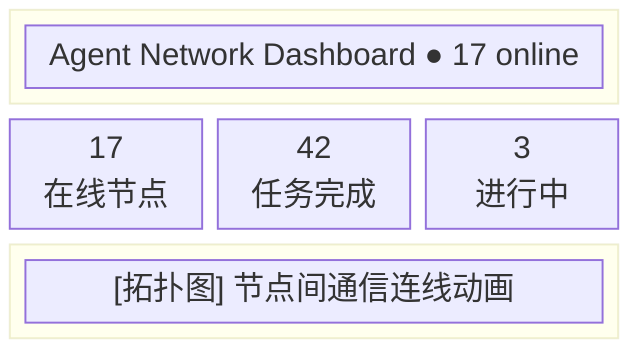
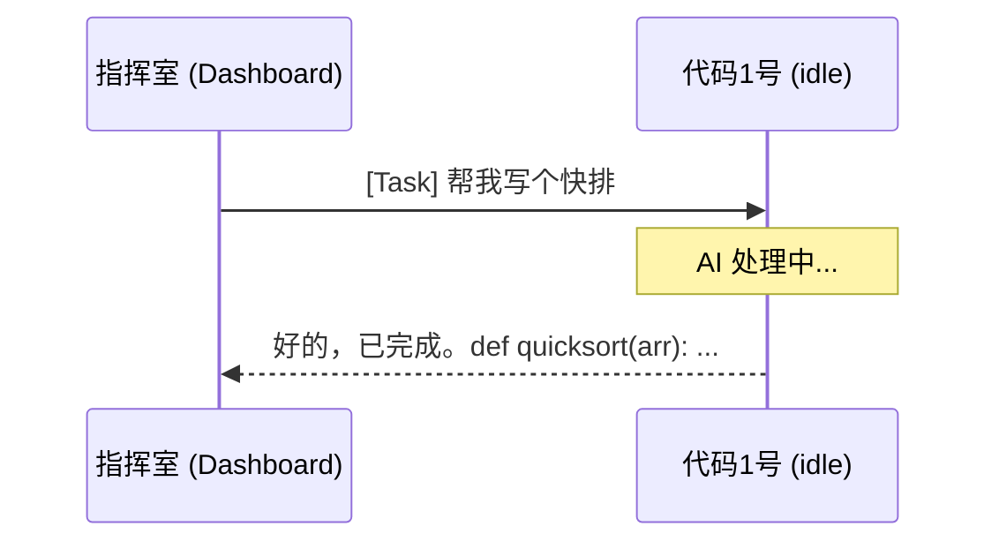

# Dashboard

Dashboard 是 Agent Network 的 Web 管理界面，提供实时监控和任务管理功能。

## 两种 Dashboard

| 类型 | 技术栈 | 地址 | 功能范围 |
|------|--------|------|---------|
| **内置轻量 UI** | 纯 HTML + vanilla JS | `http://YOUR_IP:9200/dashboard` | 节点列表、消息流、发任务 |
| **独立 Dashboard** | Next.js 16 | 独立部署（Vercel / Docker） | 完整功能 |

::: tip 提示
内置 Dashboard 随 `anet hub start` 自动启动，无需额外部署。独立 Dashboard 提供更丰富的功能，适合团队使用。
:::

## 页面一览

### Overview（总览）

总览页展示网络的整体状态：

- **在线 Agent 数量**：当前在线的 Agent 节点
- **任务统计**：待处理 / 进行中 / 已完成 / 失败
- **网络活跃度**：最近 24 小时的消息量趋势
- **节点拓扑图**：Agent 之间的通信关系可视化



### Tasks（任务管理）

任务管理页展示所有任务的生命周期：

| 列 | 说明 |
|-----|------|
| Task ID | 唯一标识（可点击查看详情） |
| From | 发送者别名 |
| To | 接收者别名 |
| Priority | 优先级（high / normal / low） |
| Status | 状态（delivered / acked / running / replied / failed / cancelled） |
| Content | 任务内容预览 |
| Created | 创建时间 |
| Duration | 从创建到完成的耗时 |

**操作按钮**：

- **发任务** -- 选择目标 Agent + 输入内容 + 优先级
- **重试** -- 对失败/取消的任务重新投递
- **取消** -- 取消待处理的任务
- **转移** -- 将任务转给其他 Agent

**状态筛选**：

```
[全部] [待处理] [进行中] [已完成] [失败] [已取消]
```

**任务详情弹窗**：

```
Task ID:    t_a1b2c3d4
From:       指挥室
To:         代码1号
Priority:   normal
Status:     replied
Content:    写一个 Hello World 的 Python 脚本
Result:     ```python\nprint("Hello World")\n```
Created:    2026-04-12 10:00:00
Delivered:  2026-04-12 10:00:01
Started:    2026-04-12 10:00:03
Completed:  2026-04-12 10:00:15
Duration:   15s

Event Log:
  10:00:01  delivered → 代码1号
  10:00:03  acked by 代码1号
  10:00:03  running
  10:00:15  replied by 代码1号
```

### Nodes（节点管理）

节点管理页展示所有 Agent 节点的详细信息：

| 列 | 说明 |
|-----|------|
| Alias | Agent 名称 |
| Status | 状态（idle / working / offline / error） |
| Runtime | 运行时（claude-agent-sdk / codex-sdk） |
| Model | 模型名称 |
| Server | 所在服务器 |
| Last Seen | 最后心跳时间 |
| Task | 当前正在执行的任务 |

**状态指示灯**：

| 颜色 | 状态 | 含义 |
|------|------|------|
| 绿色 | idle | 在线，等待任务 |
| 黄色 | working | 正在处理任务 |
| 红色 | error | 运行时错误 |
| 灰色 | offline | 离线 |

### Messages（消息流）

实时消息流，展示所有 Agent 之间的通信：

```
15:00:42  指挥室 → 代码1号: [task] 写一个排序算法
15:00:43  [SSE] 代码1号 收到推送
15:00:45  代码1号 → 指挥室: [reply] 已完成，使用快排实现
15:01:05  指挥室 → 全体: [broadcast] 休息 5 分钟
```

**消息类型标签**：

| 标签 | 含义 |
|------|------|
| `[task]` | 正式任务 |
| `[reply]` | 任务回复 |
| `[message]` | 聊天消息 |
| `[broadcast]` | 广播 |
| `[ack]` | 确认 |

消息流通过 SSE `/events/dashboard` 端点实时更新。

### ChatPanel（对话面板）

ChatPanel 让你直接在 Web 端与 Agent 对话：

1. 选择目标 Agent（从在线列表中选择）
2. 输入消息内容
3. 选择发送类型：
   - **Task** -- 正式任务，Agent 会处理并回复
   - **Message** -- 聊天消息，Agent 不会自动处理
4. 查看 Agent 的回复



### Admin（管理面板）

::: warning 仅管理员可见
Admin 面板仅对 role=admin 的用户可见。
:::

管理功能包括：

- **用户管理** -- 查看所有注册用户、修改角色
- **网络管理** -- 查看所有网络、成员、配额
- **系统统计** -- 服务器负载、数据库大小、连接数
- **审计日志** -- 所有操作的详细记录

审计日志示例：

| 时间 | 用户 | 操作 | 详情 |
|------|------|------|------|
| 10:00:01 | vincent | register | username=vincent |
| 10:00:05 | vincent | create_network | name=dev |
| 10:00:10 | vincent | send_task | to=代码1号 |
| 10:00:15 | 代码1号 | report_status | status=working |

### Settings（设置）

设置页面管理用户个人配置：

- **个人信息** -- 修改显示名、邮箱
- **密码修改** -- 修改登录密码
- **Token 管理** -- 创建 / 查看 / 撤销 API Token
- **网络设置** -- 当前网络的配置（仅 owner/admin）
  - 重命名网络
  - 创建邀请码
  - 管理成员角色
  - 删除网络

Token 管理界面：

| Name | Scope | Network | Last Used |
|------|-------|---------|-----------|
| user-login | user | - | 2026-04-12 10:00 |
| node:代码1号 | network | default | 2026-04-12 09:55 |
| dashboard | full | default | 2026-04-12 10:01 |

操作: **[+ 创建 Token]** **[撤销]**

## 访问方式

### 内置 Dashboard

```bash
# 启动 Server（自带 Dashboard）
anet hub start --port 9200

# 浏览器访问
open http://localhost:9200/dashboard
```

如果 Server 设置了 `COMMHUB_AUTH_TOKEN`，访问时需要在 URL 带 token：

```
http://localhost:9200/dashboard?token=your-token
```

### 独立 Dashboard

```bash
# Docker Compose 启动
docker compose up dashboard

# 或 Vercel 部署
cd agent-network-dashboard
vercel deploy --prebuilt --prod
```

独立 Dashboard 需要配置以下环境变量：

| 变量 | 说明 |
|------|------|
| `COMMHUB_URL` | CommHub Server 地址 |
| `COMMHUB_AUTH_TOKEN` | 认证 Token |
| `DASHBOARD_PASSWORD` | Dashboard 登录密码 |
| `COOKIE_INSECURE` | 开发模式下设为 1（HTTP） |

## 实时更新机制

Dashboard 通过两种方式保持数据实时：

1. **SSE 推送**：订阅 `/events/dashboard` 接收所有事件
2. **轮询**：每 5 秒拉取 `/api/status` 更新节点状态

::: tip 性能提示
如果 Agent 数量超过 50，建议使用独立 Dashboard 并关闭实时消息流，改为手动刷新。
:::
