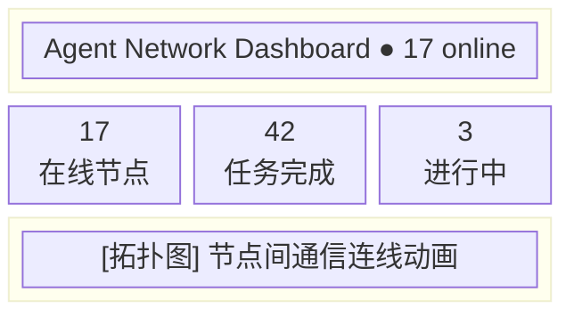
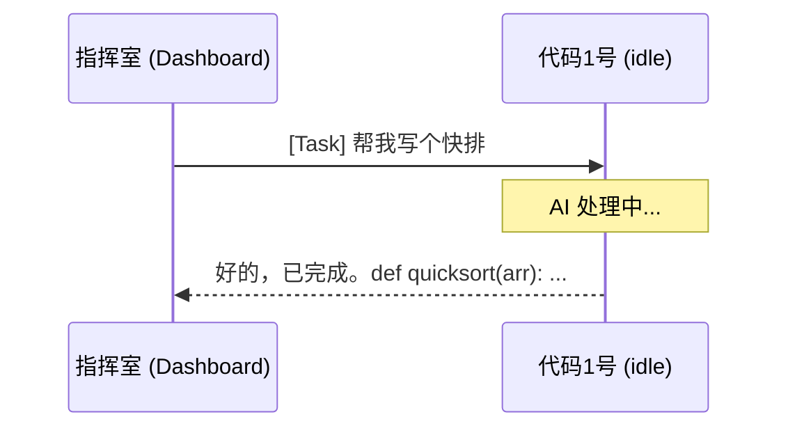

# Dashboard

Dashboard 是 Agent Network 的 Web 管理界面，提供实时监控和任务管理功能。

## 当前 Dashboard

| 启动方式 | 技术栈 | 默认地址 | 说明 |
|------|--------|------|------|
| `anet hub dashboard` | Next.js 16 | `http://localhost:3000` | CLI 通过 `npx @sleep2agi/agent-network-dashboard@0.4.2`（v0.8.1 起 pin 该版本）启动，thin cookie-proxy 模式（不再持 service token） |
| 独立部署 | Next.js 16 | 自定义 | 需要自己配置 CommHub 地址 |

::: tip 提示
`anet hub start` 只启动 CommHub Server；Web UI 需要另开终端运行 `anet hub dashboard`。
:::

## 页面一览

### Overview（总览）

总览页展示网络的整体状态：

- **在线 Agent 数量**：当前在线的 Agent 节点
- **任务统计**：待处理 / 进行中 / 已完成 / 失败
- **网络活跃度**：最近 24 小时的消息量趋势
- **节点拓扑图**：Agent 之间的通信关系可视化



### Tasks（任务管理）

任务管理页展示所有任务的生命周期：

| 列 | 说明 |
|-----|------|
| Task ID | 唯一标识（可点击查看详情） |
| From | 发送者别名 |
| To | 接收者别名 |
| Priority | 优先级（high / normal / low） |
| Status | 状态（delivered / acked / running / replied / failed / cancelled） |
| Content | 任务内容预览 |
| Created | 创建时间 |
| Duration | 从创建到完成的耗时 |

**操作按钮**：

- **发任务** -- 选择目标 Agent + 输入内容 + 优先级
- **重试** -- 对失败/取消的任务重新投递
- **取消** -- 取消待处理的任务
- **转移** -- 将任务转给其他 Agent

**状态筛选**：

```
[全部] [待处理] [进行中] [已完成] [失败] [已取消]
```

**任务详情弹窗**：

```
Task ID:    t_a1b2c3d4
From:       指挥室
To:         代码1号
Priority:   normal
Status:     replied
Content:    写一个 Hello World 的 Python 脚本
Result:     ```python\nprint("Hello World")\n```
Created:    2026-04-12 10:00:00
Delivered:  2026-04-12 10:00:01
Started:    2026-04-12 10:00:03
Completed:  2026-04-12 10:00:15
Duration:   15s

Event Log:
  10:00:01  delivered → 代码1号
  10:00:03  acked by 代码1号
  10:00:03  running
  10:00:15  replied by 代码1号
```

### Nodes（节点管理）

节点管理页展示所有 Agent 节点的详细信息：

| 列 | 说明 |
|-----|------|
| Alias | Agent 名称 |
| Status | 状态（idle / working / offline / error） |
| Runtime | 运行时（claude-agent-sdk / codex-sdk） |
| Model | 模型名称 |
| Server | 所在服务器 |
| Last Seen | 最后心跳时间 |
| Task | 当前正在执行的任务 |

**状态指示灯**：

| 颜色 | 状态 | 含义 |
|------|------|------|
| 绿色 | idle | 在线，等待任务 |
| 黄色 | working | 正在处理任务 |
| 红色 | error | 运行时错误 |
| 灰色 | offline | 离线 |

### Messages（消息流）

实时消息流，展示所有 Agent 之间的通信：

```
15:00:42  指挥室 → 代码1号: [task] 写一个排序算法
15:00:43  [SSE] 代码1号 收到推送
15:00:45  代码1号 → 指挥室: [reply] 已完成，使用快排实现
15:01:05  指挥室 → 全体: [broadcast] 休息 5 分钟
```

**消息类型标签**：

| 标签 | 含义 |
|------|------|
| `[task]` | 正式任务 |
| `[reply]` | 任务回复 |
| `[message]` | 聊天消息 |
| `[broadcast]` | 广播 |
| `[ack]` | 确认 |

消息流来自 CommHub REST 数据；Agent 自己通过 `/events/:alias` SSE 长连接接收任务推送。

### ChatPanel（对话面板）

ChatPanel 让你直接在 Web 端与 Agent 对话：

1. 选择目标 Agent（从在线列表中选择）
2. 输入消息内容
3. 选择发送类型：
   - **Task** -- 正式任务，Agent 会处理并回复
   - **Message** -- 聊天消息，Agent 不会自动处理
4. 查看 Agent 的回复



### Admin（管理面板）

::: warning 仅管理员可见
Admin 面板仅对 role=admin 的用户可见。
:::

管理功能包括：

- **用户管理** -- 查看所有注册用户、修改角色
- **网络管理** -- 查看所有网络、成员、配额
- **系统统计** -- 服务器负载、数据库大小、连接数
- **审计日志** -- 所有操作的详细记录

审计日志示例：

| 时间 | 用户 | 操作 | 详情 |
|------|------|------|------|
| 10:00:01 | vincent | register | username=vincent |
| 10:00:05 | vincent | create_network | name=dev |
| 10:00:10 | vincent | send_task | to=代码1号 |
| 10:00:15 | 代码1号 | report_status | status=working |

### Settings（设置）

设置页面管理用户个人配置：

- **个人信息** -- 修改显示名、邮箱
- **密码修改** -- 修改登录密码
- **Token 管理** -- 创建 / 查看 / 撤销 API Token
- **网络设置** -- 当前网络的配置（仅 owner/admin）
  - 重命名网络
  - 创建邀请码
  - 管理成员角色
  - 删除网络

Token 管理界面：

| Name | Scope | Network | Last Used |
|------|-------|---------|-----------|
| user-login | user | - | 2026-04-12 10:00 |
| node:代码1号 | network | default | 2026-04-12 09:55 |
| dashboard | full | default | 2026-04-12 10:01 |

操作: **[+ 创建 Token]** **[撤销]**

## 访问方式

### 本地 Dashboard

```bash
# 终端 1：启动 Server
anet hub start --port 9200

# 终端 2：启动 Dashboard
anet hub dashboard

# 浏览器访问
open http://localhost:3000
```

### 独立部署

```bash
# Docker Compose 启动
docker compose up dashboard

# 或 Vercel 部署
cd agent-network-dashboard
vercel deploy --prebuilt --prod
```

独立 Dashboard 需要配置以下环境变量：

| 变量 | 说明 |
|------|------|
| `COMMHUB_URL` | CommHub Server 地址 |
| `COMMHUB_AUTH_TOKEN` | 旧全局认证 Token；v0.8 起软废弃，v1.0 移除。v0.4.2 Dashboard 已是 thin cookie-proxy，不再需要 |
| `COOKIE_INSECURE` | 开发模式下设为 1（HTTP） |

## 实时更新机制

Dashboard 通过两类数据面保持更新：

1. **REST 查询**：拉取 `/api/status`、`/api/tasks`、`/api/messages` 等状态
2. **Agent SSE**：Agent 订阅 `/events/:alias`，新任务到达后更新 Hub 数据，再被 Dashboard 读取

::: tip 性能提示
如果 Agent 数量超过 50，建议使用独立 Dashboard 并关闭实时消息流，改为手动刷新。
:::

## Preview 通道（即将进入下一个 stable）

`@sleep2agi/agent-network-dashboard@preview` 上有正在打磨的下一代 UI。当前 preview pin 是 `0.4.5-preview.1`（CLI preview tag `@sleep2agi/agent-network@preview` 自动联动）。

新增能力（vs stable 0.4.2）：

- **Cmd / Ctrl + K 命令面板**：键盘驱动跳转、搜索、命令调用
- **? 键盘速查 overlay**：弹出所有快捷键
- **全局健康 banner**：红 / 琥珀 / 绿三色 + CTA + ×
- **KPI 卡 hover popover**：working / idle / offline 分布
- **EmptyState 7 变体**：登录后、空网络、零任务等场景独立插画
- **Topology 浅色变体**：中心 hub 24px 脉冲（解决了 stable 浅色不可见问题）
- **Tasks 状态 tab**：color-coded 圆点 + 移动端横滚
- **移动端 audit 修复**：banner 让位 hamburger / UserBar 图标化
- **Sidebar 底部 "Quick search ⌘K" chip**：移动端 launcher 入口
- **LoadingSkeleton 重做**：镜像 Overview 布局 + brand-pulse 节奏
- **P0 浅色 contrast 修**：`text-{color}-300/400 → -700` sweep

试用：

```bash
# 升级 CLI 到 preview
npm i -g @sleep2agi/agent-network@preview
anet -v                                    # 应显示 2.1.x-preview.N
anet hub dashboard                          # 自动 npx 拉 0.4.5-preview.1
```

或直接绕过 CLI：

```bash
npx -y @sleep2agi/agent-network-dashboard@preview --ip 0.0.0.0
```

::: warning preview 不保证向后兼容
preview 通道随时迭代，不会立刻 promote 到 latest。生产环境请继续用 stable（`@sleep2agi/agent-network@latest`）。
:::
