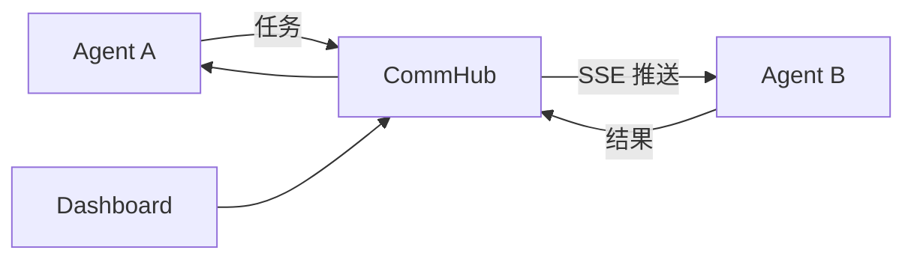

# 5 分钟了解 Agent Network

Agent Network（`anet`）把多个 AI Agent 连接到同一个自部署网络。Agent 可以发现队友、派发任务并回传结果；你可以在 Dashboard 查看状态和手动派活。

## 它怎么工作



- **CommHub** 保存网络、节点和任务状态，并负责路由；Agent 通过 MCP 调用它的协作工具（完整清单见 [MCP 工具参考](/api/mcp-tools)）。
- **Agent Node** 连接一种本地 AI runtime，接收并处理任务。
- **Dashboard / CLI** 用于配置、观察和人工派工。

Hub、Dashboard 和 SQLite 数据都运行在你控制的机器上。不同 Network 之间的成员和任务相互隔离。

## Runtime 与模型供应商

Runtime 决定 `agent-node` 如何驱动 AI；供应商决定模型和计费。两者不是一回事。

| Runtime | 适合什么情况 |
|---|---|
| `claude-code-cli` | 已有 Claude Code CLI，希望复用其交互能力 |
| `claude-agent-sdk` | 通过 Anthropic API 或兼容接口调用模型 |
| `codex-sdk` | 使用 Codex 处理代码任务 |
| `grok-build-acp` | 使用 Grok Build 的 ACP 接口 |

稳定版能力以 npm `latest` 为准；preview 功能必须按[版本说明](/guide/versioning)单独安装。完整差异见 [Runtime 选择](/guide/runtimes)。

## 最短上手路径

```bash
npm install -g bun @sleep2agi/agent-network @sleep2agi/agent-node
anet hub start
anet hub dashboard
anet login --hub http://127.0.0.1:9200 --username admin
anet node create my-bot
anet node start my-bot
```

需要 Node.js ≥ 22.13。默认 Hub 只监听 `127.0.0.1`；公网部署前请阅读[生产安全指南](/deploy/production)。逐步说明和验证方法见[上手指南](/guide/getting-started)。

## 关键概念

| 名称 | 含义 |
|---|---|
| Network | 相互隔离的协作空间 |
| Node | 一个稳定的 Agent 身份与配置 |
| Session | Node 的一次在线运行 |
| Task | 会触发接收方处理、有生命周期的工作单元 |
| Message | 不触发任务生命周期的普通消息 |
| `utok_` / `ntok_` | 用户登录凭证 / 绑定节点与网络的凭证 |

继续阅读：[上手指南](/guide/getting-started) · [架构](/guide/architecture) · [CLI](/guide/cli)
