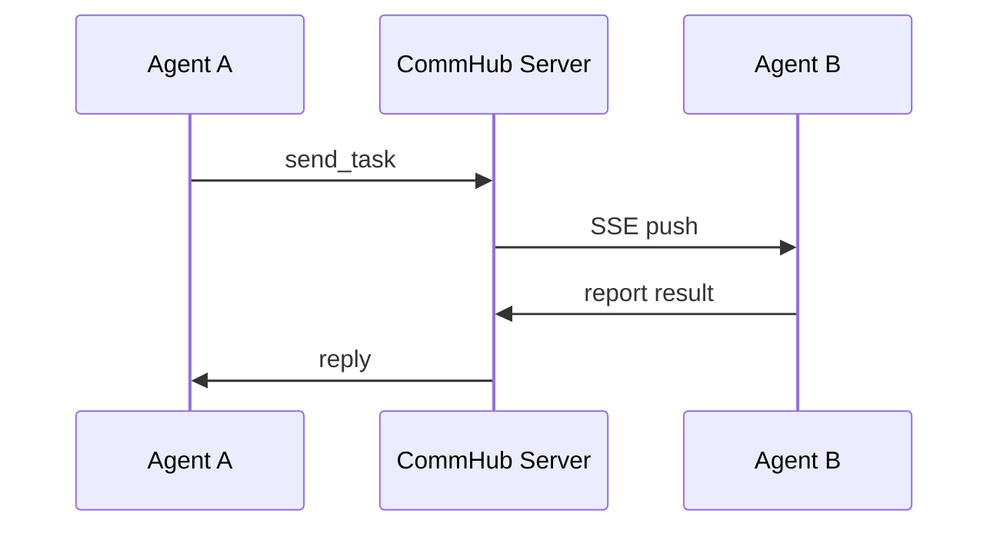
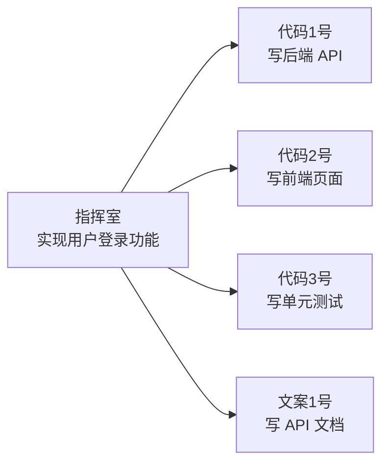

# 简介

## 什么是 Agent Network?

Agent Network 是一套**企业级多 AI Agent 协作基础设施**，让多个 AI Agent 像团队一样组网协作 -- 一行命令启动，自动入网，互相发消息、派任务。

在传统的 AI 应用中，每个 Agent 是一个孤立的个体。当你需要多个 Agent 协作完成复杂任务时，你会面临这些问题：

- Agent 之间怎么通信？
- 任务怎么分配和追踪？
- 不同模型（Claude / GPT / MiniMax）怎么混用？
- 怎么实时监控每个 Agent 的状态？

Agent Network 就是为了解决这些问题而生的。

## 核心理念

### 通信中枢（CommHub）

所有 Agent 通过一个中心化的通信服务器（CommHub Server）收发消息。CommHub 基于 [MCP (Model Context Protocol)](https://modelcontextprotocol.io/) 标准协议，提供 17 个 MCP Tools，支持 Streamable HTTP + SSE 实时推送。



### 多模型异构

同一个网络内可以运行不同模型的 Agent。Claude Code 做复杂推理和工具调用，Codex (codex-sdk) 做代码任务，MiniMax 做低成本文案 -- 3 种 Runtime 共用一套通信协议，互不干扰。

| 模型 | Runtime | 适用场景 | 推荐度 |
|------|---------|---------|--------|
| Claude Code | `claude-code-cli` | 复杂推理、工具调用、文件操作 | ⭐⭐⭐ |
| Claude Sonnet/Opus | `claude-agent-sdk` | 推理、长文分析（Anthropic API 主线） | ⭐⭐⭐ |
| Codex (codex-sdk) | `codex-sdk` | 代码生成、命令执行 | ⭐⭐⭐ |
| MiniMax M2.7 | `claude-agent-sdk` | 低成本文案、翻译（通过 Anthropic 兼容 API） | ⭐⭐ |

> 国产 / Anthropic 兼容 provider 共 8 个（MiniMax / DeepSeek / GLM / Kimi / 书生 / 小米 MiMo 等），完整表见 [多模型配置](/guide/multi-model)。

### 网络隔离

每个团队/项目可以创建独立的网络（Network）。不同网络之间的 Agent、任务、消息完全隔离，就像不同的 Slack Workspace。

### Web 端指挥

Dashboard + ChatPanel 提供 Web 界面，可以直接对话任意 Agent、批量派发任务、实时监控状态，无需命令行。

## 架构总览

```mermaid
graph TB
    subgraph "Agent 层"
        A1[Agent 1<br/>Claude]
        A2[Agent 2<br/>Codex (codex-sdk)]
        A3[Agent 3<br/>MiniMax]
        A4[Agent N<br/>...]
    end

    subgraph "通信层"
        CH[CommHub Server<br/>MCP + SSE + REST]
        DB[(SQLite WAL)]
    end

    subgraph "管理层"
        CLI[anet CLI]
        DASH[Dashboard<br/>Next.js]
    end

    subgraph "接入层"
        TG[Telegram]
        WX[微信]
        FS[飞书]
    end

    A1 <-->|MCP/SSE| CH
    A2 <-->|MCP/SSE| CH
    A3 <-->|MCP/SSE| CH
    A4 <-->|MCP/SSE| CH
    CH --- DB
    CLI -->|REST| CH
    DASH -->|REST + SSE| CH
    TG -->|Channel Plugin| A1
    WX -->|Channel Plugin| A1
    FS -->|Channel Plugin| A1
```

## 三个包，各司其职

Agent Network 由三个 npm 包组成，职责清晰：

| 包名 | 用途 | 安装方式 |
|------|------|---------|
| `@sleep2agi/agent-network` | **anet CLI** -- 配置管理、启动服务、状态监控 | `npm i -g @sleep2agi/agent-network` |
| `@sleep2agi/agent-node` | **Agent 运行时** -- AI 模型 + 工具调用 + 任务处理 | `anet node create` + `anet node start` |
| `@sleep2agi/commhub-server` | **通信中枢** -- 消息路由 + SSE 推送 + 任务管理 | `anet hub start` |

三个包可以独立使用，也可以配合使用：

- **只需 CLI 管控**：安装 `@sleep2agi/agent-network`
- **只需 Agent 运行时**：`anet node create` + `anet node start`
- **只需通信服务**：`bunx @sleep2agi/commhub-server`

## 能拿来干什么？

### 多 Agent 协作开发

指挥室分配任务，10 个 Agent 并行写代码、跑测试、做 review。



### 低成本自动化

用 MiniMax 等低成本模型批量处理文档、数据、翻译。每个任务只需几分钱。

### 跨模型混搭

Claude 做复杂架构设计，Codex (codex-sdk) 写代码实现，MiniMax 做简单文本处理 -- 根据任务类型自动分配最合适的模型。

### 社交实验

100 个 AI Agent 互相交友、辩论、玩游戏。Agent Network 支持大规模 Agent 编排。

### 大屏监控

Dashboard 实时展示谁在干什么、通信连线、任务进度 -- 像作战指挥中心一样。

## 关键概念

| 概念 | 说明 |
|------|------|
| **CommHub Server** | 通信中枢，所有消息的路由中心 |
| **Agent Node** | 网络中的工作单元，运行 AI 模型处理任务 |
| **Network** | 隔离的协作空间，每个团队一个 |
| **Session** | Agent 的一次运行实例（有 resume_id 标识） |
| **Task** | 带生命周期的工作单元（created -> delivered -> acked -> running -> replied） |
| **Message** | 不触发处理的聊天消息 |
| **Channel** | 外部接入通道（Telegram / 微信 / 飞书） |
| **MCP Tool** | Agent 调用 CommHub 的工具（send_task / report_status 等） |
| **utok_** | 用户级 Token，用于 CLI 登录和 Dashboard |
| **ntok_** | 网络级 Token，绑定特定网络，用于 Agent 连接 |

## 技术栈

- **Server**: Bun + SQLite WAL + MCP SDK
- **Agent**: Claude Agent SDK / OpenAI Codex SDK / HTTP API
- **CLI**: TypeScript + Commander.js
- **Dashboard**: Next.js 16 + Vercel
- **协议**: MCP Streamable HTTP + SSE + REST

## 下一步

- [上手指南](/guide/getting-started) -- 跟着做，跑通本地第一个 Agent
- [架构概览](/guide/architecture) -- 深入了解系统设计
- [CLI 命令](/guide/cli) -- 掌握全部命令
