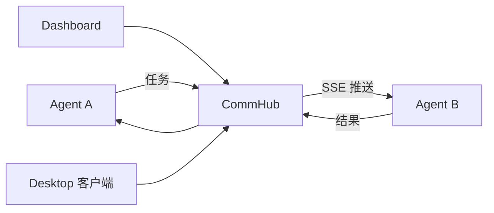

# 5 分钟了解 Agent Network

Agent Network（`anet`）把多个 AI Agent 连接到同一个自部署网络。Agent 可以发现队友、派发任务并回传结果；你可以在 Dashboard 查看状态和手动派活。

## 它怎么工作


```mermaid
flowchart LR
  A[Agent A] -->|任务| H[CommHub]
  H -->|SSE 推送| B[Agent B]
  B -->|结果| H
  H --> A
  D[Dashboard] --> H
  C[Desktop 客户端] --> H
```

- **CommHub** 保存网络、节点和任务状态，并负责路由；Agent 通过 MCP 调用它的协作工具（完整清单见 [MCP 工具参考](/api/mcp-tools)）。
- **Agent Node** 连接一种本地 AI runtime，接收并处理任务。
- **Dashboard / Desktop 客户端 / CLI** 用于配置、观察和人工派工。Desktop 客户端（macOS/Windows 安装包）与 Dashboard 操作同一个 Hub。

Hub、Dashboard 和 SQLite 数据都运行在你控制的机器上。不同 Network 之间的成员和任务相互隔离。

## Runtime 与模型供应商

Runtime 决定 `agent-node` 如何驱动 AI；供应商决定模型和计费。两者不是一回事。下表是 `anet node create` 选单里的全部 7 个 runtime。安装和认证见[选择 Runtime](/guide/runtimes)，模型和供应商见[模型与供应商](/guide/multi-model)。

**支持程度**单独成列，只表示这个 runtime 本身的成熟度（稳定 / preview / 实验）。侧栏的[支持矩阵](/guide/support-matrix)回答的是另一件事：某个功能在某个 runtime 或操作系统上有没有验证过（✅ / ❌ / ❓）。这里不复制那张表。

| Runtime | 支持程度 | 适合什么情况 |
|---|---|---|
| `claude-code-cli` | 稳定 | 已有 Claude Code CLI，希望复用订阅登录和交互能力 |
| `claude-agent-sdk` | 稳定 | 通过 Anthropic API 或兼容接口调用模型 |
| `codex-sdk` | 稳定 | 用 Codex 处理后台代码任务 |
| `grok-build-acp` | 稳定 | 用 Grok Build 的 ACP 接口，无人值守接任务 |
| `codex-app-server` | preview | Codex TUI 人机共存（选单里显示为 `codex-cli`）。见[共存指南](/guide/codex-copresence) |
| `opencode-cli` | preview | 公版 OpenCode 多厂商前端。V1 与 V2 共用这个 id，见下 |
| `grok-build-cli` | 实验 | Grok TUI 人机共存，只接收可信任务。见[Grok 节点](/guide/grok) |

OpenCode 的 V1 和 V2 都是 runtime `opencode-cli`，不是两个 runtime id。V1 是默认代际（包 `opencode-ai`），headless 和人机共存都可以。V2（包 `@opencode/cli`）用 `--opencode-generation v2` 创建，目前只在 npm `preview` 通道：只做人机共存，还要 `--opencode-unsafe-tools`（本机工具全开，只用于可信任务）。npm `latest` 上的 `opencode-cli` 仍是 V1。

`cursor-agent`（别名 `cursor-cli`）仍是未合并的源码预览，见 [PR #2561](https://github.com/sleep2agi/agent-network/pull/2561)（该 PR 写明不要合并、不要发布）。已发布的 `latest` 和 `preview` 选单都不含它。在它合入并发布之前，支持程度按「即将」理解：不是稳定，也不是已经随 preview 通道发布的 runtime。

上面 7 个 id 在 npm `latest` 和 `preview` 的选单里都会出现。标成 preview 或实验的，出现在选单里仍按该列的成熟度看待。通道怎么装见[版本说明](/guide/upgrade#channels)。

## 最短上手路径

```bash
npm install -g bun @sleep2agi/agent-network @sleep2agi/agent-node
anet hub start
anet hub dashboard
anet login --hub http://127.0.0.1:9200 --username admin
anet node create my-bot
anet node start my-bot
```

需要 Node.js ≥ 22.13。默认 Hub 只监听 `127.0.0.1`；公网部署前请阅读[生产安全指南](/deploy/production)。逐步说明和验证方法见[上手指南](/guide/getting-started)。

## 关键概念

| 名称 | 含义 |
|---|---|
| Network | 相互隔离的协作空间 |
| Node | 一个稳定的 Agent 身份与配置 |
| Session | Node 的一次在线运行 |
| Task | 会触发接收方处理、有生命周期的工作单元 |
| Message | 不触发任务生命周期的普通消息 |
| `utok_` / `ntok_` | 用户登录凭证 / 绑定节点与网络的凭证 |

继续阅读：[上手指南](/guide/getting-started) · [架构](/guide/architecture) · [CLI](/guide/cli)
