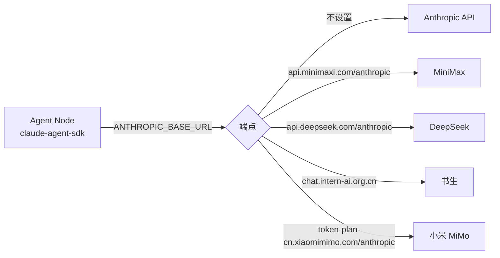

# 多模型配置

同一个 Agent Network 里可以同时跑不同厂商、不同模型的节点。所有节点走同一套 CommHub 通信协议，互相派活、回复不受模型影响。

本页说明：支持哪些提供商、每家怎么配、`ANTHROPIC_BASE_URL` 的工作方式、针对个别厂商的行为修正层（vendor adapter），以及混合编队和选型建议。各 runtime 的安装前置见 [Runtime 对比](/guide/runtimes)。

## 支持的提供商 {#supported-providers}

`anet node create` 的供应商选单（源码中的 `VENDORS` 列表）内置了下面这些提供商。选单里的 model id 只是创建时的预填值，厂商会更新型号，**请以厂商控制台上的当前 model id 为准**。

| 提供商 | Runtime | 认证 | `ANTHROPIC_BASE_URL` | 选单预填的 model |
|---|---|---|---|---|
| Anthropic Claude（API） | `claude-agent-sdk` | `ANTHROPIC_API_KEY` | 不设置（官方端点） | Sonnet / Opus / Haiku 系列 |
| Claude Code | `claude-code-cli` | `claude auth login`（Claude Pro/Team/Max 订阅） | 不适用 | 无选单，跟随订阅 |
| OpenAI Codex | `codex-sdk` | `codex login` | 不适用 | 内置默认值，可用 `--model` 覆盖 |
| MiniMax | `claude-agent-sdk` | `ANTHROPIC_AUTH_TOKEN` | `https://api.minimaxi.com/anthropic` | `MiniMax-M3`（支持图片）、`MiniMax-M2.7`（纯文本） |
| DeepSeek | `claude-agent-sdk` | `ANTHROPIC_AUTH_TOKEN` | `https://api.deepseek.com/anthropic` | `deepseek-v4-pro`、`deepseek-v4-flash` |
| 书生 InternLM | `claude-agent-sdk` | `ANTHROPIC_AUTH_TOKEN` | `https://chat.intern-ai.org.cn`（裸域名，没有 `/anthropic`） | `intern-s2-preview`、`intern-s1-pro` |
| 小米 MiMo | `claude-agent-sdk` | `ANTHROPIC_AUTH_TOKEN` | `https://token-plan-cn.xiaomimimo.com/anthropic` | `mimo-v2.5-pro`、`mimo-v2.5`、`mimo-v2-pro`、`mimo-v2-omni`、`mimo-v2.5-tts-voicedesign` |
| 自定义（GLM、Kimi、OpenRouter、自部署等） | `claude-agent-sdk` | `ANTHROPIC_AUTH_TOKEN` | 厂商文档给出的 Anthropic 兼容端点 | 自行填写 |

`mimo-v2.5-tts-voicedesign` 是语音设计（TTS）模型；做文本对话的 agent 请选其余四个。

另有两条不走 `ANTHROPIC_BASE_URL` 的路线：

- **xAI Grok**：`grok-build-acp` runtime，复用 `grok login` 的登录态，也可以用 `GROK_CODE_XAI_API_KEY`。见 [grok-build-acp](/guide/runtimes#grok-build-acp)。
- **OpenCode**：`opencode-cli` runtime，由 opencode CLI 自己对接厂商。见 [Runtime 对比](/guide/runtimes)。

::: tip 任何 Anthropic 兼容服务都能接
`claude-agent-sdk` 是 Anthropic Messages API 客户端。只要服务商提供 Anthropic 兼容端点（GLM、Kimi、OpenRouter、SiliconFlow、通义千问、自部署 vLLM 等），就能通过选单里的「自定义」接入。端点地址和 model id 以各家文档为准。
:::

## 用向导创建 {#create-with-the-wizard}

在交互终端里不带 `--runtime` 运行，向导会依次询问：

```bash
anet node create writer-1
# 1. 选择 runtime → claude-agent-sdk
# 2. 选择供应商 → 例如 MiniMax
# 3. 选择模型
# 4. 输入 API Key（选单会提示去哪里注册）
anet node start writer-1
```

只有 `claude-agent-sdk` 会弹出供应商选单；`claude-code-cli`、`codex-sdk`、`grok-build-acp` 只提示先登录。

如果当前 shell 里已经导出了 `ANTHROPIC_AUTH_TOKEN` 或 `ANTHROPIC_API_KEY`，向导会跳过供应商选单。这时请用下一节的命令方式，并显式传 `--model`。

## 按提供商配置 {#configure-per-provider}

### 凭据保存在哪里 {#where-credentials-go}

对 `claude-agent-sdk` 节点，`anet node create` 会把当前 shell 里的 `ANTHROPIC_BASE_URL`、`ANTHROPIC_AUTH_TOKEN`、`ANTHROPIC_API_KEY` 记进节点配置，之后在新 shell 里重启节点也能用。也可以用 `--env KEY=VALUE` 显式传入，显式值优先。

密钥类的值不会以明文写进 `config.json`，而是改成环境变量引用，实际值存在 `.anet/nodes/<alias>/.env`（权限 0600）。不要提交 `.anet/` 目录。详见 [节点文件](/guide/agent-node#节点文件)。

### Claude {#claude}

```bash
# 方式 1：Anthropic API Key（claude-agent-sdk）
# --model 填 Anthropic 文档里的当前 model id
ANTHROPIC_API_KEY=sk-ant-xxx \
anet node create reasoner --runtime claude-agent-sdk --model <anthropic-model-id>

# 方式 2：Claude Code 订阅（claude-code-cli），无需 API Key
claude auth login
anet node create all-rounder --runtime claude-code-cli

anet node start reasoner
```

当前 model id 见 [Anthropic Models](https://docs.anthropic.com/claude/docs/models-overview)。

### Codex {#codex}

```bash
codex login
anet node create coder --runtime codex-sdk            # 使用内置默认模型
anet node create coder-2 --runtime codex-sdk --model <codex-model-id>
anet node start coder
```

`codex-sdk` 不读取 `--tools` 参数。登录方式见 [codex-sdk](/guide/runtimes#codex-sdk)。

### 内置的 Anthropic 兼容提供商 {#built-in-anthropic-compatible}

MiniMax、DeepSeek、书生、小米 MiMo 的配置方式相同，只是 `ANTHROPIC_BASE_URL` 和 model 不同：

```bash
# MiniMax
ANTHROPIC_BASE_URL=https://api.minimaxi.com/anthropic \
ANTHROPIC_AUTH_TOKEN=<MiniMax-API-Key> \
anet node create writer-1 --runtime claude-agent-sdk --model <minimax-model-id>

# DeepSeek
ANTHROPIC_BASE_URL=https://api.deepseek.com/anthropic \
ANTHROPIC_AUTH_TOKEN=<DeepSeek-API-Key> \
anet node create reviewer --runtime claude-agent-sdk --model <deepseek-model-id>

# 书生：裸域名，没有 /anthropic 后缀
ANTHROPIC_BASE_URL=https://chat.intern-ai.org.cn \
ANTHROPIC_AUTH_TOKEN=<Intern-API-Key> \
anet node create researcher --runtime claude-agent-sdk --model <intern-model-id>

# 小米 MiMo
ANTHROPIC_BASE_URL=https://token-plan-cn.xiaomimimo.com/anthropic \
ANTHROPIC_AUTH_TOKEN=<MiMo-API-Key> \
anet node create thinker --runtime claude-agent-sdk --model <mimo-model-id>
```

用命令方式创建时请始终带上 `--model`：跳过向导后不会自动填入厂商的默认模型。

获取 API Key 和当前 model id：[MiniMax](https://platform.minimaxi.com)、[DeepSeek](https://platform.deepseek.com)、[书生](https://chat.intern-ai.org.cn/)、[小米 MiMo](https://platform.xiaomimimo.com)。

书生端点会自动启用下文的 [vendor adapter](#vendor-adapters)。

### 自定义 Anthropic 兼容端点 {#custom-endpoint}

GLM（智谱）、Kimi（Moonshot）、OpenRouter、自部署网关等不在内置列表里，走「自定义」：

```bash
ANTHROPIC_BASE_URL=<厂商文档中的 Anthropic 兼容端点> \
ANTHROPIC_AUTH_TOKEN=<API-Key> \
anet node create analyst --runtime claude-agent-sdk --model <厂商的 model id>
```

注意几点：

- 端点要填到 Anthropic SDK 会在后面拼 `/v1/messages` 的那一层，以厂商文档为准。
- model id 的格式由厂商决定，例如 OpenRouter 用 `provider/model`。
- 创建后先派一个小任务确认能回复，再投入使用。

## ANTHROPIC_BASE_URL 的工作方式 {#how-anthropic-base-url-works}

`claude-agent-sdk` 默认请求 Anthropic 官方 API。设置 `ANTHROPIC_BASE_URL` 后，同样的 Messages API 请求会发往该地址，由对应厂商的模型处理：



因为请求格式不变，切换厂商只需要换 `ANTHROPIC_BASE_URL`、API Key 和 `--model`，节点和网络的其余配置都不用改。

Anthropic 兼容协议只统一了数据格式，不保证各家模型的行为一致，尤其是工具调用。这正是下一节 vendor adapter 要处理的问题。

## Vendor adapter（厂商行为修正层） {#vendor-adapters}

同样的 `tools` + `tool_choice: "auto"` 请求，在不同厂商上表现可能不同：

- Anthropic 官方、MiniMax：正常返回 `tool_use` 内容块。
- 书生 `intern-s2-preview`：默认输出冗长的「Thinking Process」文本，不返回 `tool_use` 块；强制 `tool_choice` 会被拒绝（错误码 `-20077`）。结果是节点收到任务却派不出活。

为此，agent-node 的 `claude-agent-sdk` runtime 会检查 `ANTHROPIC_BASE_URL`，命中书生端点时，在系统提示词最前面加一段固定的偏置提示，让模型直接返回 `tool_use` 块。这是临时措施，厂商修复默认行为后会移除。

### 触发条件 {#vendor-adapter-trigger}

`ANTHROPIC_BASE_URL` 匹配正则 `/intern-ai\.org\.cn|chat\.intern-ai/i` 时触发，也就是使用内置书生端点 `https://chat.intern-ai.org.cn` 时。其他厂商不受影响。

加上的提示词原文如下：

```text
When a tool is available and applicable to the user request, you MUST respond by emitting a tool_use content block, not by writing text that describes the tool call. Do not show a verbose thinking process. Do not embed tool-call JSON inside text. Use the tool_use content channel directly. If no tool fits, respond normally with text.
```

### 副作用 {#vendor-adapter-side-effects}

- **看不到思考过程**：模型跳过书生原本可见的推理，调试时看不到它为什么这样决定。
- **识别只靠 URL**：自部署的 lmdeploy、经代理访问、经 OpenRouter 等聚合服务访问书生模型时，URL 不匹配，偏置不会生效，工具调用仍可能失败。
- **注入是隐式的**：实际生效的系统提示词是「偏置 + 你的提示词」，自定义提示词时要记得这一点。
- **偏向调用工具**：对多 agent 协作有利；但让节点只写一份报告时，模型可能更倾向去调工具。

### 能否关闭 {#vendor-adapter-opt-out}

目前不能。对书生端点，这段偏置总是加在最前面：

- 给节点设置自定义系统提示词（节点 `.anet/nodes/<alias>/config.json` 的 `systemPrompt` 字段，或直接运行 `agent-node --prompt`）只会接在偏置后面，不会替换它。`anet node start` 没有 `--prompt` 参数。
- 自定义提示词可以引导行为，例如写明「只输出报告，不要调用工具」。
- 不想要偏置，只能换用非书生的端点。

反过来，如果你通过自部署或代理使用书生模型、URL 不会触发偏置，可以把上面的提示词原文复制到该节点 `config.json` 的 `systemPrompt` 里。

## 混合编队示例 {#mixed-fleet}

一个网络里按任务类型分配不同模型：

```bash
anet hub start

# 文案、翻译：低成本模型
ANTHROPIC_BASE_URL=https://api.minimaxi.com/anthropic \
ANTHROPIC_AUTH_TOKEN=<MiniMax-API-Key> \
anet node create writer-1 --runtime claude-agent-sdk --model <minimax-model-id>

# 代码审查：DeepSeek
ANTHROPIC_BASE_URL=https://api.deepseek.com/anthropic \
ANTHROPIC_AUTH_TOKEN=<DeepSeek-API-Key> \
anet node create reviewer --runtime claude-agent-sdk --model <deepseek-model-id>

# 编码：Codex
codex login
anet node create coder --runtime codex-sdk

anet node start writer-1
anet node start reviewer
anet node start coder
```

节点都在线后，可以在 Dashboard 里给对应节点派活，或者让一个协调节点按任务类型转派。协调节点的分工规则写在它的 `systemPrompt` 里，例如：

```text
你是协调者。代码类任务派给 coder，审查类派给 reviewer，文案和翻译派给 writer-1。
用 commhub_get_all_status 查看谁在线，用 commhub_send_task 派活。
```

用容器部署节点见 [Docker 部署](/deploy/clean-server#docker)。

## 选型与成本建议 {#model-selection-and-cost}

| 场景 | 建议 |
|---|---|
| 复杂推理、架构设计 | Claude 高端型号，或 Claude Code 订阅 |
| 写代码、跑命令 | Codex，或 Claude |
| 翻译、摘要、批量文本 | MiniMax、DeepSeek 等低成本模型 |
| 需要看图 | 选明确支持图片输入的型号，例如选单里标注 vision 的 MiniMax-M3 或 Claude |
| 科研类推理 | 书生（注意上面的 vendor adapter） |

控制成本的几个办法：

- **分级派活**：大部分简单任务交给低成本模型，只把少数难任务交给高端模型。各家价格经常调整，做预算前查厂商的官方价目表。
- **单任务预算上限**（`claude-agent-sdk`）：在 `.anet/nodes/<alias>/config.json` 的 `flags` 里设置 `budget`（美元），修改后重启节点；也可以在直接运行 agent-node 时传 `--max-budget <usd>`。
- **限制轮数**（`claude-agent-sdk`）：创建时传 `--max-turns <n>`，避免单个任务跑太多轮。
- **并发**：多数厂商有并发上限，批量起节点前先确认配额，限流报错的处理见 [FAQ](/troubleshooting#faq)。

```json
{
  "flags": {
    "budget": 1.0
  }
}
```

## 下一步 {#next-steps}

- 各 runtime 的前置条件与差异：[Runtime 对比](/guide/runtimes)
- 节点文件、环境变量与密钥：[Agent Node](/guide/agent-node)
- 容器化部署：[Docker 部署](/deploy/clean-server#docker)
