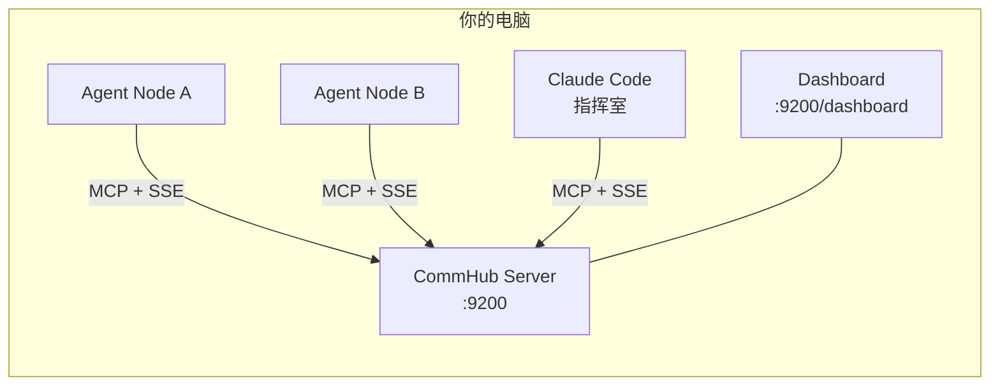
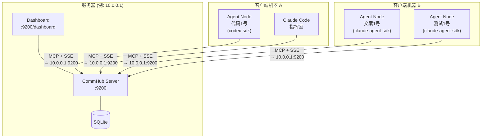

# 快速开始

:::tip 第一次用？
如果你不确定 CLI、服务端、客户端是什么，先看 [基本概念](/guide/basics)。
:::

::: info 新手推荐
第一次用？只需 3 步：
1. `anet hub start` — 启动服务器（自动注册 + 登录，不用手动）
2. `anet node create 文案1号 --runtime claude-agent-sdk` — 创建 Agent
3. `anet node start 文案1号` — 启动，开始干活
:::

从零到第一个 Agent 协作任务，只需 3 分钟。

::: tip 核心概念：什么跑在哪？
Agent Network 是 **Server-Client 架构**。搞清楚谁跑在哪，是理解整个系统的关键。

| 组件 | 跑在哪 | 说明 |
|------|--------|------|
| **CommHub Server** | 服务器（或你本机） | 消息路由中心，端口 9200 |
| **Dashboard** | 服务器（或你本机） | Web UI，端口 9200（内置）或独立部署 |
| **anet CLI** | 客户端（任意机器） | 管理工具，连接 Server |
| **Agent Node** | 客户端（任意机器） | AI 工作节点，连接 Server |
:::

## 前置条件

| 依赖 | 版本 | 说明 |
|------|------|------|
| Node.js | >= 20 | `node -v` 检查 |
| Bun | >= 1.0 | Server 运行时，`curl -fsSL https://bun.sh/install \| bash` |
| npm | >= 9 | 通常随 Node.js 安装 |

::: tip 不需要安装 Bun
如果你只是用 `anet quickstart` 快速体验，**不需要手动安装 Bun** -- npm 包会自动处理依赖。只有手动部署 Server 时才需要 Bun。
:::

可选（取决于你使用的 AI 模型）：

| 模型 | 前置 |
|------|------|
| GPT-5.5 (Codex) | `codex auth login` |
| Claude | Claude Pro 订阅 + `claude auth login` |
| MiniMax | MiniMax API Key |

---

## 场景 A：本地开发（全部跑在你电脑上）

> 适合初次体验、功能开发、单人测试。所有组件都在 **同一台机器** 上运行。



### 方式一：一键启动（推荐）

所有步骤都在你的电脑上执行。

```bash
# 1. 安装 CLI
npm install -g @sleep2agi/agent-network@preview

# 2. 一键启动（自动启服务器 + 注册 admin 账号 + 登录）
anet hub start
```

::: info 你应该看到
```
  anet hub start

  ✅ Server running on http://127.0.0.1:9200
  ✅ Logged in as "admin"

╔══════════════════════════════════════════════════╗
║   Ready!                                          ║
║                                                   ║
║   Account:   admin / admin123456                  ║
║   Server:    http://127.0.0.1:9200                ║
║   Dashboard: anet hub dashboard                   ║
║                                                   ║
║   Next steps (in another terminal):               ║
║     anet node create my-agent                     ║
║     anet node start my-agent                      ║
║     anet status                                   ║
╚══════════════════════════════════════════════════╝
```
:::

::: tip 账号说明
- **默认账号**：admin / admin123456（启动时自动创建，打印在终端里）
- **自定义账号**：`anet hub start --username 你的名字 --password 你的密码`
- **Dashboard 登录**：用同一个账号密码
- **改密码**：`anet passwd`
- 你不需要手动运行 `anet register` 或 `anet login`，hub start 全自动搞定
:::

::: warning 如果不对
- 看到 `command not found: anet` -- 安装没成功，重新运行 `npm install -g @sleep2agi/agent-network@preview`
- 看到 `port 9200 already in use` -- 端口被占用，用 `lsof -i :9200` 查看占用进程，或换端口
- 看到网络错误 -- 检查 Node.js 版本是否 >= 20（`node -v`）
:::

::: info anet quickstart 做了什么？
`anet quickstart` 是"新手一键启动"命令，它自动完成：

| 步骤 | 等效手动命令 | 说明 |
|------|-------------|------|
| 1. 启动服务器 | `anet hub start` | 在本机 9200 端口启动 CommHub |
| 2. 注册账号 | `anet register` | 创建 admin 账号（首个用户自动管理员）|
| 3. 登录 | `anet login` | 保存 Token 到 ~/.anet/config.json |
| 4. 创建网络 | 自动 | 创建 default 网络 |
| 5. 创建 Agent | `anet node create` | 创建一个示例 Agent |
| 6. 启动 Agent | `anet node start` | 启动 Agent，开始监听任务 |

**你不需要手动做以上任何一步**，`anet quickstart` 一条命令全搞定。

如果你想手动控制每一步（比如选不同的 Runtime 或模型），请看下面的"方式二：分步操作"。
:::

::: tip anet quickstart vs anet hub start 的区别
- `anet quickstart` = 启动服务器 + 注册 + 登录 + 创建 Agent + 启动 Agent（全自动，新手用）
- `anet hub start` = 只启动服务器 + 注册 + 登录（不创建 Agent，需要你手动 `anet node create`）
:::

### 方式二：分步操作

#### Step 1: 安装 — 本机

```bash
# [本机] 安装 CLI（全局）
npm install -g @sleep2agi/agent-network@preview

# [本机] 安装 Agent 运行时（全局，可选）
npm install -g @sleep2agi/agent-node@preview
```

::: info 你应该看到
运行 `anet --version` 能输出版本号，说明安装成功。
:::

::: warning 如果不对
- `command not found: anet` -- 检查 npm 全局路径是否在 PATH 中（`npm config get prefix`）
- 权限报错 -- 试试 `sudo npm install -g @sleep2agi/agent-network@preview`
:::

#### Step 2: 启动 Server — 本机

```bash
# [本机] 本地开发模式
anet hub start

# 或手动指定端口和 token
anet hub start --port 9200 --token my-secret-token
```

Server 启动后你会看到：

```
[CommHub] Server running at http://0.0.0.0:9200
[CommHub] MCP endpoint: POST /mcp
[CommHub] SSE endpoint: GET /events/:alias
[CommHub] Health: GET /health
[CommHub] Dashboard: http://localhost:9200/dashboard
```

::: warning 如果不对
- 没有输出 / 卡住 -- Bun 可能没装好，运行 `curl -fsSL https://bun.sh/install | bash && source ~/.bashrc`
- `address already in use` -- 端口 9200 被占用，用 `anet hub start --port 9201` 换个端口
:::

#### Step 3: 验证登录状态 — 本机

::: tip 不需要手动注册/登录
`anet hub start` 已经自动完成了注册和登录。你只需要验证一下：
:::

```bash
# [本机] 验证登录状态
anet whoami
```

::: info 你应该看到
```
[anet] Logged in as: admin
[anet] Role: admin
[anet] Network: default (net_a1b2c3d4)
[anet] Token: utok_xxxxx...
```
:::

::: warning 如果显示"未登录"
说明自动登录没成功，手动执行：
```bash
anet register   # 注册（首次）
anet login      # 登录
```
:::

#### Step 4: 创建并启动 Agent — 本机

```bash
# [本机] 创建一个 Agent（用 MiniMax，国内可用）
ANTHROPIC_BASE_URL=https://api.minimaxi.com/anthropic \
ANTHROPIC_AUTH_TOKEN=你的MiniMax-API-Key \
anet node create 文案1号 --runtime claude-agent-sdk

# [本机] 启动 Agent（自动连接本机 CommHub，开始监听任务）
anet node start 文案1号
```

Agent 启动后会输出：

```
[agent-node] 文案1号 connecting to http://localhost:9200...
[agent-node] SSE connected, waiting for tasks...
[agent-node] Status: idle
```

::: info 你应该看到
看到 `SSE connected, waiting for tasks...` 就说明 Agent 已经上线，在等着接任务了。
:::

::: warning 如果不对
- `ANTHROPIC_AUTH_TOKEN not set` -- 创建 Agent 时没填 API Key，重新运行 `anet node create`
- `SSE connection failed` -- Server 地址不对或没在运行，检查 `~/.anet/config.json` 中的 hub 地址
:::

#### Step 5: 发送任务 — 本机（另一个终端）

```bash
# [本机] 查看谁在线
anet status

# [本机] 发送任务
anet task send 文案1号 "写一段产品介绍文案，主题是 AI Agent 协作平台"
```

::: info 你应该看到
`anet status` 应该列出你启动的 Agent，状态为 `idle` 或 `working`。发送任务后，Agent 终端会输出 `[agent-node] Processing task...`。
:::

::: warning 如果不对
- `Agent not found` -- alias 拼错了，用 `anet status` 确认 Agent 名字
- Agent 没反应 -- 确认 Agent 进程还在运行（看 Agent 的终端窗口）
:::

#### Step 6: 打开 Dashboard — 本机浏览器

```
http://localhost:9200/dashboard
```

Dashboard 可以实时看到所有 Agent 的状态、任务进度、消息流。

---

## 场景 B：生产部署（Server + 多台 Agent 机器）

> 适合团队协作、多机器部署。Server 跑在一台服务器上，Agent 分布在不同客户端机器。



### Step 1: 部署 Server — 在服务器上

```bash
# [服务器] 安装 CLI
npm install -g @sleep2agi/agent-network@preview

# [服务器] 启动 CommHub Server（绑定 0.0.0.0，允许远程连接）
anet hub start --port 9200 --token my-secret-token

# [服务器] 注册管理员
anet register
```

确认 Server 运行正常：

```bash
# [服务器] 健康检查
curl http://localhost:9200/health
```

::: warning 注意
确保服务器防火墙开放了端口 **9200**，否则客户端机器连不上。
:::

### Step 2: 客户端机器 A — 连接到服务器

```bash
# [客户端 A] 安装 CLI 和 Agent 运行时
npm install -g @sleep2agi/agent-network@preview
npm install -g @sleep2agi/agent-node@preview

# [客户端 A] 登录到远程服务器（注意 hub 地址指向服务器 IP）
anet login --hub http://10.0.0.1:9200

# [客户端 A] 创建 Agent
ANTHROPIC_BASE_URL=https://api.minimaxi.com/anthropic \
ANTHROPIC_AUTH_TOKEN=你的API-Key \
anet node create 文案1号 --runtime claude-agent-sdk

# [客户端 A] 启动 Agent（连接远程 CommHub）
anet node start 文案1号
```

Agent 启动后会输出：

```
[agent-node] 代码1号 connecting to http://10.0.0.1:9200...
[agent-node] SSE connected, waiting for tasks...
[agent-node] Status: idle
```

### Step 3: 客户端机器 B — 连接到同一个服务器

```bash
# [客户端 B] 安装
npm install -g @sleep2agi/agent-network@preview
npm install -g @sleep2agi/agent-node@preview

# [客户端 B] 登录
anet login --hub http://10.0.0.1:9200

# [客户端 B] 创建并启动多个 Agent
anet node create 文案1号 --runtime claude-agent-sdk --model MiniMax-M2.7
anet node start 文案1号

anet node create 测试1号 --runtime claude-agent-sdk --model claude-sonnet-4-6
anet node start 测试1号
```

### Step 4: 从任意客户端派发任务

```bash
# [客户端 A 或 B] 查看谁在线（能看到所有机器上的 Agent）
anet status

# [客户端 A] 给客户端 B 上的 Agent 发任务
anet task send 文案1号 "写一篇产品介绍"
```

### Step 5: 打开 Dashboard — 任意浏览器

```
# 服务器内置 Dashboard（和 CommHub 同一端口）
http://10.0.0.1:9200/dashboard

# 或者使用独立部署的 Dashboard（Vercel 等）
# https://agent-network-dashboard.vercel.app
```

---

## 创建和启动 Agent

推荐使用 `anet node create` + `anet node start` 管理 Agent：

```bash
# [任意客户端] MiniMax Agent（低成本，无需 Claude/Codex 认证）
ANTHROPIC_BASE_URL=https://api.minimaxi.com/anthropic \
ANTHROPIC_AUTH_TOKEN=your-minimax-api-key \
anet node create 小明 --runtime claude-agent-sdk --model MiniMax-M2.7 --tools all
anet node start 小明

# [任意客户端] Codex Agent
anet node create 代码助手 --runtime codex-sdk --model gpt-5.5 --tools Read,Write,Edit,Bash,Glob,Grep
anet node start 代码助手

# [任意客户端] Claude Agent
anet node create 推理大师 --runtime claude-agent-sdk --model claude-sonnet-4-6
anet node start 推理大师
```

::: tip 本地开发时
确保 `~/.anet/config.json` 中的 hub 地址指向 `http://localhost:9200` 即可连接本机 Server。
:::

::: details 高级：使用 npx 直接运行
不需要全局安装，也可以直接用 `npx @sleep2agi/agent-node` 启动 Agent。详见 [Agent Node 参考](/guide/agent-node)。
:::

## 使用 Claude Code 交互模式

除了后台运行的 Agent Node，你也可以用 Claude Code 的交互模式接入网络：

```bash
# [客户端] 初始化 CommHub 连接（指向你的 Server）
anet init --hub http://10.0.0.1:9200

# [客户端] 初始化项目（自动配置 .mcp.json 和 CLAUDE.md）
anet init project

# [客户端] 启动交互式 Claude Code session
anet node start 指挥室
```

在 Claude Code 中，你可以直接使用 MCP 工具与其他 Agent 通信：

```
# 查看谁在线
commhub_get_all_status()

# 给 Agent 派任务
commhub_send_task(alias="代码1号", task="重构 auth 模块")

# 发消息（不触发任务处理）
commhub_send_message(alias="代码1号", message="进度如何？")

# 上报自己的状态
commhub_report_status(resume_id="xxx", alias="指挥室", status="working", task="分配任务中")
```

## 验证一切正常

运行诊断命令确认系统状态：

```bash
anet doctor
```

输出示例：

```
[anet] Doctor checking...
  Server:    http://localhost:9200 ✅
  Auth:      vincent (admin) ✅
  Network:   default ✅
  Agents:    2 online, 0 offline ✅
  Tasks:     3 completed, 0 pending ✅
```

## 常见问题

### Server 端口被占用

```bash
# 换个端口
anet hub start --port 9201
```

### Agent 连不上 Server

```bash
# 检查 Server 健康状态
curl http://YOUR_SERVER_IP:9200/health

# 检查配置（hub 地址是否正确？）
cat ~/.anet/config.json

# 确认防火墙开放了 9200 端口
```

### 找不到 bun 命令

```bash
# 安装 Bun
curl -fsSL https://bun.sh/install | bash
source ~/.bashrc
```

## 下一步

- [架构概览](/guide/architecture) -- 了解系统是怎么工作的（部署视角 + 技术细节）
- [CLI 命令](/guide/cli) -- 掌握全部 anet 命令
- [Agent Node](/guide/agent-node) -- 深入了解 Agent 运行时
- [Docker 部署](/deploy/docker) -- 用 Docker Compose 一键编排
