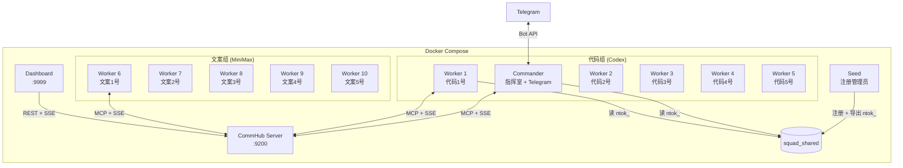

# Docker 部署

Agent Network 提供 Docker Compose 编排方案，一键启动完整的 Agent 军团。

## 快速开始

```bash
cd demos/codex-telegram-squad

# 1. 配置环境变量
cp .env.example .env
# 编辑 .env 填入 Token 和 API Key

# 2. 启动（12 个容器）
docker compose up -d

# 3. 查看状态
docker compose ps
docker compose logs -f commander
```

## 架构



## Dockerfile 说明

### Dockerfile.server (CommHub Server)

```dockerfile
FROM oven/bun:1
WORKDIR /app

# 只复制 server 目录
COPY server/ ./server/
COPY agent-network/src/ ./agent-network/src/

WORKDIR /app/server
RUN bun install

EXPOSE 9200
CMD ["bun", "run", "src/index.ts"]
```

关键点：
- 基于 Bun 镜像（CommHub Server 用 Bun 运行）
- 只需要 `server/` 和 `agent-network/src/`
- 暴露 9200 端口

### Dockerfile.agent (Agent Node)

```dockerfile
FROM node:20-slim
WORKDIR /app

# 安装 agent-node 和 CLI
COPY agent-network/ ./agent-network/
COPY agent-node/ ./agent-node/
COPY channel/ ./channel/

RUN cd agent-network && npm install && npm link
RUN cd agent-node && npm install

# 安装 Codex CLI（可选）
RUN npm install -g @openai/codex

COPY demos/codex-telegram-squad/entrypoint.sh /entrypoint.sh
RUN chmod +x /entrypoint.sh

ENTRYPOINT ["/entrypoint.sh"]
```

关键点：
- 基于 Node.js 镜像
- 安装 agent-network (CLI) 和 agent-node (运行时)
- 通过 entrypoint.sh 启动，根据环境变量选择 runtime

### entrypoint.sh

```bash
#!/bin/bash
set -e

# 等待 Server 就绪
until curl -sf http://$COMMHUB_URL/health; do
  sleep 1
done

# 读取 ntok_（从 seed 容器导出的共享卷）
if [ -f /shared/ntok ]; then
  export COMMHUB_TOKEN=$(cat /shared/ntok)
fi

# 启动 Agent Node
exec npx @sleep2agi/agent-node \
  --alias "$ALIAS" \
  --runtime "$RUNTIME" \
  --model "$MODEL" \
  --hub "$COMMHUB_URL" \
  --token "$COMMHUB_TOKEN" \
  ${TOOLS:+--tools "$TOOLS"} \
  ${SYSTEM_PROMPT:+--system-prompt "$SYSTEM_PROMPT"}
```

## docker-compose.yml 详解

### 共享配置

```yaml
x-common: &common
  build:
    context: ../..
    dockerfile: demos/codex-telegram-squad/Dockerfile.agent
  volumes:
    - ${HOME}/.codex:/root/.codex:ro          # Codex 认证
    - ${HOME}/.claude.json:/root/.claude.json:ro  # Claude 认证
    - squad_shared:/shared                     # 共享 ntok_
  tmpfs:
    - /root/.claude    # 可写临时目录
    - /tmp
  depends_on:
    seed:
      condition: service_completed_successfully
  restart: unless-stopped
```

**关键设计**：

| 挂载 | 模式 | 说明 |
|------|------|------|
| `~/.codex` | `ro` | Codex 认证（只读） |
| `~/.claude.json` | `ro` | Claude 认证（只读） |
| `squad_shared` | `rw` | 共享卷，存 ntok_ |
| `/root/.claude` | `tmpfs` | Agent SDK 需要可写，用 tmpfs |

### Seed 容器

Seed 容器负责在 Server 启动后注册管理员并导出 ntok_：

```yaml
seed:
  image: curlimages/curl:latest
  depends_on:
    server:
      condition: service_healthy
  volumes:
    - squad_shared:/shared
  entrypoint:
    - sh
    - -c
    - |
      # 注册管理员
      RESP=$(curl -sX POST http://server:9200/api/auth/register \
        -H "Content-Type: application/json" \
        -H "Authorization: Bearer ${COMMHUB_AUTH_TOKEN}" \
        -d '{"username":"admin","password":"admin123"}')

      # 提取 ntok_ 并写入共享卷
      NTOK=$(echo "$RESP" | sed -n 's/.*"network_token":"\(ntok_[^"]*\)".*/\1/p')
      echo "$NTOK" > /shared/ntok
  restart: "no"
```

Seed 容器是一次性的（`restart: "no"`），只在首次启动时运行。后续重启如果 `/shared/ntok` 已存在则跳过。

### Server 健康检查

```yaml
server:
  healthcheck:
    test: ["CMD", "curl", "-sf", "http://127.0.0.1:9200/health"]
    interval: 3s
    timeout: 5s
    retries: 10
```

所有 Agent 容器通过 `depends_on` + `condition: service_healthy` 等待 Server 就绪。

## 环境变量

### .env 文件

```bash
# CommHub 认证
COMMHUB_AUTH_TOKEN=squad-token

# Telegram Bot
TELEGRAM_BOT_TOKEN=123456789:ABCdefGhIJKlmNoPQRsTUVwxyz
TELEGRAM_ALLOW_USER=999999999

# MiniMax API
MINIMAX_API_KEY=your-minimax-api-key

# Dashboard 密码
DASHBOARD_PASSWORD=squad-dash
```

### 容器环境变量

| 变量 | 说明 | 示例 |
|------|------|------|
| `ALIAS` | Agent 名称 | `代码1号` |
| `RUNTIME` | 运行时 | `codex-sdk` / `claude-agent-sdk` |
| `MODEL` | 模型 | `gpt-5` / `claude-3-5-haiku-20241022` |
| `COMMHUB_URL` | Server 地址 | `http://server:9200` |
| `COMMHUB_TOKEN` | 认证 Token | `ntok_xxx` 或从 /shared/ntok 读取 |
| `TOOLS` | 工具列表 | `Read,Write,Edit,Bash,Glob,Grep` |
| `SYSTEM_PROMPT` | 系统提示词 | 指挥室的任务分配规则 |
| `ANTHROPIC_BASE_URL` | MiniMax API 地址 | `https://api.minimaxi.com/anthropic` |
| `ANTHROPIC_AUTH_TOKEN` | MiniMax API Key | MiniMax Key |

## 常用操作

### 启动

```bash
# 启动所有
docker compose up -d

# 只启动 Server + Commander
docker compose up -d server seed commander

# 启动并查看日志
docker compose up
```

### 查看状态

```bash
# 容器状态
docker compose ps

# 所有日志
docker compose logs

# 特定容器日志
docker compose logs -f commander
docker compose logs -f worker-1

# CommHub API 查看
curl http://localhost:9299/api/status
curl http://localhost:9299/health
```

### 扩缩容

```bash
# 增加 Worker（需要在 compose 中定义）
docker compose up -d --scale worker=10

# 停止特定 Worker
docker compose stop worker-5
```

### 停止和清理

```bash
# 停止所有
docker compose down

# 停止并清理数据卷
docker compose down -v

# 重建镜像
docker compose build --no-cache
docker compose up -d
```

## 端口映射

| 服务 | 容器端口 | 宿主端口 | 说明 |
|------|---------|---------|------|
| Server | 9200 | 9299 | CommHub API |
| Dashboard | 3000 | 9999 | Web UI |

## 持久化

| 数据 | 存储 | 说明 |
|------|------|------|
| CommHub 数据库 | Server 容器内 | 默认不持久化，重启丢失 |
| ntok_ | `squad_shared` 卷 | 持久化到 Docker 卷 |
| Agent 日志 | tmpfs | 不持久化 |

如果需要持久化数据库：

```yaml
server:
  volumes:
    - ./data:/root/.commhub  # 持久化 SQLite 数据库
```

## 自定义 Compose

### 添加更多 Worker

```yaml
# 在 docker-compose.yml 中添加
worker-11:
  <<: *common
  environment:
    - ALIAS=代码6号
    - RUNTIME=codex-sdk
    - MODEL=gpt-5
    - COMMHUB_URL=http://server:9200
    - TOOLS=Read,Write,Edit,Bash,Glob,Grep
```

### 使用不同模型

```yaml
# DeepSeek Worker
worker-deepseek:
  <<: *common
  environment:
    - ALIAS=深度1号
    - RUNTIME=claude-agent-sdk
    - MODEL=deepseek-chat
    - ANTHROPIC_BASE_URL=https://api.deepseek.com/anthropic
    - ANTHROPIC_AUTH_TOKEN=${DEEPSEEK_API_KEY}
    - COMMHUB_URL=http://server:9200
```
