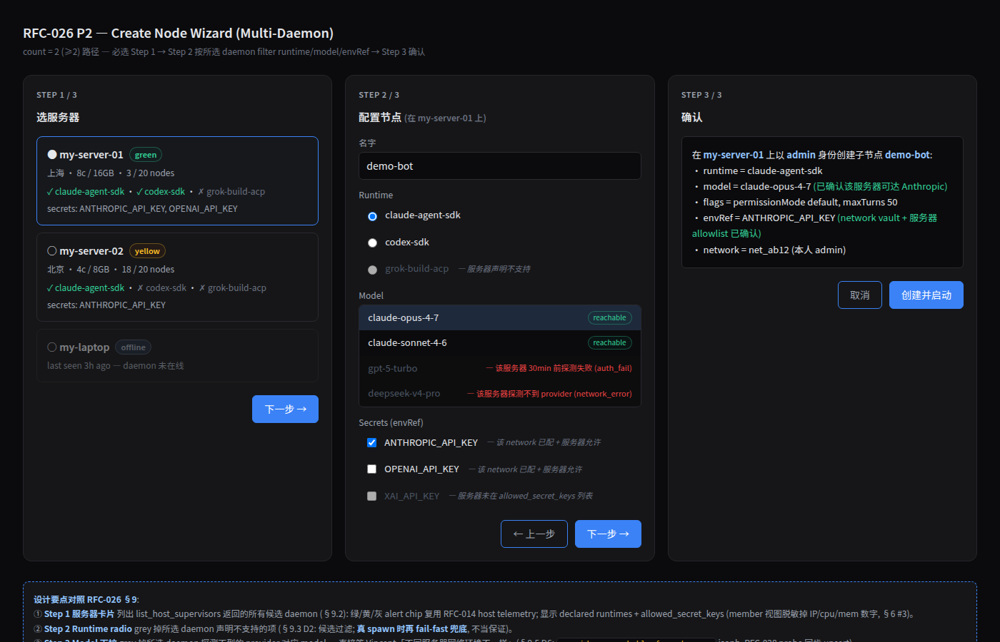

# RFC-026 — Dashboard 远程创建节点 + Host-Daemon

**作者**: 通信工程马
**状态**: Draft v4 (通信牛 v3 复判 CHANGE_REQ → 2 blocker 修, 待二次复判)
**v4 变更说明**: 通信牛 v3 [comment](https://github.com/sleep2agi/agent-network/pull/297)（task `732335d5`）C2/C4/C5/F1 闭合 ✅，但 C1/C3 有 2 个真安全洞，impl 前必修：
- **B1 (env-key 覆盖 — C1/C3 矛盾 → LD_PRELOAD 注入)**：`ENV_KEY_RE` 仍接受 `PATH`/`LD_PRELOAD`/`NODE_OPTIONS`/`BUN_*`/`npm_*`；`minimalEnv()` 又用 `{PATH:SAFE_PATH, HOME, LANG, ...extra}` spread 把 extra 放后面 → 取名 `PATH` 的 env secret 覆盖 SAFE_PATH。**修**：加 `RESERVED_ENV_KEYS_EXACT` + `RESERVED_ENV_PREFIXES` denylist (hub + daemon 双层 enforce) + minimalEnv 防御式组装 (固定键最后 set 胜出 + collision throw)。scenario G7/G8 + I-sub 验。详 §4.4.7 / §4.2.6
- **B2 (PATH 解析仍走 daemon 启动期 PATH — C3 没真满足 scenario I)**：boot 时 `which anet`，scenario I PATH 前置 evil-bin → which 解析的就是 evil。**修**：install-time canonicalize anet 绝对路径 → 写 `/etc/anet-daemon/path.conf` 或 systemd `Environment=ANET_BIN_ABS=...`；daemon boot 从 conf 读 + 校验「绝对路径 + 非 user/world-writable + 非 symlink-to-tmp + (option) hash 对得上 install-time」；runtime fork 永不再 `which` lookup。详 §4.2.6
- **C4 impl 注意 (通信牛 提醒, 不算 blocker)**：token 行带 `request_id` + `token_id` 元数据，不碰明文 token 即可 revoke。已加 §4.4.8 impl note

**v3 变更说明** (历史): 通信牛 v2 安全终审 5 must-fold (通信龙 转 task `609da9ef`)：F1/F2/F3 主方向 PASS，但加 5 条**设计不变量**才是可开工规格。每条同时是 §5 P1 test plan 的新 scenario G-K。Vincent 「充分测试」要求与之对齐。
- **C1 (env_refs 严格校验)** — §4.4.7 新加 + scenario G: key regex / 去重 / count/size 上限 / vault-presence / daemon allowlist / `.env.local` safe serializer
- **C2 (get/ack 绑 daemon node_id)** — §4.1.4 新加 + scenario H: 同 network 同 role 的 daemonA 也不能 get/ack daemonB 的 request
- **C3 (ANET_BIN 绝对路径不走 PATH)** — §4.2.6 新加 + scenario I: 启动一次 `which` resolve + pin；`minimalEnv.PATH` 固定，PATH 投毒不影响 fork
- **C4 (mint-stream-evict 失败语义 + orphan ntok revoke)** — §4.4 case-table + scenario J: hub-crash-before-get vs daemon-crash-after-get-before-ack 都 terminal failed/expired + child ntok 一律 revoke
- **C5 (P1 channels fail-closed)** — §3.3 + §4.2.5 + scenario K: non-empty channels hub/daemon 均拒，P3 再上 schema

**v2 变更说明** (历史)：通信龙 [v1 review](https://github.com/sleep2agi/agent-network/pull/297) 3 amends 全折：
- **F1 (重要·安全)**: env_blob 永不入 hub DB，改 `mint-stream-evict`——内存按 `request_id` keyed, daemon 拉取时现取现传, ack 后 evict; 表里只存 `env_keys` 做 audit（详 §2.5 step 2 + §4.4）
- **F2 (安全·加固)**: 删 `FORK_ARGS_PATTERN` regex-on-rebuilt-string（误导，像留 shell 路径）；改逐字段 enum + 类型校验 + `execFile` 数组，永不拼 shell 串（详 §4.2.2）
- **F3 (minor)**: 装机脚本 utok 走 env var (`ANET_ADMIN_TOKEN`) 或交互 prompt，不上 argv 避免 `ps`/shell history 暴露（详 §2.3）
- **§6 五未决 verdict 全锁**：①子进程 PINNED ②dashboard 不能改 daemon 自身配置 ③host telemetry admin-only 详情 member 脱敏 ④secret rotation 复用 restart_node ⑤每 host 1 daemon
- **§4.1.1 加一行**：daemon **首次装机 mint daemon-ntok 限 admin+**（信任根）；之后日常 create_node admin 即可
**关联**: #260（dashboard 真生效系列）、RFC-024（config-apply，本 RFC 的姐妹）、RFC-014（host telemetry，本 RFC 的复用底座）
**目标 ship**: P1 MVP `v0.12-preview.X` 单机闭环；P2/P3 后续
**长度承诺**: 该 RFC 限定 design，**任何代码改动不在本 RFC 内**

---

## 0. TL;DR

Vincent 原需求 #③：**dashboard 上「新建节点」+ 「选服务器」一整套**。今天 anet 没有「远程在某台机器上代为起进程」的能力，节点必须人在那台机器上手动 `anet node create + start`。本 RFC 设计一条**最小入侵、复用 RFC-014/RFC-024 既有底座、安全边界明确**的链路：

> **「Host-Daemon = 一个特殊角色的 anet 节点」**——它不是新二进制、不是新协议，只是一个常驻 `anet node start` 进程，多挂了 1 个 `create_local_node` MCP 工具。Dashboard 选服务器 → hub 调该 daemon 的 `create_local_node` → daemon fork-exec `anet node create + start` 生出真节点子进程 → 子进程拿独立 ntok 注册回 hub → dashboard 看到新节点。

**为什么选这个形态**：
- 复用已有的 SSE doorbell（RFC-024）+ ntok auth + supervisor wrap（RFC-024 W1）+ host telemetry（RFC-014）→ 几乎不加新基础设施
- 「daemon = 特殊节点」让安装路径 = `npm i -g @sleep2agi/agent-node` 一句话，不引入第二个 binary 的分发负担
- 子进程的 ntok 由 hub 现场 mint 给 daemon 转发，**daemon 永远拿不到用户 utok**——安全边界最强

MVP（P1）只做单机本机 daemon 闭环（dashboard 列「本机」一个服务器，证 chain），然后 P2 多机选择 + role gate，P3 一整套可选项 + 反向操作（停/删节点）。

---

## 1. 现状审计

### 1.1 RFC-014（host telemetry）现状

| 能力 | 现状 | 给本 RFC 的价值 |
|---|---|---|
| 每个 agent-node 周期 `report_status.host` 上报 hostname / ip / cpu / mem / disk | ✅ shipped v0.10.0/0.11.0 | **「在线服务器列表 = 已注册 daemon 的 host 列表」可直接基于此数据** |
| `/api/server/:host/health` 返回 alert_level + history | ✅ shipped | dashboard「服务器卡片」可直接显示健康状态，不重新设计 |
| 每个 host 可能跑多个节点 | 现状如此 | daemon 是 host 上的 1 个**特殊**节点；普通节点照常 |

**结论**：RFC-014 已经把「per-host 心跳 + 资源 + 健康」的协议、表、UI 都做完。本 RFC 不重写。

### 1.2 RFC-024（config-apply）现状

| 复用点 | 本 RFC 用法 |
|---|---|
| SSE doorbell `pushEvent(alias, {type: "config_update"})` | 改成 `{type: "create_node"}` 唤醒 daemon |
| MCP tools/call 通用调用 + tools 注册体系 | 新增 `create_local_node` 工具 |
| W1 supervisor wrap（exit 75 自动 respawn） | daemon 进程本身就跑在 W1 下；fork 出的子节点也跑 W1 |
| 单飞 unique index + reaper 60s 超时 | 复用为「同一 daemon 同一 node_name 单飞」 |
| `report_status.config_snapshot` content-match finalize | 复用为「create 完成 = 子节点首次 report_status 收到 = update applied」 |

**结论**：RFC-024 留下的「派单 + 应用 + 终态」骨架可以直接长出「create 任务」这一条新分支。

### 1.3 现有 `anet node create + start` CLI

```
anet node create <name> [--runtime ...] [--model ...] [--channels ...]
  → 写 .anet/nodes/<name>/config.json
  → 把 alias 注入 ~/.anet/global/aliases
  → 不启动进程

anet node start <name>
  → 读 config.json
  → launchAgent(name) → spawn `agent-node` 子进程
  → W1 supervisor wrap，exit 75 自动 respawn
```

agent-node 启动后即向 hub `register()` + `reportStatus("idle")`，**完全是 self-bootstrapping**，hub 只是被动接收。

本 RFC 的「daemon 代为创建」= **daemon 进程内 spawn `anet node create + start`**，对子节点而言跟人手敲完全等价。

---

## 2. Host-Daemon 架构

### 2.1 总览（一图）

```
┌────────────┐        utok        ┌────────┐
│  Dashboard │ ─────────────────► │  Hub   │
└────────────┘   create_node      └────────┘
                                       │
                                       │ SSE doorbell {type: create_node, payload}
                                       ▼
                                  ┌────────────────────────────┐
                                  │ Host-Daemon (alias=         │
                                  │  daemon-<hostname>)         │
                                  │ ntok=daemon-only, scope=host│
                                  ├────────────────────────────┤
                                  │ MCP tool: create_local_node│
                                  │  • 验证 payload 来自 hub    │
                                  │  • mint child ntok via hub  │
                                  │  • fork-exec:               │
                                  │     anet node create <n>    │
                                  │     anet node start <n>     │
                                  │  • 子进程 W1 wrapped         │
                                  │  • ack hub: child_node_id   │
                                  └────────────────────────────┘
                                       │
                                       │ spawn (W1 wrap)
                                       ▼
                                  ┌────────────────────────────┐
                                  │ 普通 agent-node 子进程      │
                                  │ alias = 用户填的 name        │
                                  │ ntok = hub mint 的新 ntok    │
                                  │ register → hub               │
                                  │ report_status → hub          │
                                  └────────────────────────────┘
```

### 2.2 Daemon 形态：特殊节点而非新 binary

**Daemon = 一个跑在每台「可创建节点的服务器」上的 anet 节点**，跟普通节点同一个 `@sleep2agi/agent-node` 二进制；唯一区别：

- alias 固定为 `daemon-<hostname>`（dashboard 据此识别 host）
- config.json 多一行 `role: "host_supervisor"`
- 启动时挂载一个**额外**的 MCP 工具集合 `create_local_node` / `stop_local_node` / `list_local_nodes`（仅当 role=host_supervisor 才注册）
- `report_status.host` 多带一个 `daemon_capabilities` 字段：`{can_create_nodes: true, allowed_runtimes: [...], max_concurrent_children: N}`

**为什么不做独立 binary**：
- 分发：`npm i -g @sleep2agi/agent-node` 一句话覆盖 daemon + 普通节点两个角色，少一条 install 路径
- 升级：preview/latest npm 同 channel，不维护第二个 release pipeline
- 监控：daemon 自身的 host telemetry / health / alert 全部白送（沿用 RFC-014）
- 代码：本 RFC 真正新增的逻辑 = 1 个工具注册 + ~150 LOC fork-exec 编排，不是新进程

### 2.3 Daemon 安装 + 启动

**目标用户**：管理员在「希望被 dashboard 列入候选服务器」的机器上跑 1 次

```bash
# 一键脚本（v2 F3：utok 不进 argv，避免 ps/shell history 泄漏）
# 方式 1 — env var（CI / 自动化推荐）
export ANET_ADMIN_TOKEN=utok_admin_xxx
curl -fsSL https://anet.sh/install-daemon | bash -s -- \
    --hub https://hub.example.com \
    --network net_xxx \
    --hostname-alias my-server-01      # 可选；默认用 os.hostname()
unset ANET_ADMIN_TOKEN                  # 立即清掉

# 方式 2 — 交互 prompt（人手装机推荐）
curl -fsSL https://anet.sh/install-daemon | bash -s -- \
    --hub https://hub.example.com \
    --network net_xxx
# 脚本里: read -s -p "Admin utok: " ANET_ADMIN_TOKEN
#         ↑ -s 不回显; 仅本次 bash 进程内存; 不入 history

# 脚本内部：
# 1) 从 $ANET_ADMIN_TOKEN env / read -s 取 utok; 校验非空; **永不打印 / log**
# 2) 校验 npm/node 版本（>= node 22）
# 3) npm i -g @sleep2agi/agent-node (复用 RFC-024 已发版的)
# 4) 调 hub /api/auth/node-token 现场 mint 一个 ntok（标 role=daemon, scope=host_supervisor）
#    → 然后 `unset ANET_ADMIN_TOKEN` + bash 退出（不持久化）
# 5) 写 ~/.anet/daemon/config.json （ntok + role=host_supervisor + hub + alias=daemon-<host>，权限 600）
# 6) 启动 systemd unit `anet-host-daemon.service`（或 launchd / NSSM 跨平台 fallback）
# 7) 进程内自动 `anet node start daemon-<host>`（普通节点的代码路径）
```

**关键点**：
- 管理员的 utok 永不出现在 `ps auxww`、永不入 `~/.bash_history`、永不写盘
- daemon 之后跟 hub 通信全凭 daemon-ntok（只能创建节点 + 心跳，不能代用户调任何业务工具）
- **mint daemon-ntok 这一步需要 admin+ 角色（信任根）**——之后日常 create_node admin 即可，但首次发牌必须 admin/owner（一旦发出，daemon 就有了在该 network 创建节点的能力，门槛与日常操作一档）

### 2.4 Daemon ↔ Hub 的注册与发现

**注册**：daemon 起来 = 一个普通 `report_status`，唯一不同是 `daemon_capabilities` 字段。Hub 见到该字段 → 在 `nodes` 表的 `daemon_capable=1` flag + `daemon_alias` 索引登记。

**Dashboard 取「可用服务器列表」**：复用 RFC-014 的 `/api/server/:host/health`，扩展加 1 字段：

```json
{
  "host": "my-server-01",
  "alert_level": "green",
  "latest": {...},
  "history": {...},
  "daemon": {
    "alias": "daemon-my-server-01",
    "node_id": "node_xxx",
    "online": true,
    "allowed_runtimes": ["claude-agent-sdk", "codex-sdk", "grok-build-acp"],
    "current_children": 3,
    "max_concurrent_children": 20
  }
}
```

`daemon` 字段缺失 = 这台 host 没装 daemon → dashboard 创建按钮 grey 掉 + 提示「该服务器未启用远程创建」。

### 2.5 创建流程（hub 视角）

1. **Dashboard** POST `/mcp` `tools/call` `create_node`（**新工具，hub-side**，不是 daemon 上的）：
   ```json
   {
     "daemon_node_id": "node_xxx",        // 目标 daemon
     "node_spec": {
       "name": "demo-bot",                 // 子节点 alias
       "runtime": "claude-agent-sdk",
       "model": "claude-opus-4-6",
       "flags": {"permissionMode": "default", "maxTurns": 50, ...},
       "channels": [],                     // P1 强制空数组 (fail-closed, 见 §4.2.6); 非空 hub+daemon 双层拒
       "env_refs": ["ANTHROPIC_API_KEY"]   // 仅传引用，hub 端解 envRef
     },
     "network_id": "net_xxx"
   }
   ```

2. **Hub** 串行 5 件事：
   - SEC-2 检查（详见 §4）：调用者 role ≥ admin？目标 daemon 在调用者 network？请求的 runtime 在 daemon allowed_runtimes 里？
   - 单飞检查（复用 RFC-024 reaper 模式）：同 daemon + 同 child name 不能并发
   - 现场 mint child-ntok：`createNetworkTokenForNode(network_id, name)` → 拿 `ntok_xxx`
   - envRef 解 + **mint-stream-evict**（v2 F1）：从 network 级 secret vault 取真值组装 `env_blob = {KEY1: "..."}`，**只放进 hub 进程内 `pendingEnvBlobs: Map<request_id, {env_blob, child_ntok, expires_at}>`，不入任何持久表**。短 TTL（默认 60s），到点 GC 清掉。
   - 写 `node_create_requests` 表（status=pending）：**仅写 metadata** —— `request_id / daemon_node_id / child_name / runtime / model / flags_json / env_keys (仅名字, ["KEY1"]) / network_id / status / created_at`；**不写 env_blob, 不写 child_ntok**
   - pushEvent doorbell to daemon: `{type: "create_node", request_id}`（**payload 不含 secret**，daemon 现场拉）

3. **Daemon** 收 SSE `{type: "create_node", request_id: ...}` → 内部循环：
   ```ts
   const { request_id } = sseEvent;
   // get_create_request 现场从 hub 内存 pendingEnvBlobs 取走 env_blob + child_ntok
   // (hub 端：取后立即 evict 该 request_id 的 entry, 一次性消费)
   const req = await mcpCall("get_create_request", { request_id });
   // req = { node_spec, child_ntok, env_blob, expires_at }
   // env_blob 此刻只在 daemon 进程内存 + hub 已 evict; DB 里永远没存过
   if (Date.now() > req.expires_at) { ack({status: "expired"}); return; }
   if (!ALLOWED_RUNTIMES.includes(req.node_spec.runtime)) {
     ack({status: "rejected", error: "runtime_not_in_local_allowlist"}); return;
   }
   if (currentChildren >= MAX_CHILDREN) {
     ack({status: "rejected", error: "max_children_exceeded"}); return;
   }
   try {
     execFileSync("anet", ["node", "create", req.node_spec.name, ...flags]);
     writeFileSync(`.anet/nodes/${name}/.env.local`, formatEnv(req.env_blob));  // 600 perm
     const child = spawn("anet", ["node", "start", name], { detached: true, ... });
     await ack({status: "started", child_node_id: req.node_spec.name, child_pid: child.pid});
   } catch (e) {
     await ack({status: "failed", error: redact(e.message)});
   }
   ```

4. **子进程** `anet node start` 起来 → register → first `report_status` 到 hub → **hub content-match 把 `node_create_requests.status` 标 `succeeded`**（复用 RFC-024 finalizePendingMatchingUpdates 同款模式）。

5. **Dashboard** 轮 `GET /api/nodes/<network>?recently_created=true` 或新 endpoint `/api/node-create-requests/<request_id>` → 看到 succeeded + child node 出现 → 渲染新节点卡片。

---

## 3. Dashboard 创建流程 + 可选项

### 3.1 创建向导（3 步）

```
[Step 1 — 选服务器]
┌──────────────────────────────┬──────────────────────────────┐
│ ● my-server-01  (上海)        │ ○ my-server-02  (北京)        │
│   ✓ green · 8c / 16GB / 220GB │   ⚠ yellow · 4c / 8GB / 30GB │
│   3 / 20 nodes running        │   18 / 20 nodes running       │
│   runtimes: ✓ claude ✓ codex  │   runtimes: ✓ claude          │
└──────────────────────────────┴──────────────────────────────┘
  ○ my-laptop (未装 daemon — 装一下) [复制安装命令]

[Step 2 — 配置节点]
  名字:     [demo-bot              ]
  Runtime:  (○) claude-agent-sdk
            ( ) codex-sdk
            ( ) grok-build-acp     ← grey, 服务器未启用
  Model:    [claude-opus-4-6      ▼]
  Flags:    ☑ permissionMode = default   maxTurns: [50] budget: [5] timeout: [600]
  Channels: ☐ Telegram (P3, 暂不接)
  Secret:   ☑ ANTHROPIC_API_KEY (该 network 已配)

[Step 3 — 确认]
  「在 my-server-01 上以 admin 身份创建 demo-bot (claude-agent-sdk + claude-opus-4-6)，
    使用 network net_xxx 的 ANTHROPIC_API_KEY」
                                        [取消]  [创建并启动]
```

### 3.2 创建后流程

- Dashboard 进入「正在创建…」（max 30s ceiling，跟 config-apply 同款）
- 进度文案：`已派单 daemon → daemon 已 fork → 子进程已起 → 子节点已 register → ✓ 已创建`（用 hub 的 `node_create_requests.status` + 子节点 first report 两个信号合成）
- 失败：error 文案映射（详见 §4 error catalog）+ 「重试」按钮

### 3.3 可选项的版本切分（细节见 §5）

| 选项 | P1 MVP | P2 | P3 |
|---|---|---|---|
| 选服务器 | ❌ 只本机 | ✅ 列表 | ✅ 列表 + role 过滤 |
| Runtime | claude only | ✅ 3 种 | ✅ 3 种 |
| Model | 1 个默认 | ✅ 各 runtime 默认列表 | ✅ + 自定义 |
| Flags | RFC-024 6 字段 | RFC-024 6 字段 | + per-runtime 扩展 |
| Channels | ❌ | ❌ | ✅ Telegram/IM 绑定 |
| envRef | ✅ network vault | ✅ + per-secret picker | ✅ + per-node override |

---

## 4. 安全边界（**本 RFC 最重要章节**）

> 「在别人机器上远程起进程」=「远程执行」的近亲。任何不严的边界都是后门。下面每一条都是必须立的红线。

### 4.1 谁能创建节点（authorization 三层）

**4.1.1 Role gate**（hub-side enforce，dashboard UI 是辅助）：

| Role | 创建节点权限 |
|---|---|
| `owner` | ✅ 任意 daemon、任意 runtime、任意 flag |
| `admin` | ✅ daemon 在本 network、runtime 在 daemon allowlist、flag 在 RFC-024 SEC-2 允许范围 |
| `member` | ❌ 直接拒（403 `insufficient_role_for_create_node`） |
| `viewer` | ❌ 直接拒 |

理由：创建节点 = 拉新资源 + 烧 API 配额，比单点改 flag 影响大一档；最低门槛 admin。

**4.1.2 Daemon allowlist**（daemon-side enforce）：

daemon 配置 `allowed_runtimes`、`max_concurrent_children`、`allowed_secret_keys`，hub 派进来超出范围一律 reject。理由：即使 hub 被攻破，daemon 本机管理员仍能限制「能在我机器上起什么」。

**4.1.3 Network scope**：

daemon 注册时绑定 1 个 `network_id`，hub 派任务前必须验证「调用者 utok 当前 network == daemon 的 network」（RFC-024 SEC-1 相同的防护带模式）。

**4.1.4 get_create_request / ack_create_request 强绑 daemon node_id（v3 C2 新加）**：

仅仅校验「daemon-ntok role=host_supervisor + 同 network」**不够**——同一 network 可能有未来 multi-daemon 场景（虽然 §6.5 锁定 P1 每 host 1 daemon，但 token 层防御要假设最坏）。每次 `get_create_request(request_id)` / `ack_create_request(request_id, ...)` 调用必须额外检查：

```ts
// hub-side enforce, MCP tool 入口
function handleGetCreateRequest(callerNtok: Token, request_id: string) {
  const callerNodeId = callerNtok.node_id;     // ntok 绑定的 node_id
  if (callerNtok.role !== "host_supervisor") throw forbidden("not_daemon");

  const req = pendingCreateRequests.get(request_id);
  // ↑ DB row not Map; Map 是 env_blob ephemeral 存储, request 元数据在表
  if (!req) throw notFound();

  if (req.daemon_node_id !== callerNodeId) {
    // 同 network 同 role 的 daemonA 也不能拿 daemonB 的 request
    auditLog("cross_daemon_request_access_denied", { caller: callerNodeId, target: req.daemon_node_id });
    throw forbidden("not_your_request");
  }
  // ...通过后取 env_blob from Map + evict
}
```

理由：daemon-ntok 是「在那台机器起进程的能力」，daemonA 偷拿 daemonB 的 request 等于「在 B 机器派工的事被 A 机器接走 + secret 流到 A」——即使两 daemon 都属同 admin，物理隔离也必须由 token-bound `node_id` 守住。

`ack_create_request` 同模式：先 SELECT daemon_node_id WHERE request_id = ? → 比 caller_node_id → 不等直接 403。

### 4.2 Daemon 防被滥用「在你机器上起任意进程」

**4.2.1 daemon-ntok 权限最小化**：

daemon-ntok 在 hub `tokens` 表标 `role=host_supervisor` + `scope=daemon-only`。**它只能调** `register / report_status / get_create_request / ack_create_request`，**调任何业务工具一律 403**（hub 端 tool registration 强制 role check）。即使 daemon 进程被入侵，劫持者拿 daemon-ntok 也不能 send_task / 创建任意 task / 看别人 inbox。

**4.2.2 fork-exec 命令固定 — 结构化字段校验 + execFile 数组, 0 shell 拼接（v2 F2 锁）**：

daemon 内部 fork **永不构造命令字符串**，永不过 shell。所有参数逐字段白名单 + 类型校验 + 直接 `execFile` 数组传参：

```ts
// 字段级白名单 + 类型 (在 daemon 端 + hub 端各自独立校验, 双层防护)
//
// NB: binary 引用一律用 §4.2.6 install-time pin 的 ANET_BIN_ABS
// 绝对路径. v3 之前这里写过 `const ANET_BIN = "anet"` 字面量是
// 过时的示意, 实际 fork 必须用 ANET_BIN_ABS (避免 runtime which/
// PATH lookup, 防 scenario I PATH 投毒). impl 直接 import:
//   import { ANET_BIN_ABS } from "./bin-pin";  // 见 §4.2.6
const VERBS = ["create", "start", "delete"] as const;
const RUNTIMES = ["claude-agent-sdk", "codex-sdk", "grok-build-acp"] as const;
const FLAG_KEYS = ["permissionMode", "dangerouslySkipPermissions", "maxTurns", "budget", "timeout"] as const;

function validateName(s: unknown): asserts s is string {
  if (typeof s !== "string" || !/^[a-z][a-z0-9_-]{0,63}$/.test(s)) throw new Error("bad name");
}
function validateModel(s: unknown): asserts s is string {
  // 允许字母数字 `.` `-` `_` `:` —— 覆盖 "claude-opus-4-6" / "claude-opus-4.6" / "gpt-4o" / "vendor:model" 等
  if (typeof s !== "string" || s.length > 100 || !/^[a-zA-Z0-9._:-]+$/.test(s)) throw new Error("bad model");
}
function validateFlagValue(k: string, v: unknown) {
  switch (k) {
    case "permissionMode": if (!["default", "acceptEdits", "plan", "bypassPermissions"].includes(v as string)) throw 0; break;
    case "dangerouslySkipPermissions": if (typeof v !== "boolean") throw 0; break;
    case "maxTurns": if (!Number.isInteger(v) || (v as number) < 1 || (v as number) > 9999) throw 0; break;
    case "budget":   if (typeof v !== "number" || !Number.isFinite(v) || (v as number) < 0 || (v as number) > 1000) throw 0; break;  // 允许小数, 如 5.5
    case "timeout":  if (!Number.isInteger(v) || (v as number) < 1 || (v as number) > 86400) throw 0; break;
  }
}

function buildAnetArgs(spec: NodeSpec): string[] {
  validateName(spec.name);
  if (!RUNTIMES.includes(spec.runtime as any)) throw new Error("bad runtime");
  validateModel(spec.model);
  const args = ["node", "create", spec.name, "--runtime", spec.runtime, "--model", spec.model];
  for (const [k, v] of Object.entries(spec.flags || {})) {
    if (!FLAG_KEYS.includes(k as any)) throw new Error("bad flag key");
    validateFlagValue(k, v);
    args.push(`--${kebabCase(k)}`, String(v));  // value 已类型校验, String() 安全
  }
  return args;
}

execFileSync(ANET_BIN_ABS, buildAnetArgs(spec), { cwd: WORK_DIR, env: minimalEnv(envBlob) });
//             ↑ install-time pin (§4.2.6), runtime 永不 which lookup
//             ↑ buildAnetArgs 返回数组, 不过 shell
```

**关键不变量**：
1. binary 路径 = `ANET_BIN_ABS`（§4.2.6 install-time pin），**不接受 hub 派进来的 path** 字段
2. 第一个 arg 必须是 `node`，第二个必须在 VERBS enum
3. **不重建命令字符串去 regex match**——任何「先拼成字符串再 regex 验」的模式都暗示 shell 路径存在; v1 草稿里那段 `FORK_ARGS_PATTERN` 已删
4. 子进程 cwd 强制 `WORK_DIR`，env 用 `minimalEnv()` 白名单（PATH / HOME / `.env.local` 路径），不继承 daemon 的全部环境
5. **校验在 daemon 和 hub 端各做一遍**（防御深度）——hub 拒在 RPC 层，daemon 拒在 fork 前；任一层挂都不会执行越权命令

**4.2.3 工作目录隔离**：

daemon 的 `WORK_DIR = ~/.anet/daemon/workspaces/<network_id>/` 固定；fork 出的子进程 cwd 强制在该目录下；不允许 dashboard 指定 cwd（哪怕 owner 也不行）。

**4.2.4 资源上限**：

daemon 配置 `max_concurrent_children`（默认 20）+ 每子进程 systemd-style cgroup（v2 P2 加）；超限 reject。理由：阻止「用 daemon 当 cryptominer 拉起器」攻击。

**4.2.5 channels fail-closed in P1（v3 C5 新加）**：

`node_spec.channels` 在 P1 必须是空数组 `[]`。hub 在 MCP 工具入口拒非空：

```ts
if (Array.isArray(spec.channels) && spec.channels.length > 0) {
  throw new ValidationError("channels_not_supported_in_p1", {
    received: spec.channels.length,
    p3_tracker: "RFC-026 §5 P3",
  });
}
```

daemon 在 fork 前**再次**校验同款（双层）。**P3** 才上 channel schema（参数 / 鉴权 / 绑定流程），届时整体跟 RFC-020 IM 集成对齐。

理由：channel 绑定 = 「子节点能从外部接收消息」= 攻击面骤增；P1 守住「daemon 只起进程，进程默认无入口」的纯净边界。fail-closed 比 fail-open 安全：未支持的字段一律拒，不 silent ignore（避免 dashboard 以为绑了但实际没绑）。

**4.2.6 ANET_BIN install-time 绝对路径 pin + minimalEnv 防御式组装（v4 重写, B1+B2 一并修）**：

v3 的 `daemon boot 时 which anet pin` 仍有洞：scenario I 攻击者在 daemon 启动**前**把 `/tmp/evil-bin` 加进 daemon 的启动期 PATH（例如改 `~/.bashrc`、改 systemd unit、注入 env），`which anet` 解析的就是 evil；boot pin 把 evil 绑死了一辈子（更糟）。

修法：**install-time canonicalize**——把信任根从「daemon 启动期 PATH」上移到「装机时」。

```ts
// === install 期 (一键脚本里, 不是 daemon 进程) ===
// install 脚本跑 (在受控环境，PATH 由 root 控制):
//   1) resolve: ANET_BIN_RAW=$(command -v anet)
//   2) canonicalize: ANET_BIN_ABS=$(realpath -e "$ANET_BIN_RAW")
//   3) safety check:
//      - 绝对路径 (开头 /)
//      - 文件存在 + 可执行 (test -x)
//      - 非 symlink-to-/tmp / 非 symlink-to-$HOME / 非 user-writable
//        (stat -c '%U %a' 检查 owner=root + perm 不含 group/other write)
//      - (option) 算 sha256 hash 留底
//   4) 写: /etc/anet-daemon/path.conf  (root:root, mode 0640)
//      或 systemd unit Environment=ANET_BIN_ABS=/usr/local/bin/anet
//   5) hash 也写进 conf 作 install-time witness
//
// 写出来的 path.conf 示例:
//   ANET_BIN_ABS=/usr/local/bin/anet
//   ANET_BIN_SHA256=abc123...
//   INSTALLED_AT=2026-06-28T14:30:00Z
//   INSTALLED_BY_UID=0

// === daemon boot (运行时) ===
import { statSync, readFileSync } from "node:fs";
import { createHash } from "node:crypto";

function loadAndVerifyAnetBin(): string {
  // 来源固定: /etc/anet-daemon/path.conf 或环境变量 ANET_BIN_ABS
  // (二选一, 取决于 systemd / launchd / 容器 install 路径)
  const confPath = process.env.ANET_DAEMON_PATH_CONF || "/etc/anet-daemon/path.conf";
  const conf = parseConf(readFileSync(confPath, "utf-8"));    // 简单 KEY=VALUE 解析
  const abs = conf.ANET_BIN_ABS;
  const expectedHash = conf.ANET_BIN_SHA256;

  // 1) 必须绝对路径
  if (!abs || !abs.startsWith("/")) {
    throw new Error("daemon boot: ANET_BIN_ABS not absolute");
  }
  // 2) 路径中不含 symlink 到 /tmp / $HOME / 可写区 (defense in depth, install 已查)
  const real = realpathSync(abs);
  if (real !== abs) throw new Error(`daemon boot: ANET_BIN_ABS contains symlink: ${abs} → ${real}`);
  // 3) 文件 stat 校验: owner=root + 非 group/other writable + executable
  const st = statSync(abs);
  if (st.uid !== 0) throw new Error(`daemon boot: ANET_BIN owner not root (uid=${st.uid})`);
  if ((st.mode & 0o022) !== 0) {
    throw new Error(`daemon boot: ANET_BIN writable by group/other (mode=${st.mode.toString(8)})`);
  }
  if ((st.mode & 0o111) === 0) throw new Error(`daemon boot: ANET_BIN not executable`);
  // 4) hash 校验 (防 install 后被换)
  if (expectedHash) {
    const actual = createHash("sha256").update(readFileSync(abs)).digest("hex");
    if (actual !== expectedHash) {
      throw new Error(`daemon boot: ANET_BIN hash mismatch (install-time vs now)`);
    }
  }
  return abs;
}

const ANET_BIN_ABS = loadAndVerifyAnetBin();    // 启动期失败 = exit, 不带病上岗

// === runtime fork ===
const SAFE_PATH = "/usr/local/sbin:/usr/local/bin:/usr/sbin:/usr/bin:/sbin:/bin";
const FIXED_ENV_KEYS = ["PATH", "HOME", "LANG"];   // 永远由 daemon 决定, 不可被 extra 覆盖

function minimalEnv(extra: Record<string, string> = {}): NodeJS.ProcessEnv {
  // v4 B1: 防御式组装 — denylist 已挡, 这是 second 防线.
  // (1) 先 filter extra (避开 reserved keys; 应已被 validateEnvRefs 挡, 兜底再拒)
  const filtered: Record<string, string> = {};
  for (const [k, v] of Object.entries(extra)) {
    if (isReservedEnvKey(k)) {
      // 走到这里说明 §4.4.7 漏了 — 必须 throw, 不能 silent drop
      throw new Error(`minimalEnv: reserved env key ${k} reached fork (denylist gap)`);
    }
    if (FIXED_ENV_KEYS.includes(k)) {
      // 同样 throw — 即使没在 reserved set 里 (双 list 漂移防御)
      throw new Error(`minimalEnv: fixed env key ${k} reached fork`);
    }
    filtered[k] = v;
  }
  // (2) 组装顺序: filtered 先, 固定键 最后 set —— 即使 (1) 漏检, 固定键也必胜
  return {
    ...filtered,
    PATH: SAFE_PATH,                    // 永远是 SAFE_PATH, 不可覆盖
    HOME: process.env.HOME!,             // daemon 自己的 HOME (~/.anet/)
    LANG: process.env.LANG || "C.UTF-8",
    // 故意 ❌ 不带: LD_PRELOAD, NODE_OPTIONS, npm_*, 任何 dynamic loader env
  };
}

execFileSync(ANET_BIN_ABS, args, { cwd: WORK_DIR, env: minimalEnv(envBlob) });
//             ↑ install-time pin, runtime 永不 which
```

**约束**（v4 强化）：
1. **信任根 = 装机时的 root + /etc/anet-daemon/path.conf**，不是 daemon 启动时的 PATH。攻击者要污染必须先拿 root 写 `/etc`——已超出 daemon-level 攻击面。
2. **runtime 永不再 PATH lookup**：grep 整个 daemon 代码不应再出现 `which` / `command -v` / `execFile` 用相对名字。lint 规则 (CI guard) 检查 `execFile.*"[^/]` pattern。
3. **boot 校验四重**：绝对路径 + 无 symlink + owner=root + perm 排他 + (option) hash 对得上 install。任一条 fail = exit。比「fork 假 binary 再发现」省太多。
4. **minimalEnv 防御式组装 (通信龙 emphasis ②)**：filter + 固定键最后 set。即使 §4.4.7 denylist 漏了 `PATH`，fork 时仍以 SAFE_PATH 为准。`isReservedEnvKey` 调用兜底，但 throw 而非 silent drop（让 denylist 漂移立刻暴露）。**throw 必须发生在 fork 之前**：`minimalEnv()` 是纯函数，返回 env object 才调 `execFileSync`；throw 在函数体内同步抛出，fork 一字节都没起 → 0 attack surface。impl 跑 unit test 验「`reserved key 进 extra → minimalEnv throw，execFileSync 永不被调」（用 spy/mock 验调用计数 = 0）。
5. **hub-side `node_spec` 永不可影响** PATH / LD_PRELOAD / NODE_OPTIONS / 任何 dynamic loader env，三层 belt-and-suspenders。

### 4.3 跨租户隔离（SEC-1 等价）

- daemon 注册绑死 1 个 network；不允许跨 network 创建
- hub 在 `node_create_requests` 表存 `network_id` 字段，每次 ack/status 查询都 `AND network_id = caller_net` 防护带
- 子进程 mint 的 ntok 同样 `network_id` scope，子进程没法跨 network send_task

**测试**：等同 RFC-024 SEC-1 测试集移植，新增 2 个用例：
1. netA 的 admin 不能在 netB 的 daemon 上创建节点
2. netA 的 daemon 不能创建 netB 的子节点（即使 hub 端被注入 cross-net spec）

### 4.4 Secrets / envRef 不明文过 hub

**核心原则**：用户 API key、token 等 secret **永不在 hub 日志里**、**永不在 hub<->daemon SSE 帧里明文出现**、**永不在 dashboard cookie/local-storage 里**。

实现：

1. **hub 端 secret vault**（已有 `network_secrets` 表，本 RFC 复用）：每 network 一份；admin 通过单独 endpoint `POST /api/networks/<id>/secrets` 写入；hub 内存级解密后立刻 zero-fill key buffer

2. **dashboard 不传 secret 值，只传 key 名**：`env_refs: ["ANTHROPIC_API_KEY"]`。hub 在派单时从 vault 取真值，组装一次性 `env_blob`

3. **mint-stream-evict（v2 F1，本节关键）—— env_blob 永不入 hub DB**：
   - hub 进程内 `pendingEnvBlobs: Map<request_id, {env_blob, child_ntok, expires_at}>`，TTL 60s
   - `node_create_requests` 表里**只**写 `env_keys: ["KEY1"]`（仅名字）做 audit；不写 env_blob，不写 child_ntok
   - daemon `get_create_request(request_id)` → hub 从 Map 取出 + **立即 evict 该 entry**（一次性消费）→ stream 给 daemon
   - daemon 收到后写子节点 `.env.local`（chmod 600）→ daemon 进程内立即 zero-fill
   - 超时 GC：到 TTL 仍未取走 → drop + 在 audit_log 标 `secret_dispatch_timeout`
   - **原因**：哪怕 short-lived，secret 入生产 hub DB（即使加密）= 比传输更大的暴露面。hub DB 备份/快照/oplog 都可能携带。

4. **传输加密**：
   - **P1**: 复用现有 SSE 鉴权（Bearer daemon-ntok over TLS）+ hub-daemon 强制 HTTPS（dev 本机回环 HTTP 例外）。env_blob 仅在 TLS payload 内明文出现一次（hub → daemon），不入任何日志、任何 DB
   - **P2**: 额外上 ECDH ephemeral session key（首次 daemon 注册时 hub 推 hub-pub-key，daemon 反推 daemon-pub-key），把 env_blob 在 TLS 之上再 AES-GCM 加密，**hub TLS 中间人即使在 hub 进程外抓包也看不到 secret**

5. **日志脱敏**：hub log + daemon log 对 `env_blob` 字段一律 redact 成 `<env-blob redacted, keys=[K1,K2]>`。redact 在 callsite 而非 sink，避免 logger plugin 漏过

6. **「禁止用户在 dashboard 输入裸 secret」**：UI 只暴露 secret picker（从 vault 选 key），不提供 textfield 写入；硬要写入只能走单独的 secret-vault 管理页（独立 endpoint，独立 audit）

### 4.4.7 env_refs 严格校验（v3 C1 新加）

每条 `env_refs` 进 hub 必须穿过 6 层 gate：

```ts
const ENV_KEY_RE = /^[A-Z][A-Z0-9_]{0,63}$/;       // 大写起头 / 字母数字下划线 / ≤64
const MAX_ENV_KEYS_PER_NODE = 32;
const MAX_ENV_VALUE_BYTES   = 16 * 1024;

// v4 B1: reserved denylist — env_refs 永远不能命名为系统/进程模型敏感 key,
// 否则会污染子进程的 PATH/LD_PRELOAD/NODE_OPTIONS 等, 实质等于任意代码执行.
// 即使 ENV_KEY_RE 通过, 还要穿过这层 denylist (hub + daemon 双层 enforce).
const RESERVED_ENV_KEYS_EXACT = new Set<string>([
  "PATH", "HOME", "LANG", "LC_ALL", "SHELL", "USER", "LOGNAME",
  "NODE_OPTIONS", "IFS", "PS1", "PS4", "ENV", "BASH_ENV",
  "CDPATH", "PROMPT_COMMAND", "TMPDIR",
]);
const RESERVED_ENV_PREFIXES = [
  "LD_",        // LD_PRELOAD / LD_LIBRARY_PATH / LD_AUDIT (Linux dynamic loader)
  "DYLD_",      // macOS dynamic loader (DYLD_INSERT_LIBRARIES, etc.)
  "BUN_",       // bun runtime env (BUN_INSTALL / BUN_RUNTIME_TRANSPILER_CACHE_PATH)
  "NPM_",       // npm config (NPM_CONFIG_*, NPM_TOKEN, ...)
  "NPM_CONFIG_",
  "NODE_",      // NODE_PATH / NODE_REPL_HISTORY / NODE_TLS_REJECT_UNAUTHORIZED ...
];

function isReservedEnvKey(k: string): boolean {
  if (RESERVED_ENV_KEYS_EXACT.has(k)) return true;
  for (const p of RESERVED_ENV_PREFIXES) if (k.startsWith(p)) return true;
  return false;
}

function validateEnvRefs(
  refs: string[],
  callerNetworkId: string,
  daemonAllowList: string[],
): void {
  // ① regex
  for (const k of refs) {
    if (typeof k !== "string" || !ENV_KEY_RE.test(k)) {
      throw new ValidationError("env_key_invalid", { key: k });
    }
  }
  // ② reserved denylist (v4 B1)
  // 在 regex 后, 在所有 vault 查询前 —— 避免「合法 regex + vault 里恰好有
  // PATH 这个 key (用户失手或攻击者建)」绕过.
  for (const k of refs) {
    if (isReservedEnvKey(k)) {
      throw new ValidationError("env_key_reserved", { key: k });
    }
  }
  // ③ 去重 + ④ 数量上限 (校验在去重后, 防"重复填满 32")
  const uniq = Array.from(new Set(refs));
  if (uniq.length !== refs.length) throw new ValidationError("env_key_duplicate");
  if (uniq.length > MAX_ENV_KEYS_PER_NODE) throw new ValidationError("env_key_too_many");
  // ⑤ 必须属 caller network 的 vault
  for (const k of uniq) {
    const v = networkSecretsGet(callerNetworkId, k);
    if (v === undefined) throw new ValidationError("secret_not_in_vault", { key: k });
    // ⑥ value 大小上限
    if (Buffer.byteLength(v, "utf8") > MAX_ENV_VALUE_BYTES) {
      throw new ValidationError("secret_too_large", { key: k });
    }
  }
  // ⑦ 必须在 daemon 的 allowed_secret_keys 白名单
  // (daemon 注册时声明它的本机管理员允许下放哪些 key, 即使 vault 里有别的 secret
  //  也不能流到这台机器。最小权限。)
  for (const k of uniq) {
    if (!daemonAllowList.includes(k)) {
      throw new ValidationError("secret_not_in_daemon_allowlist", { key: k });
    }
  }
}
```

**双层 enforce + drift guard（v4，通信龙 emphasis ①）**: hub 在 `create_node` RPC 入口跑一次 `validateEnvRefs`，daemon 在 `get_create_request` 收到后再跑一次。即使 hub 被攻破或 RPC 中间人改包，daemon 仍然挡。

**denylist 必须 hub + daemon 逐字一致**——若一边漏一个 key（比如 hub 加了 `NPM_TOKEN` 但 daemon 忘了），attacker 专走漏的那层。两个落地姿势二选一：

- **首选**：把 `RESERVED_ENV_KEYS_EXACT` + `RESERVED_ENV_PREFIXES` 抽到 `shared/reserved-env.ts`，hub + daemon 都从同一个 module import（不允许各自硬编码副本）
- **fallback**（如果两个项目共享 module 有打包/对齐成本）：两边各硬编码 + **CI test 强制断言两份集合 set-equal**（`assert(hubReserved === daemonReserved && hubPrefixes === daemonPrefixes)`）

scenario G 增加 G9：CI test 跑 — 在 PR 改了一边没改另一边 → CI 红，merge blocked。impl 锁这条 invariant：**denylist 永远只有 1 个 source of truth**。

**`.env.local` safe serializer**（防 newline/quote 注入污染相邻 key 或逃逸引号）：

```ts
// ❌ 错: `KEY=${value}\n` — value 含 \n 或 " 都会污染下一行
// ❌ 错: 用 shell-style export, 即使 quote 也得 escape
//
// ✅ 用 dotenv "double-quoted with escape" 规范:
function serializeEnvLocal(env: Record<string, string>): string {
  return Object.entries(env).map(([k, v]) => {
    // 1) 反斜杠先 escape (必须最先, 不然会 unescape 后续 escape)
    // 2) 双引号 escape
    // 3) 实际换行符 → \n 字面量
    // 4) 实际回车 → \r 字面量
    const esc = String(v)
      .replace(/\\/g, "\\\\")
      .replace(/"/g, '\\"')
      .replace(/\n/g, "\\n")
      .replace(/\r/g, "\\r");
    return `${k}="${esc}"`;
  }).join("\n") + "\n";
}
```

写盘：`writeFileSync(path, content, { mode: 0o600 })`。daemon 内存里 zero-fill source buffer。

### 4.4.8 mint-stream-evict 失败语义 + orphan ntok revoke（v3 C4 新加）

mint-stream-evict 是 happy-path 设计；失败路径必须**永不留可用的 orphan 资源**。两种 failure case：

| Case | 时序 | 风险 | 处置 |
|---|---|---|---|
| **F-1**: hub crash before daemon get | hub mint child-ntok → 写 Map + 表 → SSE 推 daemon → **hub 进程 OOM/重启** | child-ntok 已发牌但永无 daemon 来取；hub 重启后 Map 空, 表里那行 status=pending; 那个 ntok 仍可被持有者用 | hub 启动后跑 boot-time sweeper：扫 `tokens WHERE role=child AND created_at < now-2*TTL AND never_used_at IS NULL AND request_id IN (SELECT request_id FROM node_create_requests WHERE status='pending' OR status='expired')` → 一律 `revokeToken()`，对应 request 标 `status='failed', error='hub_crash_before_delivery'`，audit log 记 |
| **F-2**: daemon get OK, daemon crash before ack | hub 已 evict Map → daemon 拿到 env_blob + child_ntok → daemon **进程死掉**（OOM、SIGKILL、电源拔）→ ack 永不到 | 表里 status 还是 `pending`（不是 `received`）；child-ntok 已在 daemon 进程内存（已死），磁盘 `.env.local` 可能写了一半也可能没写；child-ntok 理论上没人持有但 hub 不知道 | 复用 RFC-024 reaper 逻辑：扫 `node_create_requests WHERE status IN ('pending', 'received') AND age > REAPER_TTL` (默认 60s) → 标 `status='expired'` + `revokeToken(child_ntok)` + audit log 记 `daemon_crash_or_timeout` |

**关键不变量**：
1. **child-ntok 永远是「一次性单飞」**——成功路径上 daemon 收到后立刻给子进程；失败路径上 sweeper revoke。**永不存在「mint 了但既没人用又没 revoke」的 token**
2. **revoke 必须先于 status update**——SQL transaction 内 `BEGIN; revokeToken(); UPDATE status; COMMIT;`，避免 status 标了 expired 但 token 还活
3. **F-1 sweeper 跑频率** = hub boot 一次 + 每 30s 一次（cheap，SQL index on (status, age)）
4. **「never_used_at IS NULL」判断 token 是否被领过**：hub 给每个 token 加 `last_used_at` 字段，daemon 任何调用都 update。boot 扫到的 token 若 `last_used_at` 已 set 但 request 还是 pending = case F-2，仍 revoke（因 ack 没来 = daemon 死了或被持有者私吞）

**why not 让 child-ntok 自带短 expires_at**：可以，但 expires_at 是 client-side 检查，server-side 不强制；revoke 是 server-side ground truth，更可靠。两者可叠加（child-ntok TTL=300s + sweeper），但 sweeper 是必须项。

**impl note (v4，通信牛 C4 提醒)**：sweeper 不需要碰明文 token 即可 revoke。`tokens` 表行带 `request_id` + `token_id` 元数据：

```sql
-- mint 时 (在 create_node 工具 handler 内):
INSERT INTO tokens (token_id, token_hash, role, network_id, request_id, never_used_at, created_at)
  VALUES (?, ?, 'child', ?, ?, datetime('now'), datetime('now'));

-- sweeper (boot + 每 30s):
BEGIN;
  UPDATE tokens
     SET revoked_at = datetime('now')
   WHERE role = 'child'
     AND revoked_at IS NULL
     AND request_id IN (
       SELECT request_id FROM node_create_requests
        WHERE status IN ('pending', 'expired', 'failed')
          AND age > ?
     );
  UPDATE node_create_requests
     SET status = 'failed', error = 'sweeper_revoked_orphan_ntok'
   WHERE status = 'pending' AND age > ?;
COMMIT;
```

revoke 只更新 `revoked_at` 列；后续 token 校验 (resolveToken) 看到 `revoked_at IS NOT NULL` 一律拒。**不需要任何明文 token**，安全 + 简单。


### 4.5 Audit

每次 `create_node` 必写 audit log（hub 已有 `audit_log` 表）：

```
ts | actor_utok_id | actor_user_id | daemon_node_id | child_name | runtime | env_keys (names only) | result
```

dashboard 一个 admin-only 页直接查 audit。理由：远程拉起进程是高风险动作，事后必须可追溯。

### 4.6 Error catalog（dashboard ↔ hub ↔ daemon）

| code | source | UI 文案 |
|---|---|---|
| `insufficient_role_for_create_node` | hub | 「需要 admin 权限才能创建节点」 |
| `daemon_offline` | hub | 「目标服务器 daemon 离线，请稍后重试或联系管理员」 |
| `daemon_max_children` | hub or daemon | 「该服务器节点数已达上限 (N/N)，请选其它服务器」 |
| `runtime_not_in_local_allowlist` | daemon | 「该服务器未启用 runtime: codex-sdk」 |
| `secret_not_found` | hub | 「该 network 未配置 secret: ANTHROPIC_API_KEY，请先在 secret vault 添加」 |
| `node_name_conflict` | hub | 「节点名 demo-bot 已存在，请换名」 |
| `node_name_invalid` | hub | 「节点名只能用小写字母 / 数字 / `_` / `-`」 |
| `child_register_timeout` | hub | 「子进程已起但 30s 内未注册回 hub，请到服务器查日志」 |
| `cross_network_node` | hub | 「无权限：该服务器不在你的 network」 |
| `daemon_internal` | daemon | 「daemon 执行失败：<redacted>」（详情仅写 audit log） |
| `not_your_request` (v3 C2) | hub | 「不能跨 daemon 取/确认 request」（daemon ↔ hub 内部错；UI 不直接暴露给用户） |
| `env_key_invalid` (v3 C1) | hub | 「环境变量名格式非法：必须大写字母开头」 |
| `env_key_duplicate` (v3 C1) | hub | 「环境变量名重复」 |
| `env_key_too_many` (v3 C1) | hub | 「环境变量数量超过上限 (32)」 |
| `secret_not_in_vault` (v3 C1) | hub | 「该 network 未配置 secret: <key>，请先在 secret vault 添加」（同 `secret_not_found`，保持一致命名） |
| `secret_not_in_daemon_allowlist` (v3 C1) | hub | 「该服务器未启用 secret: <key>」 |
| `secret_too_large` (v3 C1) | hub | 「secret 值超过 16KB 上限」 |
| `channels_not_supported_in_p1` (v3 C5) | hub | 「P1 不支持 channel 绑定 (P3 接入)，请先不带 channel 创建」 |
| `daemon_path_resolve_failed` (v3 C3) | daemon (boot) | daemon 启动 fail-fast (path.conf 缺/坏)；管理员控制台报错，dashboard 不参与 |
| `env_key_reserved` (v4 B1) | hub + daemon | 「环境变量名 <key> 是系统保留字 (如 PATH/LD_PRELOAD/NODE_OPTIONS), 不可下放」 |
| `anet_bin_unsafe_path` (v4 B2) | daemon (boot) | daemon 启动 fail-fast: ANET_BIN_ABS 非绝对/含 symlink/owner≠root/world-writable/hash 不对 |

---

## 5. 分阶段

### P1 MVP — 本机 daemon 闭环（ETA ~3-4d 实际工程）

**目标**：证 chain 通；不做选择 UI；只能在「跑 dashboard 的本机」起节点。

- agent-node 加 `role=host_supervisor` config + `create_local_node` MCP 工具
- hub 加 `create_node` 工具 + `node_create_requests` 表（**无 env_blob 字段**，C1 F1 锁死）+ 派单 + content-match 终态
- agent-node 子进程首次 `report_status` → hub content-match → request status `succeeded`
- dashboard 加 1 个「在本机创建节点」按钮（写死本机 daemon，绕过选服务器 UI）
- §4.1 / 4.2 / 4.3 / 4.5 全开（4.4 简化：用 NETWORK_SECRETS 表直接传 plaintext via TLS，**不上 ECDH**——单机够用，C4 sweeper 仍开）

#### P1 Docker e2e test plan — 11 scenarios (test-first, 安全 critical)

> 全部在 docker container 内跑（独立 namespace、`COMMHUB_DB=/tmp/...`），不碰本机/生产。每条都要真起进程、真 register、真验数据库 + 文件 + token revoke 状态。fail-fast 过≠能 think；子节点必须 real `think()` smoke。

| # | Scenario | 验什么 | 覆盖的设计 |
|---|---|---|---|
| **A** | admin 创建成功端到端 | curl create_node → daemon SSE → fork → child 真 register → request 表 status=succeeded | §2.5 happy path |
| **B** | member/viewer role 挡 | non-admin utok 调 create_node → 403 `insufficient_role_for_create_node`；daemon 永不收到 SSE | §4.1.1 |
| **C** | 跨租户挡 | netA admin 不能在 netB daemon 创建；hub-side payload 注入 cross-net spec 也被 SEC-1 防护带拒；F3 子节点 mint 出的 ntok scope = caller_net 不可跨 net send_task | §4.3 |
| **D** | secret 不落库 | dry-run 创建后 `sqlite3 commhub.db "SELECT * FROM node_create_requests"` → env_keys 字段是 `["ANTHROPIC_API_KEY"]` 名字；无 env_blob 字段；hub 进程内 Map 在 daemon get 后立刻 evict (验 `tools/call get_create_request` 二次返 not_found) | §4.4 F1 |
| **E** | name/flag 注入挡 | `node_spec.name = "; rm -rf /"` / `runtime = "bash"` / `flags.maxTurns = "DROP TABLE"` 全被结构化 validateName/Runtime/FlagValue 拒；hub 拒一遍, daemon 拒一遍 (双层) | §4.2.2 F2 |
| **F** | daemon_max_children 挡 | 先连发 N 个 create 把 daemon 撑到 max → 第 N+1 个 hub-side 即拒 (从 nodes 表读 daemon current_children) + daemon-side 兜底拒 | §4.2.4 |
| **G** | env_refs 严格校验 (9 sub-case, v4 加 G7-G9) | G1 bad key regex (`"lowercase"`) / G2 dup (`["K","K"]`) / G3 越 max count / G4 not-in-vault / G5 not-in-daemon-allowlist → 5 个独立 error code；G6 vault 里 secret 值含 `\n + "evil=KEY2"` → safe serializer escape；**G7** `env_refs:["PATH"]` → `env_key_reserved` (exact denylist); **G8** `env_refs:["LD_PRELOAD"]` / `["DYLD_INSERT_LIBRARIES"]` / `["NPM_CONFIG_REGISTRY"]` → `env_key_reserved` (prefix denylist); **G9** CI test 跑「hub denylist set === daemon denylist set」(drift guard) — PR 改一边没改另一边 → CI 红 merge blocked | §4.4.7 C1+B1 |
| **H** | daemon 间隔离 | 同 network 起 2 个 daemon (daemonA / daemonB)；create_node 派给 daemonA → daemonB 的 ntok 调 `get_create_request(request_id)` 应 403 `not_your_request`；ack 同样拒 | §4.1.4 C2 |
| **I** | ANET_BIN install-time pin + PATH 投毒 (v4 B2 重写, 3 sub-case) | **I1** install 期受控环境跑 → `path.conf` 记 `/usr/local/bin/anet` + hash + perm 校验通过；daemon boot 从 conf 读绝对路径 + 四重校验（绝对/无 symlink/owner=root/非 world-writable）+ hash 对得上；**I2** 攻击者在 daemon 启动**前** PATH 前置 `/tmp/evil-bin/anet` → daemon 不再 `which` 直接读 conf → 不受影响（boot succeeds, ANET_BIN_ABS 仍是真）；**I3** runtime hub 派 env_blob 含 reserved key 已被 G7/G8 挡，但即使绕过 (mock 直接 inject) → minimalEnv 防御式组装 throw, fork 计数 = 0 (unit test 验); 子进程 cmdline + `cat /proc/<pid>/environ` 确认无 evil-bin, 无 LD_PRELOAD | §4.2.6 C3+B2 |
| **J** | mint-evict 失败 → orphan revoke | J1 sim hub crash before daemon get → boot-time sweeper 跑 → 验 child-ntok 被 revoke + request status=failed；J2 sim daemon get OK 但 crash before ack (通过 `kill -9 daemon-pid`) → reaper 60s 后跑 → 验 child-ntok 被 revoke + request status=expired | §4.4.8 C4 |
| **K** | channels fail-closed | `node_spec.channels = ["telegram"]` 或 `[null]` 或 `[{}]` → hub-side validate 拒 `channels_not_supported_in_p1` + daemon-side 二次拒 | §4.2.5 C5 |

**testing matrix 不变量**：
- 每条 scenario 独立 hub DB + 独立 daemon 配置 (不交叉污染)
- 安全相关 scenario (B/C/D/E/G/H/I/J/K) 必须验「错误码 + 副作用零 + audit log 记录」三件事 (不只验 reject)
- A scenario 子节点必须 real `think()` smoke (类似 RFC-024 e2e)，证 fork 出的不是哑炮

**ship 门**：11 scenarios 全 ✅ + 单元测试 (validators / mint-stream-evict / sweeper) ≥30 cases，通信牛 code review PASS → ship

**ship**：作为 v0.12-preview.X 发，docs 标 EXPERIMENTAL。

### P2 — 多机选服务器（详细见 §9，~1w）

P1 闭环后 Vincent 看向导问「为什么没有第一步选哪台服务器」——P2 正式落地选服务器：
- daemon 安装脚本 + systemd unit + 跨平台 fallback
- dashboard Step 1 服务器列表 + alert chip + runtime 过滤
- 新 hub 接口 `list_host_supervisors` (MCP) + `GET /api/host-supervisors` (REST)
- daemon self-declare `runtimes_supported`（候选过滤）+ daemon-side fail-fast 兜底（声明 ≠ 真能跑）
- RFC-028 connectivity matrix 联动 (`providers.reachable_from_daemons`) —— 选服务器后 filter 该 daemon 可达 model
- per-host audit page
- e2e: 跨 host network-scope 防护带 + secret 不明文流转 + per-daemon capability filter

详细设计 + 决策 + test plan 见 **§9**。

**ship**：v0.13-preview.X

### P3 — 一整套配置 + 反向操作（含 stop/delete，Vincent 全生命周期 scope）

- channel 绑定（Telegram / Feishu）
- per-secret picker + per-node env override
- dashboard 「停 / 删 / 重启」节点 → 反向走 daemon
- 一键模板（demo bot / monitor bot / ...）

**stop/delete 安全设计 hook（深化留 P3 单独 RFC）**：

Vincent 2026-06-28 把范围扩成节点全生命周期 (create / edit / restart / delete)。edit + restart 已是 RFC-024 (config-apply + restart_node)；**stop + delete 延伸到本 RFC**——daemon 同样负责"代为停止 + 清理"。本节预占设计 anchor，**不展开细节**（通信龙 排单独深化）：

| 动作 | hub 工具 (新) | daemon 工具 (新) | 安全敏感点 |
|---|---|---|---|
| stop_node | `request_stop_node(child_node_id)` | `stop_local_node(node_id)` | 仅 daemon 自身管理的子节点可停（同 §4.1.4 daemon_node_id 强绑模式）；非己出子节点 403 |
| delete_node | `request_delete_node(child_node_id, also_delete_config)` | `delete_local_node(node_id, also_delete_config)` | 同 stop；额外 `also_delete_config` 默认 false（先停再删 config 是两个动作）；删除路径白名单 `~/.anet/daemon/workspaces/<network_id>/<node_name>/` 内，**绝不接受任意 path** |
| 共同 | 复用 §4.4.8 reaper / §4.1 role gate / §4.2 双层校验 / §4.5 audit | 同 | 反向操作的破坏性 ≥ 创建，audit 要更严，每次 delete 留可恢复 backup |

P3 详细设计**等创建 P1 闭环跑通后**单独 RFC（RFC-027 候选），本节仅占位以让 §4 设计点可向前兼容。

**ship**：v0.14-preview.X

---

## 6. 五个原未决 — 通信龙 v1 review 全锁

| # | 决策 | 锁定理由 |
|---|---|---|
| 1 | **子进程 PINNED 到 spawn 时的 npm 版本** | daemon 升级（`npm i -g @latest`）不应顺带换所有子进程；子进程在 spawn 时把当前 npm 解析的 binary 路径 PINNED，W1 respawn 走同一 path；要换版本必须显式 `restart_node`（复用 RFC-024）|
| 2 | **dashboard 不能改 daemon 自身配置** | daemon 的 `max_concurrent_children` / `allowed_runtimes` / `allowed_secret_keys` 只能本机管理员手动改 + `systemctl restart`；dashboard 只能 GET 不能 POST。最小权限 §4.2.1 同源 |
| 3 | **host telemetry**: admin/owner 看详情 / member 看脱敏 | member 视图：host 别名 + green/yellow/red + daemon online; 不见 IP / cpu/mem 数字 / 节点数。避免泄漏内网拓扑 |
| 4 | **secret rotation 复用 RFC-024 restart_node** | network admin POST `/api/networks/<id>/secrets` 覆盖 → hub 找到所有引用该 key 的运行中子节点 → 逐个 `restart_node`（apply_mode=restart_only）→ 子进程 respawn 时通过 daemon mint-stream-evict 拿新 env_blob 写新 `.env.local` |
| 5 | **每 host 最多 1 个 daemon** | 多 network 用 daemon role 升级支持 multi-network 注册（daemon-ntok 标记可服务的 network 列表）。物理上 1 个进程 = 1 个 systemd unit = 1 份 PID 文件，避免端口/PID 竞争 |

通信龙 v1 review 五条全确认上述倾向（task `3d9350b1`），本节从「未决」升级为「锁定」。

---

## 7. 不在本 RFC 范围

- dashboard 「停 / 删 / 重启」反向操作 → P3
- 跨 host 节点迁移 → 不做（重新创建更简单）
- agent-node 二进制以外的 runtime（如 raw bash 进程）→ 不做（不符合产品定位）
- 自动扩缩容（按负载自动 daemon→拉起节点）→ 商业版话题，开源不做

---

## 8. Review checklist — v1 通信龙 first-pass 结论

- [x] §2.2 daemon = 特殊节点 vs 独立 binary —— **PASS**（同意，不另起 binary 对）
- [x] §4.1 role gate 三层 —— **PASS**（admin OK；daemon-side allowlist 是真兜底；owner-only 太死违「数字员工军团」易用定位；**首次装机 mint daemon-ntok 限 admin+ 信任根** 已加 §2.3）
- [x] §4.2 fork-exec 白名单 + WORK_DIR —— v2 折 F2: 删 regex-on-rebuilt-string，改逐字段 enum + execFile 数组（chroot/container P1 不需要，cgroup P2 加）
- [x] §4.4 secrets —— v2 折 F1: mint-stream-evict（env_blob 永不入 hub DB，哪怕加密），P1 不上 ECDH 可接受
- [x] §5 P1 MVP scope —— **合适**
- [x] §6 五未决 verdict —— 通信龙 v1 全确认我的倾向，本节升级为「锁定」

**待**: 通信牛 v4 二次复判（B1+B2 闭合性）→ 通信龙 final → Vincent 拍 → 派工 P1 MVP impl

### v3 加项 verdict（通信牛 v3 复判结果）

- [x] **C2** daemon node_id 强绑 (§4.1.4 + scenario H) — 闭合 ✅
- [x] **C4** mint-evict 失败 sweeper + orphan revoke (§4.4.8 + scenario J) — 闭合 ✅ (impl note 加 token-row 元数据)
- [x] **C5** channels fail-closed (§4.2.5 + §3.3 + scenario K) — 闭合 ✅
- [x] **F1** mint-stream-evict (§2.5 + §4.4) — 闭合 ✅
- [⚠️] **C1** env_refs 严格 (§4.4.7 + scenario G) — v4 B1 修: 加 reserved denylist + 双层 enforce + drift guard test
- [⚠️] **C3** ANET_BIN pin + minimalEnv (§4.2.6 + scenario I) — v4 B2 修: install-time canonicalize + boot 四重校验 + runtime 永不 which lookup
- [ ] 整体 11-scenario test plan + ship 门（§5 P1）— 通信牛 v3 未异议, 留 v4 复判 confirm
- [ ] P3 stop/delete hook 占位是否合理（§5 P3）— 同上

### v4 加项 verdict（待二次复判）

- [ ] **B1** denylist (RESERVED_EXACT + RESERVED_PREFIXES) + 双层 enforce (hub + daemon) + drift guard (shared module OR CI test) + minimalEnv 防御式组装 (fork 前 throw, 0 attack surface)
- [ ] **B2** install-time canonicalize → `/etc/anet-daemon/path.conf` (或 systemd Environment) + boot 四重校验 (绝对/无 symlink/owner=root/非 world-writable + hash) + runtime 0 PATH lookup (CI lint guard)
- [ ] **C4 impl note** token-row 元数据 (`request_id` + `token_id`) → sweeper 不碰明文 revoke
- [ ] scenario G7/G8/G9 + I1/I2/I3 子用例覆盖

---

**作者**: 通信工程马 · 2026-06-28
**Review 路径**: v1 通信龙 first-pass PASS ✅ → v2 折 F1/F2/F3 ✅ → v3 折通信牛 C1-C5 ✅ → v4 修 B1/B2 ✅ → 通信牛 二次复判 ✅ → 通信龙 final ✅ → Vincent 拍 ✅ → P1 MVP impl + 11 e2e scenarios ✅ → preview2 ship ✅

**v5 (P2 选服务器)**: 2026-06-29 Vincent 看 P1 向导确认页问「为什么没有第一步选哪台服务器」+「不同服务器网络环境不一样」→ 通信龙 派 P2 设计 → 详见 **§9**

---

## 9. P2 — 选服务器 (Multi-Daemon Discovery + Dispatch)

> Vincent 2026-06-29: 「为什么没有第一步选哪台服务器？」+「不同服务器网络环境不一样」。P1 把向导第一步绕过了（默认本机 daemon），P2 正式落地。

### 9.1 背景 + 决策

P1 contract 已经为多 daemon 留好钩：`create_node.daemon_node_id` 是显式字段，hub C2 token-bound 路由按该 id 推 SSE。P1 默认填本机 daemon 的 node_id（向导 Step 1 直接 skip 文案「P1: 创建在本机 daemon，绕过选服务器」）。P2 = 让向导真选 + 后端真支持发现/过滤/失败兜底。

通信龙 v5 review 一次性锁了 6 个决策（task `8c3d8cdd`，全 ack 倾向 + 一个 nit）：

| # | 决策 | 锁定 |
|---|---|---|
| D1 | **Daemon 发现 = passive** | hub 从 `nodes` 表 `role=host_supervisor` × `sessions` 在线 join 派生候选列表；不引入显式 `register_daemon` tool。0 daemon-side 改动，复用 RFC-026 现有 role 字段 + RFC-014 host telemetry 在线信号 |
| D2 | **Capability daemon-self-declare + fail-fast 兜底** | daemon 的 `config.json` 加 `runtimes_supported` 字符串数组 → `report_status` 上报到 hub `nodes.runtimes_supported` 列。 **关键 nit (通信龙)**: self-declare ≠ 真能跑（binary 缺失 / auth fail / GPU 缺 / Bun 版本不兼容都可能让声明的 runtime spawn 时挂）→ self-declare 只用于**候选过滤**（dashboard 灰掉不支持的 runtime），daemon 真创建时再做一次 capability check + fail-fast 兜底。「声明」不当「保证」 |
| D3 | **向导默认 UX** | 候选 daemon 数 ∈ {0, 1, ≥2} 三态：`0` → 显式错误「该 network 无可用 host_supervisor，引导启 daemon」并贴一键安装命令；`1` → 自动选 + skip Step 1（保 P1 quick path 体感）；`≥2` → 必选 Step 1 不可跳 |
| D4 | **跨 daemon 安全** | 选他 network 的 daemon = SEC-1 拒（复用 RFC-026 §4.3）；daemon mid-dispatch offline → hub 检测 SSE 推失败 → fail-fast 标 `request.status=failed` + 复用 §4.4.8 sweeper revoke pendingEnvBlob + child-ntok |
| D5 | **Per-daemon env validate-on-pull** | daemon 在 `get_create_request` 拉到 spec 时校验 `env_keys` 中每个 key 是否在 `allowed_secret_keys` 内（daemon-side `config.json`），不在则 `ack({status: rejected, error: "daemon_env_key_missing", key: K})`，复用 §4.2.2 双层 enforce 模式 |
| D6 | **RFC-028 connectivity matrix 联动** | provider 表加 `reachable_from_daemons` JSON 字段（probe per-daemon 结果汇总）。向导 Step 1 选 daemon 后，Step 2 Model 下拉只显示该 daemon 可达的 model（unreachable model 灰掉 + tooltip 解释「该服务器探测不到 provider」）。**这条直接答 Vincent「不同服务器网络环境不一样」**，是 P2 最关键产品价值 |

### 9.2 新 Hub-side 接口

#### 9.2.1 MCP tool: `list_host_supervisors`

```jsonc
// request
{
  "method": "tools/call",
  "params": {
    "name": "list_host_supervisors",
    "arguments": { "network_id": "net_xxx" }
  }
}
// response (text content JSON)
{
  "ok": true,
  "daemons": [
    {
      "daemon_node_id": "node_daemon_alpha",
      "alias": "daemon-my-server-01",
      "hostname": "my-server-01",
      "online": true,
      "last_seen_at": "2026-07-04T03:00:00Z",
      "runtimes_supported": ["claude-agent-sdk", "codex-sdk", "grok-build-acp"],
      "current_children": 3,
      "max_concurrent_children": 20,
      "allowed_secret_keys": ["ANTHROPIC_API_KEY", "OPENAI_API_KEY"],
      "host_telemetry": {              // 复用 RFC-014, member 见脱敏 (§6 #3)
        "alert_level": "green",
        "cpu_cores": 8,                // admin only
        "mem_gb": 16,                  // admin only
        "ip_internal": "10.0.0.5"      // admin only (member 见 null)
      }
    },
    { ... }
  ]
}
```

- **caller scope**: 只列调用者所属 network 的 daemon（SEC-1）。caller 是 admin/owner 则带详尽 host_telemetry；caller 是 member 则脱敏（§6 #3）。
- **online 判定**: `sessions.last_seen_at > now() - 60s`（复用 RFC-014 在线门）
- **过滤**: 排除 `revoked_at IS NOT NULL` 的 daemon ntok（RFC-026 §4.4.8 sweeper 标的 orphan daemon row）

#### 9.2.2 REST mirror: `GET /api/host-supervisors`

```http
GET /api/host-supervisors?network_id=net_xxx
Authorization: Bearer utok_xxx
```

Dashboard 用这个，返回 shape 同 MCP tool。**显式 column 列表**（按 #312 学到的 SELECT * 教训），不广播 daemon 内部字段。

### 9.3 Daemon-side self-declare

Daemon `config.json` 加两字段：

```jsonc
{
  "node_id": "node_daemon_alpha",
  "alias": "daemon-my-server-01",
  "role": "host_supervisor",
  "runtime": "claude-agent-sdk",          // daemon 自身跑什么 runtime
  // P2 新增：
  "runtimes_supported": [                  // daemon 能 spawn 的 runtime 列表
    "claude-agent-sdk",
    "codex-sdk",
    "grok-build-acp"
  ],
  "allowed_secret_keys": [                 // daemon 接受的 env_blob key 白名单
    "ANTHROPIC_API_KEY",
    "OPENAI_API_KEY"
  ],
  "max_concurrent_children": 20,
  ...
}
```

Daemon 的 `report_status` payload 加这两字段 → hub `upsertNodeRow` 写到 `nodes.runtimes_supported` (TEXT JSON) + `nodes.allowed_secret_keys` (TEXT JSON)。

**D2 nit 兜底**: daemon 在 `handle create_node`（§2.5 step 3）的现有 runtime allowlist check 之外，**仍**保留 spawn 后 fail-fast 检测：
- claude-agent-sdk: spawn 后 5s 内子进程死亡 → ack failed, error=`runtime_capability_check_failed`，附 stderr 前 200 字节
- codex-sdk: 同上 + 额外查 OPENAI_API_KEY 是否拒 401
- grok-build-acp: 同上 + 额外查 grok auth

daemon 不能仅凭 `runtimes_supported` 声明就报 success。

### 9.4 Wizard 三态流

**Mockup (count ≥ 2 路径, 三步并排)**:



源: [`assets/rfc-026-p2-wizard-mockup.html`](./assets/rfc-026-p2-wizard-mockup.html) (静态 HTML, 浏览器直接打开; PNG 是 1400×900 headless 渲染)。

`count = 0` / `count = 1` 路径文字流见下:


```
[Pre-flight] 调 GET /api/host-supervisors?network_id=net_xxx
  ↓
┌─ count = 0 ──────────────────────────────────────────────┐
│ 显式空状态:                                                │
│   ⚠️ 该 network 内无可用 host_supervisor                  │
│   要在某台服务器上创建节点, 先安装 daemon:                  │
│   [复制安装命令] ← 同 RFC-026 §2.3 install-time           │
│   $ curl -fsSL https://anet.sh/install-daemon | sh ...    │
│   装完 daemon 自动 register, 30s 内刷新本页                │
└──────────────────────────────────────────────────────────┘

┌─ count = 1 ──────────────────────────────────────────────┐
│ 自动选, skip Step 1, 直接 Step 2 配置节点:                │
│   ℹ️ 当前只有 my-server-01 (本机) 可用, 已自动选择        │
│ [向导照旧 Step 2 → Step 3]                                 │
│ (保 P1 quick-path 体感: 单 daemon 用户不被打扰)            │
└──────────────────────────────────────────────────────────┘

┌─ count ≥ 2 ──────────────────────────────────────────────┐
│ Step 1 — 选服务器 (必选, 不可跳)                           │
│ ┌──────────────────────┬──────────────────────┐         │
│ │ ● my-server-01 (上海) │ ○ my-server-02 (北京) │         │
│ │   green · 8c/16GB     │   yellow · 4c/8GB     │         │
│ │   3/20 nodes          │   18/20 nodes         │         │
│ │   ✓ claude ✓ codex    │   ✓ claude            │         │
│ │   ✓ ANTHROPIC_API_KEY │   ✗ OPENAI_API_KEY   │         │
│ └──────────────────────┴──────────────────────┘         │
│                                                            │
│ Step 2 — 配置节点                                          │
│   Runtime: grey 掉所选 daemon 不支持的                     │
│   Model: 调 RFC-028 reachable_from_daemons,                │
│          grey 掉所选 daemon 不可达 provider 的 model       │
│   envRef: grey 掉所选 daemon 不在 allowed_secret_keys 的   │
│                                                            │
│ Step 3 — 确认                                              │
│   「在 my-server-01 上以 admin 身份创建 demo-bot ...」     │
└──────────────────────────────────────────────────────────┘
```

### 9.5 RFC-028 联动 — `reachable_from_daemons`

RFC-028 P1 probe 已经按 (provider, model, daemon) 三元组打 `probe_results`。P2 扩展：

- `providers` 表加 `reachable_from_daemons TEXT` (JSON `{daemon_node_id: {last_probe_at, status}}`)
- RFC-028 hub `finalizeProbeAck` 在写 `probe_results` 时**同时** upsert `providers.reachable_from_daemons[daemon_node_id] = {last_probe_at, status}`
- `list_host_supervisors` 响应 join providers，附 `reachable_providers: [provider_id, ...]` 给 dashboard 用于 Model 下拉过滤
- Dashboard 选 daemon 后 Model 下拉显示 unreachable 项时灰掉 + tooltip：「该服务器最近一次探测 provider 'X' 返回 timeout/auth_fail/network_error」

**新鲜度**：probe 默认 6h cache，dashboard Step 2 选 daemon 后可点「重新探测」触发实时 probe。

### 9.6 失败模式 + 兜底

| 失败 | 触发点 | 兜底 |
|---|---|---|
| 选错 network 的 daemon | hub `create_node` SEC-1 check | 拒 `forbidden_network_id`, dashboard 不应该让用户看到他 network 的 daemon (REST endpoint 已 scope) |
| 选了的 daemon mid-dispatch offline | hub pushEvent SSE 失败 / daemon ack 60s 未到 | hub 标 `request.status=failed` + sweeper (§4.4.8) revoke pendingEnvBlob + child-ntok。dashboard 报「服务器响应超时, 请选另一台或稍后重试」 |
| daemon 声明 runtime 但 spawn 挂 | daemon spawn 后 fail-fast check (§9.3) | ack `runtime_capability_check_failed` + 附 stderr。hub 记 audit `daemon_capability_lied` 事件。 dashboard 报「服务器声明支持 X runtime 但实际跑不起来, 请检查服务器配置」 |
| daemon 不持有用户 envRef key | daemon `get_create_request` validate-on-pull | ack `daemon_env_key_missing`, 附 key 名。dashboard 报「服务器未配置 X，请联系管理员或选另一台」 |
| daemon current_children = max | daemon §2.5 step 3 max_children 检查 | ack `max_children_exceeded`，dashboard 显示该 daemon 不可选并解释 |

### 9.7 Backwards compat — P1 quick path

P2 不应该破坏 P1 quick path 体感：

- `create_node` 仍接受 `daemon_node_id` 是必填 — dashboard 客户端在 wizard count=1 case 自动填上唯一可用 daemon
- 老 dashboard 版本（不 query host-supervisors）继续传本机 daemon node_id 就一直能用
- daemon `config.json` 不带 `runtimes_supported` → hub upsert 时默认 `[daemon.runtime]`（向后兼容现有 P1 daemon）
- daemon `config.json` 不带 `allowed_secret_keys` → 默认空数组 = 严格 fail-closed（每个 env_key 都要显式声明）

### 9.8 Schema 扩展

```sql
-- nodes 表 (现有, ALTER ADD COLUMN 幂等 try/catch 模式)
ALTER TABLE nodes ADD COLUMN runtimes_supported TEXT;     -- JSON array, P1 fallback = [runtime]
ALTER TABLE nodes ADD COLUMN allowed_secret_keys TEXT;    -- JSON array, P1 fallback = []

-- providers 表 (RFC-028) 加
ALTER TABLE providers ADD COLUMN reachable_from_daemons TEXT;  -- JSON {daemon_node_id: {last_probe_at, status}}
```

**注意**：不再用 `SELECT *` 暴露 nodes 行——P2 修改 GET /api/nodes 显式列表时**不带** `runtimes_supported` / `allowed_secret_keys`（这俩属于 daemon 视角字段，list_host_supervisors 专管），仍走 #312 explicit-columns 模式。

### 9.9 P2 Test plan（mirror P1 e2e 风格）

| # | 场景 | 期望 |
|---|---|---|
| P2-A | 两 daemon online，admin 调 list_host_supervisors，返回两个，online=true | ✓ count=2 + runtimes_supported populated |
| P2-B | one daemon online，one offline (last_seen > 60s)，返回两个但 online flag 区分 | ✓ |
| P2-C | member 调 list_host_supervisors，host_telemetry IP/cpu/mem null 脱敏 | ✓ |
| P2-D | 调用者 network = netA，netB daemon 不出现在列表（SEC-1） | ✓ |
| P2-E | wizard count=0 → dashboard 显式空状态 + 安装命令 | ✓ |
| P2-F | wizard count=1 → skip Step 1，向 daemon_node_id 自动填唯一 daemon | ✓ |
| P2-G | wizard count≥2 → 必选 Step 1，未选不能进 Step 2 | ✓ |
| P2-H | 选 daemon A，create_node 真路由到 A 不漏到 B（C2 token-bound 复用） | ✓ |
| P2-I | 选 daemon mid-dispatch offline → hub failed + sweeper revoke pendingEnvBlob | ✓ |
| P2-J | daemon 声明 codex-sdk runtimes_supported 但 binary 缺 → spawn 后 fail-fast，ack runtime_capability_check_failed + dashboard 报错 | ✓ |
| P2-K | daemon 不在 allowed_secret_keys 列表 → daemon ack daemon_env_key_missing，hub failed，dashboard 报「servers 未配置 X」 | ✓ |
| P2-L | RFC-028 联动：provider 在 daemon A reachable，daemon B unreachable → Model 下拉 B 灰掉 + tooltip | ✓ |

每场景独立 docker 容器 + isolated hub port + 独立 commhub DB（同 P1 e2e 风格，per [[feedback_no_test_on_prod]]）。

### 9.10 ETA + ship

- **设计** (本节): v1 ~3h → v2 折通信龙 nit ~1h → v3 折 Vincent 反馈 ~30min → lock ~4h 净
- **impl** P2: hub 侧 ~2d (新 tool + REST + schema ALTER + RFC-028 联动 + capability fail-fast 兜底)、dashboard 侧 ~2d (wizard 三态 + Model 过滤 UI + 错误文案)、e2e ~1d (P2-A..L 12 scenario)、总 ~1w
- **ship**: v0.13-preview.X（preview3 channel，跟 RFC-028 P1 一起切）

### 9.11 不在 P2 范围（延 P3 或单独 RFC）

- 反向操作 stop/delete（§5 P3 / RFC-027 候选）
- daemon 安装一键 systemd unit 脚本（独立工具 RFC，不阻塞 P2 设计）
- ECDH ephemeral session key（§4.4 升级，P2 mint-stream-evict 60s TTL 够用）
- 跨 host 节点迁移（§7 明确不做）
- per-host UI alert page（P3 audit 扩展）

### 9.12 Review checklist — v1 草稿

- [ ] §9.1 6 决策 — 通信龙 已 ack 全部倾向 (task `8c3d8cdd`)，待 v2 fold「self-declare ≠ 保证」nit 落地到 §9.3 ✓ (已写入)
- [ ] §9.2 `list_host_supervisors` MCP tool + REST 显式列表 — 待通信牛 spot-check (member 脱敏字段范围 + revoked daemon 过滤)
- [ ] §9.3 daemon-self-declare + fail-fast 兜底 — 待通信牛 verdict（D2 nit 落实是否够）
- [ ] §9.4 wizard 三态 — 待 Vincent 看 mockup 决定 count=0 空状态文案 + count=1 是否要确认「已自动选」
- [ ] §9.5 RFC-028 联动 — 待 RFC-028 P2 owner 同意 reachable_from_daemons 字段方案 (probe ack 同时 upsert)
- [ ] §9.6 失败模式 — 待通信牛 spot-check「daemon 声明 lied」是否要审计 + alert
- [ ] §9.9 12 scenarios test plan — 与 P1 e2e 共用 Dockerfile 框架，待通信牛 cover review

---
