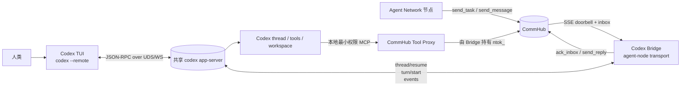

# RFC-030：Codex TUI 人类与 Agent 共用会话桥接（app-server transport）

> 状态：**Accepted（通信龙 review 通过, Vincent 授权实施 2026-07-10）** · 先做 Phase 0/1, 保守边界
> 关联 tracking issue 见下; 原始设计正文如下。


> 状态：设计提案，尚未在 Agent Network 主干实现  
> 评审基线：`sleep2agi/agent-network@84136dc`（2026-07-09）  
> Codex 验证基线：`codex-cli 0.144.0`（2026-07-10）  
> 建议落点：先作为 `codex-sdk` 的 `app-server` transport 预览开关验证，再决定是否提升为独立 runtime

## 1. 摘要

目标是让一个 Codex 会话同时具备两类消息入口：

1. 人类直接在 Codex TUI 中输入、查看输出、处理审批。
2. Agent Network 中的节点通过 CommHub 向同一个 Codex thread 派任务或发消息。

推荐方案是：

- 运行一个共享的 `codex app-server`。
- 人类 TUI 使用 `codex --remote ...` 连接该 app-server。
- Agent Network bridge 作为第二个 app-server 客户端，订阅同一个持久化 thread。
- Agent Network 入站消息经 CommHub SSE 到达 bridge，再由 bridge 调用 `turn/start`；可选的即时补充消息才调用 `turn/steer`。
- Codex 对 Agent Network 的出站操作经过 bridge 提供的本地、最小权限 MCP 代理，不把真实 CommHub `ntok_` 交给 Codex 进程。
- 同一个 thread 仍然只有一个 active turn；“同时通信”定义为多生产者可同时提交，bridge 负责串行、排队、去重和回复归属。

这是当前唯一同时满足以下条件的路线：

- 人类保留原生 Codex TUI 体验。
- Agent Network 能主动 push/wake Codex，而不是等待 Codex 主动轮询。
- 双方看到同一个 thread、同一段历史和同一组实时事件。
- Agent Network 的任务结果可以可靠地映射回原始 `task_id`。

## 2. 目标与非目标

### 2.1 目标

- Agent Network 中其他节点可向一个别名（例如 `codex-human`）调用 `send_task`。
- 任务在同一个人类可见的 Codex TUI 中出现并执行。
- 人类可在 TUI 中直接发消息，也可在 Agent 发起的 turn 中补充要求。
- Agent 发起的任务完成后，最终结果通过 CommHub `send_reply` 返回发起节点。
- `send_message`、异步子任务 reply 可作为可选消息注入 TUI。
- Codex 可通过受限 MCP 工具向 Agent Network 查询节点、派任务和读取任务结果。
- 所有 Codex 命令、文件变更和权限审批只由人类 TUI 决定。
- bridge 断线、进程重启或 Hub 重启后，不重复执行已经被 Codex 接收的任务。

### 2.2 非目标

- 不把多个 Codex turn 并行运行在同一个 thread 中。
- 不允许 Agent Network 节点直接访问原始 app-server 控制面。
- 不允许 Agent Network 消息修改 model、cwd、sandbox、approval policy、MCP 配置或开发者指令。
- 不把人类完整对话、推理内容、命令输出或敏感文件广播到 Agent Network。
- MVP 不承诺跨不互信租户隔离；只支持一个由可信成员组成的专用 Agent Network network。
- MVP 不用 `tmux send-keys`、PTY 注入或向 TUI stdin 写字节作为正式控制面。

## 3. 仓库现状评估

### 3.1 Agent Network 已有的基础能力

当前仓库已经具备本方案的大部分 Agent Network 侧基础设施：

- CommHub `send_task` 写入 `tasks + inbox` 并通过 SSE 推送 `new_task`。
- `send_message` 推送 `new_message`。
- `send_reply` 关闭任务并向发起方推送 `new_reply`。
- `agent-node` 已实现 SSE 重连、收件箱拉取、消息 inflight 去重、任务串行执行和可靠回复落盘。
- `thinkQueue` 已经将普通 Agent 任务串行化。
- `codex-sdk` runtime 已支持 Codex thread、流式事件和 CommHub 工具配置。
- 仓库已有实验性的 `codex app-server` stdio JSON-RPC client。

关键代码位置：

- [`agent-node/src/cli.ts`](https://github.com/sleep2agi/agent-network/blob/84136dc25e2e1a06b2af984aaf8fa0ce49cdace4/agent-node/src/cli.ts)：节点注册、SSE、收件箱、`thinkQueue`、可靠回复和 Codex runtime。
- [`agent-node/src/runtime/codex-stdio-client.ts`](https://github.com/sleep2agi/agent-network/blob/84136dc25e2e1a06b2af984aaf8fa0ce49cdace4/agent-node/src/runtime/codex-stdio-client.ts)：现有 app-server stdio JSON-RPC 客户端。
- [`server/src/tools.ts`](https://github.com/sleep2agi/agent-network/blob/84136dc25e2e1a06b2af984aaf8fa0ce49cdace4/server/src/tools.ts)：CommHub MCP 工具、inbox、task 与 reply 生命周期。
- [`server/src/push.ts`](https://github.com/sleep2agi/agent-network/blob/84136dc25e2e1a06b2af984aaf8fa0ce49cdace4/server/src/push.ts)：SSE client registry 与事件推送。
- [`server/src/send_dedup.ts`](https://github.com/sleep2agi/agent-network/blob/84136dc25e2e1a06b2af984aaf8fa0ce49cdace4/server/src/send_dedup.ts)：Hub 侧 `send_task` 去重保护。

### 3.2 当前 Codex 路径为什么不满足需求

| 路线 | 能主动收 Agent Network 消息 | 人类能连接同一个 live TUI/thread | 结论 |
|---|---:|---:|---|
| TUI 配置 CommHub MCP | 否，MCP 是 Codex 主动 pull/call | 是 | 只有出站，没有入站 push |
| 当前 `codex-sdk` runtime | 是 | 否 | SDK 管理自己的 Codex 进程和 thread |
| 当前 app-server stdio preview | 是 | 否 | stdio 被 `agent-node` 独占，TUI 无法 attach |
| `codex mcp-server` | 是 | 否 | headless、stdio 1:1、缺少共享 TUI 与 steer |
| `tmux send-keys` | 勉强 | 表面上是 | UI 状态相关、不可审计、审批时风险高 |
| 共享 app-server | 是 | 是 | 推荐 |

### 3.3 旧 RFC 与当前条件的变化

仓库已经认真研究过这些路线：

- [RFC-005](https://github.com/sleep2agi/agent-network/blob/84136dc25e2e1a06b2af984aaf8fa0ce49cdace4/docs/rfcs/RFC-005-codex-code-cli-runtime.md) 证明“TUI + MCP”只有 pull 能力，无法被 CommHub 主动唤醒。
- [RFC-006](https://github.com/sleep2agi/agent-network/blob/84136dc25e2e1a06b2af984aaf8fa0ce49cdace4/docs/rfcs/RFC-006-codex-code-cli-mcp-server.md) 曾设计 remote-control/app-server 多客户端路线，但基于 Codex 0.130 的实测将其归档：第二客户端当时无法稳定获得同 thread 完整流，首次 `thread/resume` 也存在 rollout 持久化竞态。
- [RFC-007](https://github.com/sleep2agi/agent-network/blob/84136dc25e2e1a06b2af984aaf8fa0ce49cdace4/docs/rfcs/RFC-007-codex-code-cli-mcp.md) 最终停止实现 `codex mcp-server` runtime，因为与现有 `codex-sdk` 重叠且无法提供共享 TUI。
- [RFC-012](https://github.com/sleep2agi/agent-network/blob/84136dc25e2e1a06b2af984aaf8fa0ce49cdace4/docs/rfcs/RFC-012-codex-mobile-bridge.md) 已验证 Codex 通过 CommHub MCP 向网络派活的“出站半链路”。

Codex 0.144 已改变 RFC-006 的关键前提：

- 官方现在文档化了 `codex app-server` 与 `codex --remote` 的连接方式。
- `thread/resume` 对运行中的 thread 表示 rejoin。
- 同一持久 thread 支持多个订阅连接，事件会送到订阅客户端。
- `turn/start`、`turn/steer`、`thread/status/changed` 和 approval server request 都已有当前版本 schema。
- 本机双客户端验证已确认：第二客户端 resume 后能收到同 thread 的消息、delta 和完成事件。

仍然存在的限制：空 thread 只执行 `thread/start`、尚未产生首个持久 turn 时，第二客户端可能无法立即 resume。因此绑定流程必须使用已有持久化 turn 的 thread，或重试到首个 turn 被写入。

## 4. 推荐架构



### 4.1 组件职责

#### 共享 `codex app-server`

- 唯一的 Codex thread/turn 运行时。
- 同时服务 TUI 和 Agent Network bridge 两个客户端。
- 只监听 Unix socket 或 loopback。
- 一个项目、一个人类控制者、一个 bridge 使用一个独立 daemon。

#### Codex TUI

- 人类输入入口。
- 展示 Agent Network 注入的用户消息与 Codex 输出。
- 唯一审批入口。
- 可在 Agent Network turn 运行时用 TUI 的正常交互补充要求。

#### Agent Network bridge

- 使用专用 `ntok_` 注册为一个 Agent Network 节点。
- 监听 CommHub SSE、拉取 inbox、持久化消息账本。
- 作为 Agent Network 唯一的 app-server 写客户端。
- 将正式 task 串行映射成独立 Codex turn。
- 只把与 task 对应的最终 Codex 回复送回 CommHub。
- 收到 approval/user-input server request 时只记录等待状态，绝不作答。

#### 本地 CommHub Tool Proxy

- 运行在 bridge 进程内或其受控 sidecar 中。
- bridge 持有真实 CommHub `ntok_`；Codex 只看到本地代理能力。
- 仅开放 `get_all_status`、`send_task`、`send_message`、`get_task`、`list_tasks` 等白名单工具。
- 固定 `from_session` 为本节点真实 alias，拒绝调用方覆盖身份。
- 不开放 `ack_inbox`、cancel、reassign、admin、token、节点删除等能力。
- 不启动第二套 SSE/inbox consumer，避免和主 bridge 抢 inbox。

### 4.2 节点语义

对 Agent Network 来说，共享会话表现为一个普通节点，例如：

```text
alias: codex-human
runtime: codex-sdk
transport: app-server
status: idle | working | waiting_human | offline
session_id: <shared-codex-thread-id>
```

人类与 Codex 共同代表这个节点。其他 Agent 只向 `codex-human` 发 task/message，不直接连接 app-server。

## 5. 双向消息流

### 5.1 人类 → Codex

1. 人类在 TUI 输入。
2. TUI 向共享 app-server 发起 `turn/start`，或在 active turn 中 steer。
3. bridge 订阅同一 thread，只更新状态，不把人类 turn 当作 Agent Network task 回复。
4. 人类 turn 的 transcript、delta 和工具输出默认不发往 CommHub。

### 5.2 Agent Network task → Codex → task 发起方

1. Agent A 调用 `send_task(alias="codex-human", task="...")`。
2. CommHub 写入 task/inbox，SSE 推送 `new_task`。
3. bridge 拉取 inbox，按 `message_id/task_id` 去重并先写本地 ledger。
4. 如果 shared thread 空闲，bridge 调用 `turn/start`；如果忙，进入 FIFO 队列。
5. TUI 收到同一 user message 和后续流式事件，人类可看到任务。
6. bridge 持久化 `message_id/task_id → turnId` 映射，再 ACK inbox；从这一刻起由 durable ledger 接管恢复责任。
7. bridge 只跟踪自己创建的 `turnId`。
8. `turn/completed` 后，bridge 提取最终 agent message，持久化结果，并通过现有可靠回复链调用 `send_reply`。
9. Agent A 收到 `new_reply`。

### 5.3 Agent Network message/reply → Codex

消息类型采用不同策略：

| CommHub 类型 | 默认投递 | 是否自动回复 |
|---|---|---:|
| `task` | 排队，空闲后独立 `turn/start` | 是，映射回 `task_id` |
| `broadcast` | 排队为独立 turn | 按现有广播策略决定 |
| `message` | MVP 排队；Phase 2 可选 steer | 否 |
| `reply` / `chained_reply` | MVP 排队；若明确属于当前子任务可选 steer | 否 |

正式 task 不应 steer 进人类 turn，因为那会破坏 `task_id → turnId → reply` 的一一对应关系。

### 5.4 Codex/人类 → Agent Network

1. 人类在 TUI 中要求 Codex 查询节点或派任务。
2. Codex 调用本地 `anet_bridge` MCP 工具。
3. Tool Proxy 校验方法、参数、大小、速率和固定来源身份。
4. bridge 使用真实 `ntok_` 调 CommHub。
5. 工具结果回到 Codex thread，并显示在 TUI。
6. 后续异步 reply 由 bridge 再注入共享 thread。

这一链路让该 TUI 不只是 Agent Network 的收件箱，而是真正可以派活的网络节点。

## 6. 并发与调度模型

### 6.1 核心不变量

- 一个 thread 同时最多一个 active turn。
- Agent Network 的所有写入只经过一个 bridge leader。
- 正式 task 一律独占一个 turn。
- app-server 的实时状态和通知是运行时权威；本地缓存只是恢复辅助。
- 人类输入优先于尚未开始的 Agent Network 队列。
- Agent Network task 默认不自动 interrupt、不自动 steer。

### 6.2 状态机

```text
DISCONNECTED
    │ connect + initialize
    ▼
SYNCING
    │ thread/resume + thread/read/status
    ▼
IDLE ───────────── Agent task ────────────► STARTING
  ▲                                             │ turn/started
  │                                             ▼
  └──────── turn/completed ◄─────────────── RUNNING
                                                │
                                                ├── approval/input request ──► WAITING_HUMAN
                                                │                                  │
                                                └──────── serverRequest/resolved ◄─┘

任意状态 ── connection lost ──► RECOVERING ──► SYNCING
```

### 6.3 调度算法

```text
onInbound(message):
  1. 验证 network、来源元数据、类型、大小和配额
  2. 以 inbox message_id / task_id 去重并持久化 received
  3. task/broadcast:
       若 thread idle 且无人类 turn 刚启动 -> turn/start
       否则 -> FIFO queue
  4. message/reply:
       MVP -> FIFO queue
       Phase 2 且 allowSteer=true、active turn 可 steer -> turn/steer(expectedTurnId)
  5. RPC 接收成功后持久化 accepted + turn_id，再 ACK inbox
```

`turn/start` 与人类 TUI 可能同时抢占 idle。bridge 必须把 app-server 的 active-turn 错误视为正常竞态：重新同步状态，并按原 delivery policy 回队，不能擅自改成 steer。

### 6.4 来源标识

Agent Network 输入必须同时具备：

- 机器关联：`clientUserMessageId = "anet:<message_id>"`。
- 模型可见来源：正文前缀。

示例：

```text
[Agent Network]
from: reviewer
type: task
task_id: 01J...

请检查当前分支的失败测试，并给出根因。
```

正文中的 alias 只是可见标签，不是安全身份。MVP 必须信任整个专用 network；生产版应把经过认证的 sender principal 写入 task/inbox envelope。

## 7. Codex App Server 协议

### 7.1 启动共享服务与 TUI

开发验证可使用 loopback WebSocket：

```bash
codex app-server --listen ws://127.0.0.1:4500
codex --remote ws://127.0.0.1:4500
```

本地长期运行优先使用 daemon Unix socket：

```bash
codex app-server daemon start
codex --remote unix://
```

注意：Unix socket transport 仍是 WebSocket Upgrade，不是裸 JSONL。`codex app-server proxy` 只代理原始 socket 字节，不会自动把协议转换为 stdio JSONL。

### 7.2 Bridge 初始化

每个连接必须单独初始化：

```json
{"method":"initialize","id":1,"params":{"clientInfo":{"name":"anet_codex_bridge","title":"Agent Network Codex Bridge","version":"0.1.0"}}}
```

收到响应后发送：

```json
{"method":"initialized","params":{}}
```

然后绑定同一个持久 thread：

```json
{"method":"thread/resume","id":2,"params":{"threadId":"<opaque-thread-id>"}}
```

不要假设 thread ID 以 `thr_` 开头。若 `thread/loaded/list` 返回多个 ID，禁止自动选择第一个；应使用节点配置中的 `session_id`、TUI `/status` 显示值或显式绑定命令。

### 7.3 Agent task 发起 turn

```json
{
  "method": "turn/start",
  "id": 10,
  "params": {
    "threadId": "<thread-id>",
    "clientUserMessageId": "anet:<message-id>",
    "input": [
      {
        "type": "text",
        "text": "[Agent Network/from=reviewer/task=<task-id>] 请检查失败测试"
      }
    ]
  }
}
```

### 7.4 可选即时 steer

只用于明确允许的即时补充，不用于正式 task：

```json
{
  "method": "turn/steer",
  "id": 11,
  "params": {
    "threadId": "<thread-id>",
    "expectedTurnId": "<active-turn-id>",
    "clientUserMessageId": "anet:<message-id>",
    "input": [
      {
        "type": "text",
        "text": "[Agent Network/update] 补充：优先检查 auth 测试"
      }
    ]
  }
}
```

`expectedTurnId` 必须匹配当前 active turn。失败后应重新同步并按原策略排队，不能盲目重试。

### 7.5 最小事件集

bridge 至少处理：

- `thread/status/changed`
- `turn/started`
- `item/started`
- `item/agentMessage/delta`
- `item/completed`
- `turn/completed`
- `error`
- `serverRequest/resolved`

只有满足以下条件的完成事件才能触发 CommHub `send_reply`：

```text
event.threadId == configuredThreadId
AND event.turnId exists in bridge.pendingTurns
AND pendingTurns[turnId].taskId != null
```

人类 TUI 发起的 turn 即使 bridge 收到完整事件，也不得产生 CommHub reply。

### 7.6 审批规则

app-server 会以带 `id` 的 server request 请求命令、文件变更、权限或用户输入审批。当前 Codex 0.144 的多订阅实现可能把未决请求送给多个订阅客户端，并以第一个有效响应为准。

bridge 规则：

```text
收到 item/*/requestApproval 或 item/tool/requestUserInput
  -> 记录 waiting_human
  -> 更新节点状态/告警
  -> 不发送 response
  -> 等 TUI 人类回答
  -> 收到 serverRequest/resolved 后恢复状态
```

若 TUI 离线且等待超过配置超时：

- MVP：中断该 Agent task，返回 `blocked/failed: human approval timeout`。
- 禁止 bridge 自动 accept、`acceptForSession` 或修改 execpolicy。

## 8. Agent Network 代码改造建议

### 8.1 产品形态选择

建议分两步：

#### 第一步：作为现有 `codex-sdk` runtime 的 transport

拟议配置：

```json
{
  "runtime": "codex-sdk",
  "session_id": "<shared-thread-id>",
  "flags": {
    "codexTransport": "app-server",
    "codexAppServerEndpoint": "unix://",
    "codexConcurrency": "queue",
    "codexAllowSteer": false,
    "approvalTimeoutSeconds": 600
  }
}
```

优点：

- 不立即扩大 runtime enum 和远程 create-node schema。
- 可复用现有 Codex dispatch、SSE、可靠回复与 session 写回。
- 便于 preview flag 回滚到当前 SDK。

#### 第二步：验证后提升为独立 runtime

若用户体验稳定，可命名为 `codex-app-server` 或 `codex-tui-bridge`。此时需同步修改：

- `agent-network/src/normalize-runtime.ts`
- `agent-network/bin/cli.ts` wizard、依赖检查、launcher
- `agent-node/src/cli.ts` runtime union/map
- `server/src/index.ts` runtime normalization
- `server/src/create-node-validate.ts`
- host supervisor 的 runtime capabilities
- Dashboard runtime 展示和配置表单

### 8.2 新增 App Server client

建议新增：

```text
agent-node/src/runtime/codex-app-server-client.ts
```

职责：

- 支持 loopback WS、WSS 和 WebSocket-over-UDS。
- request/response ID 关联。
- notification 分发。
- 带 `method + id` 的 server request 单独分流。
- bearer/capability token 握手。
- `initialize` + `initialized`。
- 断线重连、`thread/resume`、状态重新同步。
- schema/版本能力检查。

现有 `codex-stdio-client.ts` 可以复用 parser、pending map 和 EventEmitter 模式，但不能直接复用其 dispatch：当前实现把所有带 `id` 的消息当作 response，无法正确处理 app-server reverse request。

### 8.3 新增 Bridge runtime adapter

建议新增：

```text
agent-node/src/runtime/codex-app-server-bridge.ts
```

职责：

- 绑定并验证 thread。
- 维护 `threadStatus`、`activeTurnId`、`pendingTurns` 和 inbound queue。
- 对正式 task 调用独立 `turn/start`。
- 过滤跨 thread/turn 事件。
- 聚合 bridge 自己创建的 turn 最终回复。
- 处理 approval 等待状态，但不发送审批响应。
- 维护 durable ledger。

### 8.4 修改 `agent-node/src/cli.ts`

主要改动：

1. Codex dispatch 增加 `codexTransport === "app-server"` 分支。
2. `processWithCodexAppServer()` 返回字符串，继续复用现有 `processTask()` 和 `deliverReplyReliably()`。
3. `connectSSE()` 增加 `new_message`、`new_reply`、`chained_reply` doorbell。
4. `processInbox()` 不再无条件丢弃所有非 task 类型；message/reply 走 `injectMessage()`，不走 `send_reply`。
5. 心跳重报当前状态，不能每三分钟无条件覆盖成 `idle`。
6. `session_id` 使用共享 Codex thread ID，并在绑定后写回现有节点配置。

### 8.5 修改 CommHub inbox 返回

当前 `get_inbox` 需要补充：

- `in_reply_to`
- 认证后的 sender principal（生产前必须）
- 原始 message/task ID
- 可选 delivery metadata

否则 bridge 无法可靠把异步 reply 与 Codex 当前上下文关联。

### 8.6 本地 Tool Proxy

不要让当前 `.anet/node-server.js` 以完整模式连接共享 Codex：它自身会注册节点、监听 SSE、拉取并 ACK inbox，可能与主 `agent-node` 抢消息。

应新增 tool-only proxy，例如：

```text
agent-node/src/runtime/commhub-tool-proxy.ts
```

或给现有 node-server 增加：

```text
COMMHUB_TOOL_ONLY=1
```

tool-only 模式必须：

- 不注册 session。
- 不连接 `/events/:alias`。
- 不调用 `get_inbox/ack_inbox`。
- 真实 `ntok_` 只保存在 bridge 进程。
- Codex 仅拿到本地 proxy 的短期 capability。
- 工具调用固定身份、限速、限制参数和返回字段。

## 9. 持久化与恢复

### 9.1 Ledger

建议在节点目录建立权限为 `0600` 的 SQLite 或 append-only 状态文件：

```text
message_id
task_id
from_principal
from_alias_display
delivery_policy
thread_id
turn_id
state: received | queued | dispatching | accepted | completed | replied | failed
content_hash
received_at
updated_at
final_reply_hash
```

### 9.2 正常提交顺序

```text
persist received
→ dispatch turn/start(clientUserMessageId)
→ persist accepted + turn_id
→ ACK CommHub inbox
→ wait turn/completed
→ persist final result
→ enqueue reliable send_reply
→ mark replied
```

### 9.3 模糊提交恢复

若 `turn/start` 发出后连接断开、bridge 未拿到 response：

1. 不盲目重发。
2. 重连后 `thread/resume`。
3. 读取 thread/turn history，按 `clientUserMessageId` 或可见 message marker 查找。
4. 找到则恢复 `turn_id` 映射；找不到才重新排队。

系统交付语义应表述为“持久接收、尽力避免重复”，不要宣称严格 exactly-once。

### 9.4 App Server 重启

- 固定 `session_id/thread_id`。
- 重启后先 `thread/resume`，再读取 runtime status。
- 原 active turn 状态不明时标记 `unknown/interrupted`，不要自动重放有副作用的任务。
- 对发起节点返回明确的恢复状态或要求人工重试。

## 10. 安全设计

### 10.1 必须修正的现有默认值

当前 Agent Network Codex runtime 常见默认值为：

- `approvalPolicy = never`
- `sandboxMode = danger-full-access`
- `skipGitRepoCheck = true`
- 节点常启用 `dangerouslySkipPermissions`

这些默认值不能用于共享人类 TUI。

MVP 建议：

- 独立工作目录，不在 `$HOME` 直接运行。
- 整个共享 thread 默认使用 `read-only`；app-server 的 turn 级权限覆盖会影响后续 turn，bridge 不能在 Agent turn 前后静默切换权限。
- 写操作由人类在 TUI 中显式切换权限后于单独 turn 执行，并在完成后恢复 `read-only`；或者改用隔离的写入 thread。
- bridge 不改变 thread 的 sandbox/approval 设置。
- 无人类在线时 fail closed。

### 10.2 Token 隔离

- 使用节点专属 `ntok_`，不用 `utok_` 或旧 `COMMHUB_AUTH_TOKEN`。
- 不把 `COMMHUB_TOKEN` 传入 Codex/app-server 环境。
- app-server 使用清理后的环境和独立 `CODEX_HOME`。
- bridge/Tool Proxy 持有真实 token。
- 节点删除或 bridge 下线时显式 revoke/rotate token；当前普通本地 node delete 不能被假定会撤销 token。
- 节点目录设为 `0700`，token、ledger 和 config 文件设为 `0600`。

### 10.3 Agent Network 网络边界

当前 network scope 不能等价为节点私有 ACL：同 network 内其他主体可能读取目标 alias 的 inbox，部分写角色也能 ACK 或操作任务。MVP 因此必须：

- 为共享 Codex bridge 建一个只含可信成员的专用 network。
- 不用显示 alias 作为审批或授权依据。
- 不在 Agent Network message 中传秘密。
- 生产版补充不可伪造的 sender user/token principal，并实现 per-node inbox ACL。

### 10.4 App Server 控制面

- 只绑定 UDS 或 `127.0.0.1`。
- 不向 Agent Network 节点暴露 endpoint 或 capability token。
- 不使用 `ws://0.0.0.0`。
- 跨机只能走 SSH 隧道或 WSS + TLS + app-server auth。
- 一个 daemon 不跨不相关项目、用户或 network 共享。
- 版本固定，升级前重新生成 schema 并跑双客户端兼容测试。

### 10.5 Prompt injection

- 所有 Agent Network 内容按不可信 user text 处理。
- bridge 只接受 text；MVP 不接受外部本地文件路径或 image path。
- 限制消息长度、队列深度、每节点速率、turn 数和费用预算。
- 清除 ANSI、双向文本控制符等展示欺骗字符。
- 不允许 payload 指定 app-server RPC method 或任何运行时配置。
- 输出只返回该 task 的最终回答；不返回人类 transcript、reasoning、tool args、环境变量或完整命令输出。

### 10.6 Hub 首次部署

Hub 必须先在 loopback 完成管理员初始化，再置于 TLS 反向代理后。不要首次启动就把注册端点暴露在 `0.0.0.0`，避免首用户抢注成为管理员。

## 11. 启动与绑定 UX

以下命令是拟议产品 UX，当前主干尚未实现：

```bash
# 创建一个普通 codex-sdk 节点，但选择共享 app-server transport
anet node create codex-human --runtime codex-sdk --codex-transport app-server

# 启动 bridge；managed 模式可同时启动本地 app-server
anet node start codex-human

# 另一个终端连接 TUI
codex --remote unix://

# TUI 首次发一条消息，使 thread 持久化
# 然后显式绑定，避免 loaded/list 多 thread 误选
anet node bind-thread codex-human <THREAD_ID>
```

建议 bridge 在未绑定时：

- 状态显示 `waiting_for_thread`。
- 不 ACK 新 task，只把它们留在 CommHub inbox。
- 展示检测到的持久 thread 列表、cwd 和名称。
- 只在恰好一个符合 cwd 的持久 thread 且用户显式允许时自动绑定。

绑定后将 thread ID 写入节点现有 `session_id` 字段。

## 12. 分阶段实施

### Phase 0：协议 PoC

- 单机、单 TUI、单 bridge、单持久 thread。
- loopback WebSocket。
- 仅支持 `send_task`。
- FIFO，不支持 Agent steer。
- 最终文本回复，不转发 token delta 到 CommHub。
- bridge 不响应任何 approval。
- 使用假 CommHub 与假 app-server 测试竞态。

退出条件：双客户端完整事件、任务回复映射和人工审批均通过。

### Phase 1：Agent Network MVP

- `codex-sdk + codexTransport=app-server` preview flag。
- Unix socket transport。
- durable ledger、断线恢复、`clientUserMessageId` 去重。
- `new_message/new_reply` doorbell 与 inbox 字段补齐。
- 本地最小权限 Tool Proxy。
- TUI thread 显式绑定与 session 写回。
- 专用可信 network、安全文件权限和 token revoke 流程。

### Phase 2：产品化

- 根据使用反馈决定是否新增 `codex-tui-bridge` canonical runtime。
- Dashboard 线程绑定、TUI 在线状态、队列、审批等待和错误视图。
- 可选 `turn/steer`，仅用于 chat/reply，不用于正式 task。
- 人类 approval owner/lease、超时、审计。
- 认证 sender principal、per-node inbox ACL、真正的 token scope。
- schema 兼容矩阵、自动升级门禁和完整观测指标。

## 13. 建议 PR 拆分

### PR 1：App Server transport

- 新增 `codex-app-server-client.ts`。
- WS/UDS、initialize、request/notification/server-request 分流。
- schema fixtures、版本探测与假服务器测试。
- 修正现有 stdio client 对 reverse request 的错误分类。

### PR 2：共享 Codex transport

- `codexTransport=app-server` preview flag。
- thread bind/resume、状态机、事件过滤、`pendingTurns`。
- 正式 task FIFO 与现有 `processTask/deliverReplyReliably` 对接。

### PR 3：消息与恢复

- durable ledger。
- `new_message/new_reply/chained_reply` doorbell。
- `get_inbox` 补 `in_reply_to` 和必要 envelope 字段。
- 重连、模糊提交恢复和心跳状态修正。

### PR 4：最小权限 Tool Proxy

- tool-only MCP server。
- 固定节点身份、白名单工具、速率限制、返回脱敏。
- app-server 清理环境和独立 `CODEX_HOME`。

### PR 5：CLI/Dashboard 与安全

- thread bind UX。
- 权限、安全默认值和 token rotate/revoke。
- Dashboard 状态、队列和等待人类审批视图。
- 文档、迁移说明和升级门禁。

## 14. 验收标准

### 14.1 功能

- 人类 TUI 发起 turn，bridge 不产生 CommHub reply。
- Agent Network 发起 task，TUI 实时显示同一 user message 和 Codex 输出。
- Agent task 完成后，只有原始 task 发起方收到一次最终 reply。
- 两个 Agent 同时派 task，只创建一个 active turn，另一个稳定排队。
- 人类与 bridge 同时抢占 idle，不丢消息、不错误 steer。
- `send_message`、`new_reply` 能按策略进入 TUI，且不伪造 task reply。
- Codex 通过本地 Tool Proxy 能查询节点、派 task、读取结果。

### 14.2 审批

- approval 同时对 TUI/bridge 可见时，bridge 不发送 response。
- 人类 accept/decline 后，bridge 收到 `serverRequest/resolved`。
- TUI 离线时审批超时并 fail closed。
- Agent Network 消息无法构造 approval response、修改 policy 或获得 app-server token。

### 14.3 可靠性

- bridge 在 `turn/start` 后断线，重连不会重复启动同一 task。
- Hub 重启后 SSE 自动恢复、节点重新 report status。
- app-server 重启后持久 thread 能 resume，未决状态明确标记。
- ACK、reply 或网络超时不会造成 LLM turn 重复执行。
- WebSocket `-32001 Server overloaded` 使用指数退避与 jitter。

### 14.4 隔离

- 只处理配置 thread 的事件。
- 人类 transcript、其他 thread 和其他 Agent task 不串流。
- Codex 进程环境中不存在真实 CommHub `ntok_`。
- 所有状态/token 文件权限通过自动测试。
- 非 loopback app-server 暴露被启动检查拒绝。

### 14.5 升级

每次升级 Codex CLI 必须运行：

```bash
codex app-server generate-json-schema --out ./schemas
```

并重跑：

- 双客户端 subscribe/fan-out。
- `thread/resume` running-thread rejoin。
- `turn/start`/`turn/steer`。
- approval 首响应与未决请求恢复。
- 断线重连与 overload。

## 15. 风险与决策点

| 风险 | 影响 | 缓解 |
|---|---|---|
| app-server/WS 仍可能变更 | 协议破坏 | 固定 0.144.x、生成 schema、兼容测试 |
| 同 thread 一次一个 turn | 不能真正并行 | FIFO；真正并行使用独立 thread/subagent |
| 人类与 bridge 的 idle 抢占 | start 竞态 | app-server 为权威，失败回队 |
| Agent task 等待人类审批 | 长时间阻塞 | TUI 状态、超时、fail closed |
| task steer 后回复归属不清 | 错发 reply | 正式 task 禁止 steer |
| CommHub sender alias 可伪装 | 错误授权 | 专用可信 network；生产补 principal |
| 同 network inbox 不是节点私有 | 信息泄露/ACK 干扰 | 专用 network；生产补 per-node ACL |
| Codex 读取环境 token | 网络凭据泄露 | bridge 持 token，本地最小权限 proxy |
| 旧安全文档与当前代码漂移 | 错误部署 | 以当前源码测试为准，补文档回归 |

上线前需要产品负责人确认：

1. MVP 是否只支持可信专用 network。
2. Agent task 是否强制 read-only，还是允许 TUI 人类审批写操作。
3. `message/reply` 是排队还是允许 steer。
4. bridge 是 `codex-sdk` transport 还是独立 runtime。
5. daemon 由 `anet` managed 还是连接用户已有 app-server。
6. 人类不在线时，任务是排队、超时失败还是在 `never` 策略下继续只读执行。

## 16. 最终建议

建议立即做 Phase 0/1，但采用保守边界：

- 复用现有 `codex-sdk` 节点身份与 Agent Network 收发链。
- 新增 `app-server` transport，而不是再造一个与 `codex-sdk` 重叠的 headless runtime。
- TUI 与 bridge 连接同一个持久 thread。
- 正式 Agent task 一律排队成独立 turn。
- bridge 绝不响应审批；写操作由人类 TUI 控制。
- CommHub token 留在 bridge，Codex 只连接本地最小权限 Tool Proxy。
- MVP 仅运行在单用户主机、隔离工作区和可信专用 network。

这个设计保留 Agent Network 当前成熟的 SSE、任务生命周期、去重和可靠回复能力，同时补上当前 `codex-sdk`/stdio 路线缺失的“人类与 Agent 共用同一个 TUI/thread”能力。

## 17. 参考资料

- [Codex App Server](https://developers.openai.com/codex/app-server)
- [Codex CLI reference](https://developers.openai.com/codex/cli/reference)
- [Agent Network README](https://github.com/sleep2agi/agent-network/blob/84136dc25e2e1a06b2af984aaf8fa0ce49cdace4/README.md)
- [Agent Network SECURITY.md](https://github.com/sleep2agi/agent-network/blob/84136dc25e2e1a06b2af984aaf8fa0ce49cdace4/SECURITY.md)
- [Agent Network Codex stdio client](https://github.com/sleep2agi/agent-network/blob/84136dc25e2e1a06b2af984aaf8fa0ce49cdace4/agent-node/src/runtime/codex-stdio-client.ts)
- [Agent Network Codex CLI 深度设计](https://github.com/sleep2agi/agent-network/blob/84136dc25e2e1a06b2af984aaf8fa0ce49cdace4/docs/anet-codex-code-cli-design.md)
- [RFC-005：TUI + MCP 路线](https://github.com/sleep2agi/agent-network/blob/84136dc25e2e1a06b2af984aaf8fa0ce49cdace4/docs/rfcs/RFC-005-codex-code-cli-runtime.md)
- [RFC-006：旧 remote-control 路线](https://github.com/sleep2agi/agent-network/blob/84136dc25e2e1a06b2af984aaf8fa0ce49cdace4/docs/rfcs/RFC-006-codex-code-cli-mcp-server.md)
- [RFC-007：mcp-server 路线](https://github.com/sleep2agi/agent-network/blob/84136dc25e2e1a06b2af984aaf8fa0ce49cdace4/docs/rfcs/RFC-007-codex-code-cli-mcp.md)
- [RFC-012：Codex 与 CommHub MCP 桥接](https://github.com/sleep2agi/agent-network/blob/84136dc25e2e1a06b2af984aaf8fa0ce49cdace4/docs/rfcs/RFC-012-codex-mobile-bridge.md)
